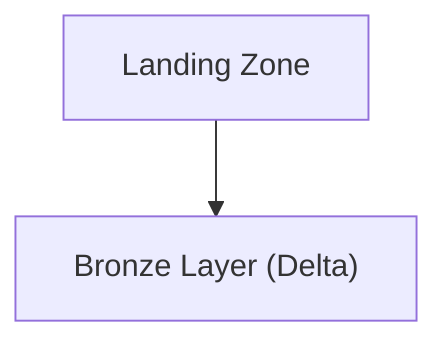
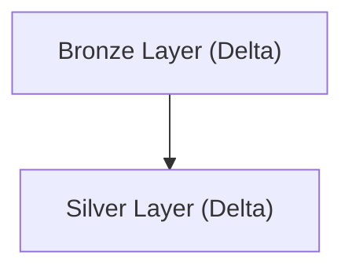
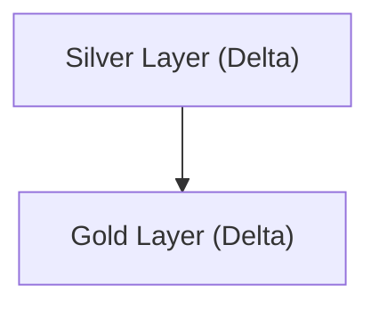
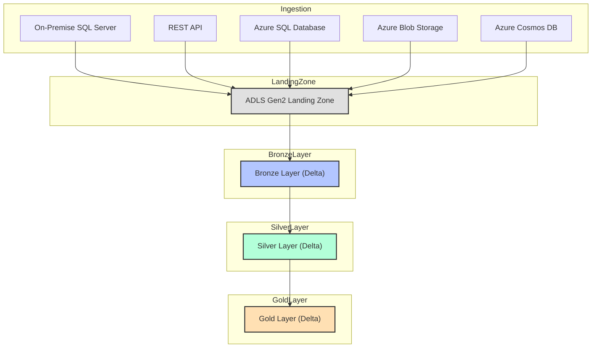

# Banking Domain: Regulatory Reporting Data Aggregation Pipeline

## Project Overview

This project implements a robust data aggregation pipeline for regulatory reporting in the banking sector, leveraging the Microsoft Azure ecosystem. The solution is designed to ingest, process, and curate data from multiple sources, ensuring compliance, accuracy, and timely delivery of regulatory reports. The architecture is built to handle large volumes of sensitive financial data, supporting both batch and near real-time analytics, and providing a scalable foundation for evolving regulatory requirements.

## Data Sources

The pipeline integrates data from five distinct sources:

1. **On-Premise SQL Server**: Core banking transactions and customer data are sourced from an on-premise SQL Server database. This source is critical for capturing operational data that must be securely transferred to the cloud.
2. **REST API**: Regulatory reference data, such as updated compliance rules and external market feeds, are ingested via secure REST APIs.
3. **Azure SQL Database**: Internal risk assessment and audit logs are stored in an Azure SQL Database, providing structured, cloud-native data.
4. **Azure Blob Storage**: Unstructured documents, scanned forms, and batch data files are uploaded to Azure Blob Storage for further processing.
5. **Azure Cosmos DB**: Real-time event streams, such as transaction alerts and fraud detection signals, are captured in Azure Cosmos DB, supporting high-velocity data ingestion.

## Azure Data Factory (ADF) for Ingestion and Orchestration

Azure Data Factory orchestrates the end-to-end data ingestion process. Using a Self-Hosted Integration Runtime, ADF securely connects to the on-premise SQL Server, extracting data and moving it to the cloud. Other sources are ingested using native connectors and REST activities. ADF pipelines manage data movement, scheduling, and error handling, ensuring reliable and repeatable workflows.

## Data Lake Storage with Delta Format

All ingested data lands in Azure Data Lake Storage Gen2, organized into Bronze, Silver, and Gold layers using the Delta Lake format:

- **Bronze Layer**: Raw, unprocessed data from all sources is stored here, preserving data fidelity and supporting traceability.
- **Silver Layer**: Data is cleansed, deduplicated, and enriched using business logic. This layer ensures data quality and consistency, making it suitable for downstream analytics.
- **Gold Layer**: Curated, aggregated, and business-ready datasets are prepared for reporting and advanced analytics.

Delta Lake provides ACID compliance, enabling reliable transactions and data integrity. Features like time travel allow for historical data analysis and rollback, while schema enforcement ensures data consistency across layers.

## Data Processing with Azure Databricks

Azure Databricks notebooks, developed in PySpark, process and transform data between the lake layers. In the Silver Layer, business rules are applied to validate transactions, remove duplicates, and enrich records with reference data. Aggregations and complex calculations are performed to prepare regulatory metrics. The Gold Layer is optimized for reporting, with data partitioned and indexed for fast access.

## Azure Synapse Analytics for Reporting

Curated Gold Layer data is loaded into Azure Synapse Analytics, where it is modeled for regulatory reporting. Synapse provides a powerful analytics engine, supporting both serverless and dedicated SQL pools for flexible querying. Data is exposed to business users and compliance teams through secure views and stored procedures.

## Power BI for Visualization

Power BI connects directly to Synapse Analytics, enabling the creation of interactive dashboards and regulatory reports. Business users can explore data, monitor compliance metrics, and generate ad-hoc analyses. The integration supports real-time data refreshes, ensuring that insights are always up to date.

## High-Level Architecture Flow

1. Data is ingested from on-premise SQL Server (via Self-Hosted IR), REST APIs, Azure SQL, Blob Storage, and Cosmos DB using ADF.
2. Raw data lands in the Bronze Layer of ADLS Gen2 (Delta Lake).
3. Azure Databricks processes data into Silver (cleansed, deduplicated) and Gold (curated, aggregated) layers.
4. Gold Layer data is loaded into Azure Synapse Analytics for reporting.
5. Power BI dashboards and reports are built on top of Synapse, providing business insights and regulatory compliance monitoring.

## Delta Lake Advantages

Delta Lake brings ACID transactions, ensuring data reliability and consistency even in complex, multi-step workflows. Time travel capabilities allow for auditing and historical analysis, which is crucial for regulatory compliance. Schema enforcement and evolution support agile data modeling as regulations change.

## Scalability, Real-Time Analytics, and Business Insights

The solution is designed for scalability, leveraging Azure's elastic resources to handle growing data volumes and user demands. Real-time analytics are supported through streaming ingestion and low-latency processing in Databricks and Synapse. Business insights are delivered through Power BI, empowering stakeholders with timely, actionable information for regulatory decision-making. 

## Azure Databricks Workflow: End-to-End Data Movement and Transformation

### Overview
This section details the full Azure Databricks workflow for ingesting data from five sources, landing it in ADLS Gen2, and transforming it through Bronze, Silver, and Gold layers using PySpark. Each stage includes code samples, flow diagrams, and explanations for best practices and architectural decisions.

---

### 1. Ingestion to Landing Zone (ADLS Gen2)

All five sources are ingested into a raw landing zone in ADLS Gen2. This is typically done using Databricks notebooks scheduled via jobs or orchestrated by ADF, but here we focus on the Databricks code.

#### PySpark Example: Ingesting from Multiple Sources
```python
# Databricks notebook: Ingest data from all sources to landing zone
from pyspark.sql import SparkSession
import requests

spark = SparkSession.builder.getOrCreate()

# On-Premise SQL Server (via JDBC)
sql_server_df = spark.read.format("jdbc").option("url", "jdbc:sqlserver://<server>:1433;databaseName=<db>") \
    .option("user", "<user>").option("password", "<password>") \
    .option("dbtable", "dbo.Transactions").load()
sql_server_df.write.mode("overwrite").parquet("abfss://landing@<storage_account>.dfs.core.windows.net/sqlserver/")

# REST API (example for regulatory data)
api_url = "https://api.regulator.com/data"
api_data = requests.get(api_url).json()
api_df = spark.createDataFrame(api_data)
api_df.write.mode("overwrite").parquet("abfss://landing@<storage_account>.dfs.core.windows.net/api/")

# Azure SQL Database
azure_sql_df = spark.read.format("jdbc").option("url", "jdbc:sqlserver://<azuresqlserver>.database.windows.net:1433;databaseName=<db>") \
    .option("user", "<user>").option("password", "<password>") \
    .option("dbtable", "dbo.RiskLogs").load()
azure_sql_df.write.mode("overwrite").parquet("abfss://landing@<storage_account>.dfs.core.windows.net/azuresql/")

# Azure Blob Storage (CSV example)
blob_df = spark.read.csv("wasbs://data@<storage_account>.blob.core.windows.net/forms/*.csv", header=True)
blob_df.write.mode("overwrite").parquet("abfss://landing@<storage_account>.dfs.core.windows.net/blob/")

# Azure Cosmos DB (using Spark Connector)
cosmos_df = spark.read.format("cosmos.oltp").options(
    endpoint="<cosmos_endpoint>",
    key="<cosmos_key>",
    database="<db>",
    container="events"
).load()
cosmos_df.write.mode("overwrite").parquet("abfss://landing@<storage_account>.dfs.core.windows.net/cosmos/")
```

**Reasoning:**
- Using PySpark for all sources ensures scalability and parallelism.
- Data is written in Parquet format for efficient storage and downstream processing.
- Each source lands in a separate folder for traceability and schema evolution.

---

### 2. Landing Zone to Bronze Layer (Delta Lake)

The next step is to convert raw landing data into Delta format in the Bronze layer. This preserves raw data but enables ACID transactions and schema enforcement.

#### Flow Diagram: Ingestion to Bronze


#### PySpark Example: Convert to Delta Bronze
```python
# Convert Parquet landing data to Delta Bronze
from delta.tables import DeltaTable

# Example for SQL Server data
landing_path = "abfss://landing@<storage_account>.dfs.core.windows.net/sqlserver/"
bronze_path = "abfss://bronze@<storage_account>.dfs.core.windows.net/sqlserver/"

raw_df = spark.read.parquet(landing_path)
raw_df.write.format("delta").mode("overwrite").save(bronze_path)

# Repeat for other sources...
```

**Reasoning:**
- Delta format enables ACID compliance, time travel, and scalable upserts.
- Keeping Bronze as a near-raw copy supports traceability and reprocessing.

---

### 3. Bronze to Silver Layer (Cleansing, Deduplication)

The Silver layer applies business logic, deduplication, and joins with reference data.

#### Flow Diagram: Bronze to Silver


#### PySpark Example: Cleansing and Deduplication
```python
# Example: Deduplicate transactions and enrich with reference data
bronze_path = "abfss://bronze@<storage_account>.dfs.core.windows.net/sqlserver/"
silver_path = "abfss://silver@<storage_account>.dfs.core.windows.net/transactions/"

bronze_df = spark.read.format("delta").load(bronze_path)

# Deduplicate by transaction_id
silver_df = bronze_df.dropDuplicates(["transaction_id"])

# Enrich with reference data (e.g., join with regulatory rules)
reg_rules_df = spark.read.format("delta").load("abfss://bronze@<storage_account>.dfs.core.windows.net/api/")
silver_df = silver_df.join(reg_rules_df, "rule_id", "left")

silver_df.write.format("delta").mode("overwrite").save(silver_path)
```

**Reasoning:**
- Deduplication ensures data quality for downstream analytics.
- Enrichment with reference data supports regulatory compliance.

---

### 4. Silver to Gold Layer (Aggregation, Business Metrics)

The Gold layer contains curated, business-ready data for reporting and analytics.

#### Flow Diagram: Silver to Gold


#### PySpark Example: Aggregation and Curation
```python
# Example: Aggregate transactions for regulatory reporting
silver_path = "abfss://silver@<storage_account>.dfs.core.windows.net/transactions/"
gold_path = "abfss://gold@<storage_account>.dfs.core.windows.net/regulatory_reports/"

silver_df = spark.read.format("delta").load(silver_path)

# Aggregate by month and regulatory category
from pyspark.sql.functions import month, year

gold_df = silver_df.groupBy(year("transaction_date").alias("year"),
                            month("transaction_date").alias("month"),
                            "regulatory_category") \
    .agg({"amount": "sum", "transaction_id": "count"}) \
    .withColumnRenamed("sum(amount)", "total_amount") \
    .withColumnRenamed("count(transaction_id)", "transaction_count")

gold_df.write.format("delta").mode("overwrite").save(gold_path)
```

**Reasoning:**
- Aggregation prepares data for efficient reporting in Synapse and Power BI.
- Gold layer is optimized for business consumption and regulatory audits.

---

### 5. Why This Approach?
- **Delta Lake**: Ensures ACID compliance, time travel, and schema enforcement, which are critical for regulatory data.
- **Layered Architecture**: Supports traceability, reprocessing, and data quality at each stage.
- **PySpark**: Enables scalable, distributed processing for large banking datasets.

---

### Full Workflow Diagram


---

Repeat this workflow for each project, adapting the business logic, enrichment, and aggregation steps to the specific domain and reporting requirements. 

---

## Azure Data Factory (ADF) Pipeline Example: Bulk Table Movement

To efficiently move 30 tables, each approximately 1GB (total 30GB), from a source (e.g., on-premise SQL Server) to a destination (e.g., ADLS Gen2 or Azure SQL), you can use an ADF pipeline with parameterized copy activities. Below is an example of how you might structure this in ADF, along with a sample JSON pipeline definition.

### Explanation
- The pipeline uses a parameterized dataset and a ForEach activity to iterate over a list of table names.
- Each iteration triggers a Copy activity that moves one table from the source to the destination.
- This approach is scalable, maintainable, and suitable for large-scale data movement.

### Sample ADF Pipeline JSON
```json
{
  "name": "BulkTableCopyPipeline",
  "properties": {
    "activities": [
      {
        "name": "ForEachTable",
        "type": "ForEach",
        "typeProperties": {
          "items": "@pipeline().parameters.tableList",
          "activities": [
            {
              "name": "CopyTable",
              "type": "Copy",
              "inputs": [
                {
                  "referenceName": "SourceTableDataset",
                  "type": "DatasetReference",
                  "parameters": {
                    "TableName": "@item()"
                  }
                }
              ],
              "outputs": [
                {
                  "referenceName": "DestinationTableDataset",
                  "type": "DatasetReference",
                  "parameters": {
                    "TableName": "@item()"
                  }
                }
              ],
              "typeProperties": {
                "source": {
                  "type": "SqlSource"
                },
                "sink": {
                  "type": "AzureBlobSink"
                }
              }
            }
          ]
        }
      }
    ],
    "parameters": {
      "tableList": {
        "type": "Array",
        "defaultValue": [
          "Table1", "Table2", "Table3", "Table4", "Table5", "Table6", "Table7", "Table8", "Table9", "Table10",
          "Table11", "Table12", "Table13", "Table14", "Table15", "Table16", "Table17", "Table18", "Table19", "Table20",
          "Table21", "Table22", "Table23", "Table24", "Table25", "Table26", "Table27", "Table28", "Table29", "Table30"
        ]
      }
    }
  }
}
```

**How to Use:**
- Replace `SourceTableDataset` and `DestinationTableDataset` with your actual dataset names.
- The dataset definitions should be parameterized to accept a table name.
- This pipeline can be triggered manually or on a schedule, and will efficiently move all 30 tables in parallel or sequentially as configured. 