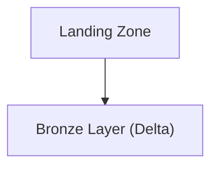
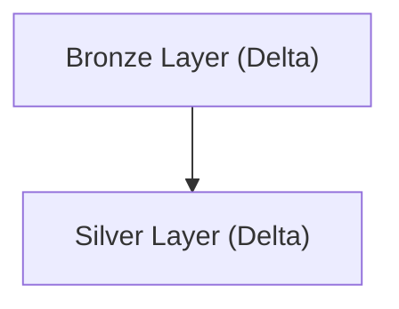
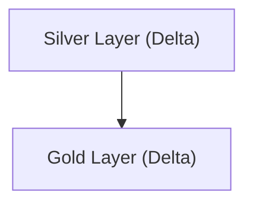
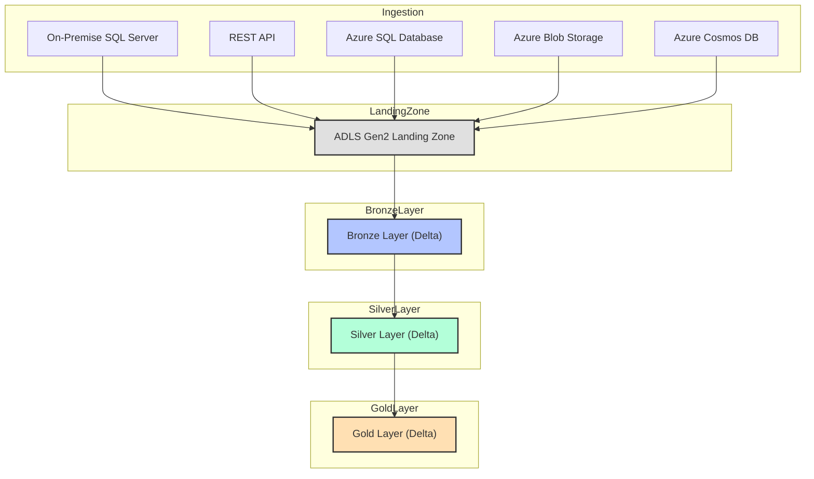

# Healthcare Claims Data Processing System

## Project Overview

This project establishes a scalable and secure healthcare claims data processing system on Microsoft Azure. The solution is engineered to ingest, process, and analyze claims data from multiple sources, ensuring accuracy, compliance, and timely reimbursement cycles. The architecture supports both batch and real-time processing, enabling healthcare providers and payers to streamline operations and gain actionable insights from claims data.

## Data Sources

The system integrates five primary data sources:

1. **On-Premise SQL Server**: Core claims data and patient records are sourced from an on-premise SQL Server, ensuring integration with legacy healthcare systems.
2. **REST API**: Insurance policy updates and external provider data are ingested via secure REST APIs.
3. **Azure SQL Database**: Internal audit logs and claims adjudication results are stored in Azure SQL, providing structured, cloud-native data.
4. **Azure Blob Storage**: Scanned claim forms, supporting documents, and batch uploads are stored in Azure Blob Storage for further processing.
5. **Azure Cosmos DB**: Real-time claim status updates and event streams are captured in Azure Cosmos DB, supporting high-velocity data ingestion.

## Azure Data Factory (ADF) for Ingestion and Orchestration

Azure Data Factory orchestrates the ingestion of data from all sources. The Self-Hosted Integration Runtime enables secure extraction from on-premise SQL Server, while native connectors and REST activities handle cloud and API sources. ADF pipelines manage data movement, scheduling, and error handling, ensuring reliable and auditable workflows.

## Data Lake Storage with Delta Format

All ingested data is stored in Azure Data Lake Storage Gen2, organized into Bronze, Silver, and Gold layers using Delta Lake:

- **Bronze Layer**: Raw claims data, documents, and logs are stored as-is, preserving original fidelity for traceability.
- **Silver Layer**: Data is cleansed, deduplicated, and enriched with policy and provider metadata. Business logic is applied to validate claims and standardize formats.
- **Gold Layer**: Curated datasets are prepared for advanced analytics, reporting, and machine learning.

Delta Lake provides ACID compliance, time travel for historical analysis, and schema enforcement, ensuring data quality and regulatory compliance.

## Data Processing with Azure Databricks

Azure Databricks notebooks (PySpark) process and transform data between layers. In the Silver Layer, claims are validated, duplicates are removed, and records are enriched with policy and provider data. Aggregations and fraud detection models are applied in the Gold Layer, supporting advanced analytics and reporting.

## Azure Synapse Analytics for Reporting

Curated Gold Layer data is loaded into Azure Synapse Analytics, where it is modeled for claims dashboards and regulatory reporting. Synapse provides scalable analytics, supporting both ad-hoc queries and scheduled reports for healthcare administrators and payers.

## Power BI for Visualization

Power BI connects to Synapse Analytics, enabling interactive dashboards for claims processing, reimbursement cycles, and compliance tracking. Real-time data refreshes ensure that stakeholders have up-to-date insights for decision-making.

## High-Level Architecture Flow

1. Data is ingested from on-premise SQL Server (via Self-Hosted IR), REST APIs, Azure SQL, Blob Storage, and Cosmos DB using ADF.
2. Raw data lands in the Bronze Layer of ADLS Gen2 (Delta Lake).
3. Azure Databricks processes data into Silver (cleansed, validated) and Gold (curated, aggregated) layers.
4. Gold Layer data is loaded into Azure Synapse Analytics for reporting.
5. Power BI dashboards provide real-time analytics and insights for healthcare stakeholders.

## Delta Lake Advantages

Delta Lake ensures data reliability with ACID transactions, supports historical analysis with time travel, and enforces schema consistency. These features are critical for healthcare claims processing, where data integrity and compliance are paramount.

## Scalability, Real-Time Analytics, and Business Insights

The system is designed for scalability, supporting large volumes of claims and high-frequency data streams. Real-time analytics enable proactive fraud detection and operational efficiency. Power BI delivers actionable insights, improving reimbursement cycles and compliance in healthcare organizations. 

## Azure Databricks Workflow: End-to-End Data Movement and Transformation

### Overview
This section details the full Azure Databricks workflow for ingesting healthcare claims data from five sources, landing it in ADLS Gen2, and transforming it through Bronze, Silver, and Gold layers using PySpark. Each stage includes code samples, flow diagrams, and explanations for best practices and architectural decisions.

---

### 1. Ingestion to Landing Zone (ADLS Gen2)

All five sources are ingested into a raw landing zone in ADLS Gen2. This is typically done using Databricks notebooks scheduled via jobs or orchestrated by ADF, but here we focus on the Databricks code.

#### PySpark Example: Ingesting from Multiple Sources
```python
from pyspark.sql import SparkSession
import requests

spark = SparkSession.builder.getOrCreate()

# On-Premise SQL Server (claims data)
sql_server_df = spark.read.format("jdbc").option("url", "jdbc:sqlserver://<server>:1433;databaseName=<db>") \
    .option("user", "<user>").option("password", "<password>") \
    .option("dbtable", "dbo.Claims").load()
sql_server_df.write.mode("overwrite").parquet("abfss://landing@<storage_account>.dfs.core.windows.net/sqlserver/")

# REST API (insurance policy updates)
api_url = "https://api.insurance.com/policies"
api_data = requests.get(api_url).json()
api_df = spark.createDataFrame(api_data)
api_df.write.mode("overwrite").parquet("abfss://landing@<storage_account>.dfs.core.windows.net/api/")

# Azure SQL Database (audit logs)
az_sql_df = spark.read.format("jdbc").option("url", "jdbc:sqlserver://<azuresqlserver>.database.windows.net:1433;databaseName=<db>") \
    .option("user", "<user>").option("password", "<password>") \
    .option("dbtable", "dbo.AuditLogs").load()
az_sql_df.write.mode("overwrite").parquet("abfss://landing@<storage_account>.dfs.core.windows.net/azuresql/")

# Azure Blob Storage (scanned claim forms)
blob_df = spark.read.format("binaryFile").load("abfss://data@<storage_account>.dfs.core.windows.net/forms/")
blob_df.write.mode("overwrite").parquet("abfss://landing@<storage_account>.dfs.core.windows.net/blob/")

# Azure Cosmos DB (claim status events)
cosmos_df = spark.read.format("cosmos.oltp").options(
    endpoint="<cosmos_endpoint>",
    key="<cosmos_key>",
    database="<db>",
    container="events"
).load()
cosmos_df.write.mode("overwrite").parquet("abfss://landing@<storage_account>.dfs.core.windows.net/cosmos/")
```

**Reasoning:**
- Using PySpark for all sources ensures scalability and parallelism.
- Data is written in Parquet format for efficient storage and downstream processing.
- Each source lands in a separate folder for traceability and schema evolution.

---

### 2. Landing Zone to Bronze Layer (Delta Lake)

The next step is to convert raw landing data into Delta format in the Bronze layer. This preserves raw data but enables ACID transactions and schema enforcement.

#### Flow Diagram: Ingestion to Bronze


#### PySpark Example: Convert to Delta Bronze
```python
from delta.tables import DeltaTable

landing_path = "abfss://landing@<storage_account>.dfs.core.windows.net/sqlserver/"
bronze_path = "abfss://bronze@<storage_account>.dfs.core.windows.net/sqlserver/"

raw_df = spark.read.parquet(landing_path)
raw_df.write.format("delta").mode("overwrite").save(bronze_path)
# Repeat for other sources...
```

**Reasoning:**
- Delta format enables ACID compliance, time travel, and scalable upserts.
- Keeping Bronze as a near-raw copy supports traceability and reprocessing.

---

### 3. Bronze to Silver Layer (Cleansing, Deduplication)

The Silver layer applies business logic, deduplication, and joins with reference data.

#### Flow Diagram: Bronze to Silver


#### PySpark Example: Cleansing and Deduplication
```python
bronze_path = "abfss://bronze@<storage_account>.dfs.core.windows.net/sqlserver/"
silver_path = "abfss://silver@<storage_account>.dfs.core.windows.net/claims/"

bronze_df = spark.read.format("delta").load(bronze_path)

# Deduplicate by claim_id
silver_df = bronze_df.dropDuplicates(["claim_id"])

# Enrich with policy data
policy_df = spark.read.format("delta").load("abfss://bronze@<storage_account>.dfs.core.windows.net/api/")
silver_df = silver_df.join(policy_df, "policy_id", "left")

silver_df.write.format("delta").mode("overwrite").save(silver_path)
```

**Reasoning:**
- Deduplication ensures data quality for downstream analytics.
- Enrichment with policy data supports claims validation and compliance.

---

### 4. Silver to Gold Layer (Aggregation, Business Metrics)

The Gold layer contains curated, business-ready data for reporting and analytics.

#### Flow Diagram: Silver to Gold


#### PySpark Example: Aggregation and Curation
```python
silver_path = "abfss://silver@<storage_account>.dfs.core.windows.net/claims/"
gold_path = "abfss://gold@<storage_account>.dfs.core.windows.net/claims_reports/"

silver_df = spark.read.format("delta").load(silver_path)

# Aggregate by provider and month
from pyspark.sql.functions import month, year

gold_df = silver_df.groupBy("provider_id", year("claim_date").alias("year"), month("claim_date").alias("month")) \
    .agg({"amount": "sum", "claim_id": "count"}) \
    .withColumnRenamed("sum(amount)", "total_claimed") \
    .withColumnRenamed("count(claim_id)", "claim_count")

gold_df.write.format("delta").mode("overwrite").save(gold_path)
```

**Reasoning:**
- Aggregation prepares data for efficient reporting in Synapse and Power BI.
- Gold layer is optimized for business consumption and regulatory audits.

---

### 5. Why This Approach?
- **Delta Lake**: Ensures ACID compliance, time travel, and schema enforcement, which are critical for healthcare claims data.
- **Layered Architecture**: Supports traceability, reprocessing, and data quality at each stage.
- **PySpark**: Enables scalable, distributed processing for large healthcare datasets.

---

### Full Workflow Diagram


---

Repeat this workflow for each project, adapting the business logic, enrichment, and aggregation steps to the specific domain and reporting requirements. 

---

## Azure Data Factory (ADF) Pipeline Example: Bulk Table Movement

To efficiently move 30 tables, each approximately 1GB (total 30GB), from a source (e.g., on-premise SQL Server) to a destination (e.g., ADLS Gen2 or Azure SQL), you can use an ADF pipeline with parameterized copy activities. Below is an example of how you might structure this in ADF, along with a sample JSON pipeline definition.

### Explanation
- The pipeline uses a parameterized dataset and a ForEach activity to iterate over a list of table names.
- Each iteration triggers a Copy activity that moves one table from the source to the destination.
- This approach is scalable, maintainable, and suitable for large-scale data movement.

### Sample ADF Pipeline JSON
```json
{
  "name": "BulkTableCopyPipeline",
  "properties": {
    "activities": [
      {
        "name": "ForEachTable",
        "type": "ForEach",
        "typeProperties": {
          "items": "@pipeline().parameters.tableList",
          "activities": [
            {
              "name": "CopyTable",
              "type": "Copy",
              "inputs": [
                {
                  "referenceName": "SourceTableDataset",
                  "type": "DatasetReference",
                  "parameters": {
                    "TableName": "@item()"
                  }
                }
              ],
              "outputs": [
                {
                  "referenceName": "DestinationTableDataset",
                  "type": "DatasetReference",
                  "parameters": {
                    "TableName": "@item()"
                  }
                }
              ],
              "typeProperties": {
                "source": {
                  "type": "SqlSource"
                },
                "sink": {
                  "type": "AzureBlobSink"
                }
              }
            }
          ]
        }
      }
    ],
    "parameters": {
      "tableList": {
        "type": "Array",
        "defaultValue": [
          "Table1", "Table2", "Table3", "Table4", "Table5", "Table6", "Table7", "Table8", "Table9", "Table10",
          "Table11", "Table12", "Table13", "Table14", "Table15", "Table16", "Table17", "Table18", "Table19", "Table20",
          "Table21", "Table22", "Table23", "Table24", "Table25", "Table26", "Table27", "Table28", "Table29", "Table30"
        ]
      }
    }
  }
}
```

**How to Use:**
- Replace `SourceTableDataset` and `DestinationTableDataset` with your actual dataset names.
- The dataset definitions should be parameterized to accept a table name.
- This pipeline can be triggered manually or on a schedule, and will efficiently move all 30 tables in parallel or sequentially as configured. 