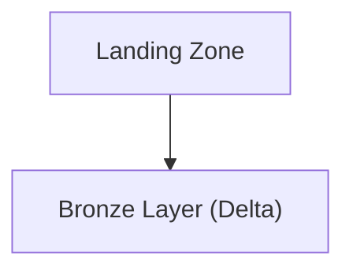
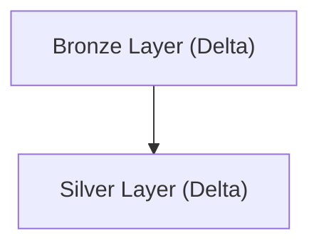
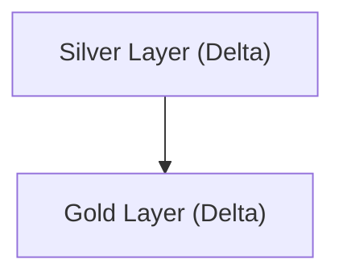
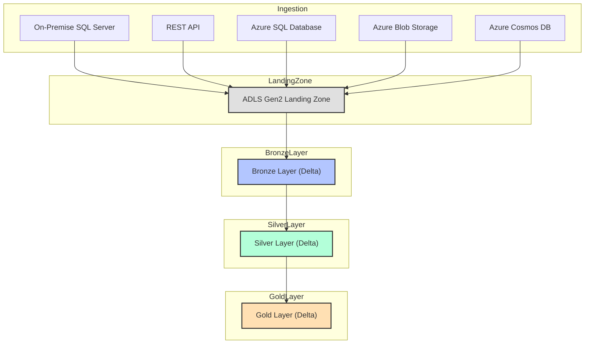

# Omni-Channel Retail Data Platform Migration

## Project Overview

This project focuses on migrating and modernizing an omni-channel retail data platform using Microsoft Azure. The solution is designed to seamlessly integrate data from various retail channels, both online and offline, and provide a unified, scalable, and analytics-ready environment. The architecture supports real-time and batch data processing, enabling retailers to gain a holistic view of their operations and customer interactions.

## Data Sources

The migration incorporates five primary data sources:

1. **On-Premise SQL Server**: Legacy point-of-sale (POS) and inventory data are sourced from an on-premise SQL Server, ensuring continuity with existing systems.
2. **REST API**: Online order and customer engagement data are ingested via secure REST APIs from e-commerce platforms.
3. **Azure SQL Database**: Loyalty program and marketing campaign data are stored in Azure SQL, providing structured, cloud-native datasets.
4. **Azure Blob Storage**: Transaction logs, receipts, and batch uploads are stored in Azure Blob Storage for further processing.
5. **Azure Cosmos DB**: Real-time clickstream and customer journey data are captured in Azure Cosmos DB, supporting high-velocity data ingestion.

## Azure Data Factory (ADF) for Ingestion and Orchestration

Azure Data Factory orchestrates the migration and ingestion of data from all sources. The Self-Hosted Integration Runtime enables secure extraction from on-premise SQL Server, while native connectors and REST activities handle cloud and API sources. ADF pipelines manage data movement, transformation, and error handling, ensuring a smooth migration process.

## Data Lake Storage with Delta Format

All ingested data is stored in Azure Data Lake Storage Gen2, organized into Bronze, Silver, and Gold layers using Delta Lake:

- **Bronze Layer**: Raw data from all channels is stored as-is, preserving original fidelity for traceability.
- **Silver Layer**: Data is cleansed, deduplicated, and enriched with channel and customer metadata. Business logic is applied to standardize formats and validate transactions.
- **Gold Layer**: Curated datasets are prepared for advanced analytics, reporting, and machine learning.

Delta Lake provides ACID compliance, time travel for historical analysis, and schema enforcement, ensuring data quality and consistency throughout the migration.

## Data Processing with Azure Databricks

Azure Databricks notebooks (PySpark) process and transform data between layers. In the Silver Layer, transactions are validated, duplicates are removed, and records are enriched with channel and customer data. Aggregations and trend analyses are performed in the Gold Layer, supporting advanced analytics and reporting.

## Azure Synapse Analytics for Reporting

Curated Gold Layer data is loaded into Azure Synapse Analytics, where it is modeled for omni-channel dashboards and operational reporting. Synapse provides scalable analytics, supporting both ad-hoc queries and scheduled reports for retail managers and analysts.

## Power BI for Visualization

Power BI connects to Synapse Analytics, enabling interactive dashboards for sales performance, customer engagement, and inventory management. Real-time data refreshes ensure that retailers have up-to-date insights for decision-making.

## High-Level Architecture Flow

1. Data is ingested from on-premise SQL Server (via Self-Hosted IR), REST APIs, Azure SQL, Blob Storage, and Cosmos DB using ADF.
2. Raw data lands in the Bronze Layer of ADLS Gen2 (Delta Lake).
3. Azure Databricks processes data into Silver (cleansed, validated) and Gold (curated, aggregated) layers.
4. Gold Layer data is loaded into Azure Synapse Analytics for reporting.
5. Power BI dashboards provide real-time analytics and business insights for omni-channel retail operations.

## Delta Lake Advantages

Delta Lake ensures data reliability with ACID transactions, supports historical analysis with time travel, and enforces schema consistency. These features are critical for data migration, where data quality and traceability are essential.

## Scalability, Real-Time Analytics, and Business Insights

The solution is designed for scalability, supporting large volumes of transactions and high-frequency data streams. Real-time analytics enable rapid response to market trends and operational challenges. Power BI delivers actionable insights, improving decision-making and customer experience in the retail sector. 

## Azure Databricks Workflow: End-to-End Data Movement and Transformation

### Overview
This section details the full Azure Databricks workflow for ingesting omni-channel retail data from five sources, landing it in ADLS Gen2, and transforming it through Bronze, Silver, and Gold layers using PySpark. Each stage includes code samples, flow diagrams, and explanations for best practices and architectural decisions.

---

### 1. Ingestion to Landing Zone (ADLS Gen2)

All five sources are ingested into a raw landing zone in ADLS Gen2. This is typically done using Databricks notebooks scheduled via jobs or orchestrated by ADF, but here we focus on the Databricks code.

#### PySpark Example: Ingesting from Multiple Sources
```python
from pyspark.sql import SparkSession
import requests

spark = SparkSession.builder.getOrCreate()

# On-Premise SQL Server (POS data)
sql_server_df = spark.read.format("jdbc").option("url", "jdbc:sqlserver://<server>:1433;databaseName=<db>") \
    .option("user", "<user>").option("password", "<password>") \
    .option("dbtable", "dbo.POS").load()
sql_server_df.write.mode("overwrite").parquet("abfss://landing@<storage_account>.dfs.core.windows.net/sqlserver/")

# REST API (online orders)
api_url = "https://api.ecommerce.com/orders"
api_data = requests.get(api_url).json()
api_df = spark.createDataFrame(api_data)
api_df.write.mode("overwrite").parquet("abfss://landing@<storage_account>.dfs.core.windows.net/api/")

# Azure SQL Database (loyalty data)
az_sql_df = spark.read.format("jdbc").option("url", "jdbc:sqlserver://<azuresqlserver>.database.windows.net:1433;databaseName=<db>") \
    .option("user", "<user>").option("password", "<password>") \
    .option("dbtable", "dbo.Loyalty").load()
az_sql_df.write.mode("overwrite").parquet("abfss://landing@<storage_account>.dfs.core.windows.net/azuresql/")

# Azure Blob Storage (transaction logs)
blob_df = spark.read.text("abfss://data@<storage_account>.dfs.core.windows.net/logs/")
blob_df.write.mode("overwrite").parquet("abfss://landing@<storage_account>.dfs.core.windows.net/blob/")

# Azure Cosmos DB (clickstream)
cosmos_df = spark.read.format("cosmos.oltp").options(
    endpoint="<cosmos_endpoint>",
    key="<cosmos_key>",
    database="<db>",
    container="clickstream"
).load()
cosmos_df.write.mode("overwrite").parquet("abfss://landing@<storage_account>.dfs.core.windows.net/cosmos/")
```

**Reasoning:**
- Using PySpark for all sources ensures scalability and parallelism.
- Data is written in Parquet format for efficient storage and downstream processing.
- Each source lands in a separate folder for traceability and schema evolution.

---

### 2. Landing Zone to Bronze Layer (Delta Lake)

The next step is to convert raw landing data into Delta format in the Bronze layer. This preserves raw data but enables ACID transactions and schema enforcement.

#### Flow Diagram: Ingestion to Bronze


#### PySpark Example: Convert to Delta Bronze
```python
from delta.tables import DeltaTable

landing_path = "abfss://landing@<storage_account>.dfs.core.windows.net/sqlserver/"
bronze_path = "abfss://bronze@<storage_account>.dfs.core.windows.net/sqlserver/"

raw_df = spark.read.parquet(landing_path)
raw_df.write.format("delta").mode("overwrite").save(bronze_path)
# Repeat for other sources...
```

**Reasoning:**
- Delta format enables ACID compliance, time travel, and scalable upserts.
- Keeping Bronze as a near-raw copy supports traceability and reprocessing.

---

### 3. Bronze to Silver Layer (Cleansing, Deduplication)

The Silver layer applies business logic, deduplication, and joins with reference data.

#### Flow Diagram: Bronze to Silver


#### PySpark Example: Cleansing and Deduplication
```python
bronze_path = "abfss://bronze@<storage_account>.dfs.core.windows.net/api/"
silver_path = "abfss://silver@<storage_account>.dfs.core.windows.net/orders/"

bronze_df = spark.read.format("delta").load(bronze_path)

# Deduplicate by order_id
silver_df = bronze_df.dropDuplicates(["order_id"])

# Enrich with loyalty data
loyalty_df = spark.read.format("delta").load("abfss://bronze@<storage_account>.dfs.core.windows.net/azuresql/")
silver_df = silver_df.join(loyalty_df, "customer_id", "left")

silver_df.write.format("delta").mode("overwrite").save(silver_path)
```

**Reasoning:**
- Deduplication ensures data quality for downstream analytics.
- Enrichment with loyalty data supports customer analytics and segmentation.

---

### 4. Silver to Gold Layer (Aggregation, Business Metrics)

The Gold layer contains curated, business-ready data for reporting and analytics.

#### Flow Diagram: Silver to Gold


#### PySpark Example: Aggregation and Curation
```python
silver_path = "abfss://silver@<storage_account>.dfs.core.windows.net/orders/"
gold_path = "abfss://gold@<storage_account>.dfs.core.windows.net/omnichannel_reports/"

silver_df = spark.read.format("delta").load(silver_path)

# Aggregate by channel and month
from pyspark.sql.functions import month, year

gold_df = silver_df.groupBy("channel", year("order_date").alias("year"), month("order_date").alias("month")) \
    .agg({"order_id": "count", "amount": "sum"}) \
    .withColumnRenamed("count(order_id)", "order_count") \
    .withColumnRenamed("sum(amount)", "total_sales")

gold_df.write.format("delta").mode("overwrite").save(gold_path)
```

**Reasoning:**
- Aggregation prepares data for efficient reporting in Synapse and Power BI.
- Gold layer is optimized for business consumption and omni-channel analytics.

---

### 5. Why This Approach?
- **Delta Lake**: Ensures ACID compliance, time travel, and schema enforcement, which are critical for retail analytics.
- **Layered Architecture**: Supports traceability, reprocessing, and data quality at each stage.
- **PySpark**: Enables scalable, distributed processing for large omni-channel datasets.

---

### Full Workflow Diagram


---

Repeat this workflow for each project, adapting the business logic, enrichment, and aggregation steps to the specific domain and reporting requirements. 