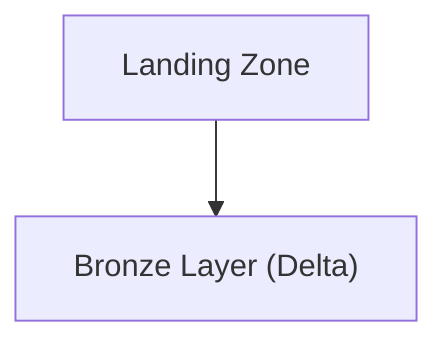
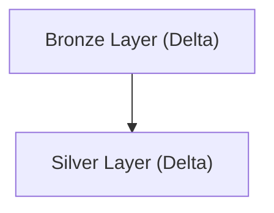
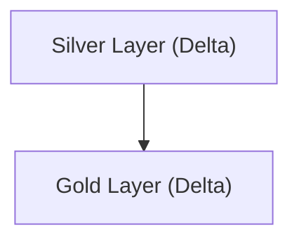
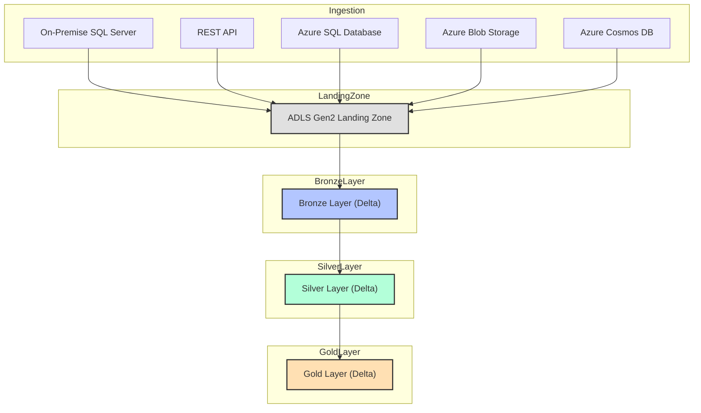

# Retail Domain: Customer Sentiment Analysis from Product Reviews

## Project Overview

This project implements a comprehensive customer sentiment analysis solution for retail product reviews, leveraging the Microsoft Azure platform. The solution is designed to ingest, process, and analyze large volumes of unstructured and structured data from multiple sources, providing retailers with actionable insights into customer opinions, product performance, and market trends. The architecture supports both batch and real-time analytics, enabling rapid response to customer feedback and competitive dynamics.

## Data Sources

The solution integrates five key data sources:

1. **On-Premise SQL Server**: Historical sales data and customer profiles are sourced from an on-premise SQL Server, ensuring integration with legacy retail systems.
2. **REST API**: Product review data from e-commerce platforms and social media is ingested via secure REST APIs.
3. **Azure SQL Database**: Product catalog and inventory data are stored in Azure SQL, providing structured, cloud-native datasets.
4. **Azure Blob Storage**: Raw review text files, images, and batch uploads are stored in Azure Blob Storage for further analysis.
5. **Azure Cosmos DB**: Real-time customer interaction streams and feedback are captured in Azure Cosmos DB, supporting high-velocity data ingestion.

## Azure Data Factory (ADF) for Ingestion and Orchestration

Azure Data Factory orchestrates the ingestion of data from all sources. The Self-Hosted Integration Runtime enables secure extraction from on-premise SQL Server, while native connectors and REST activities handle cloud and API sources. ADF pipelines manage data movement, scheduling, and error handling, ensuring reliable and auditable workflows.

## Data Lake Storage with Delta Format

All ingested data is stored in Azure Data Lake Storage Gen2, organized into Bronze, Silver, and Gold layers using Delta Lake:

- **Bronze Layer**: Raw review data, sales records, and interaction logs are stored as-is, preserving original fidelity for traceability.
- **Silver Layer**: Data is cleansed, deduplicated, and enriched with product and customer metadata. Business logic is applied to standardize formats and validate reviews.
- **Gold Layer**: Curated datasets are prepared for advanced analytics, sentiment scoring, and reporting.

Delta Lake provides ACID compliance, time travel for historical analysis, and schema enforcement, ensuring data quality and consistency.

## Data Processing with Azure Databricks

Azure Databricks notebooks (PySpark) process and transform data between layers. In the Silver Layer, review text is cleaned, sentiment analysis models are applied, and records are enriched with product and customer data. Aggregations and trend analyses are performed in the Gold Layer, supporting advanced analytics and reporting.

## Azure Synapse Analytics for Reporting

Curated Gold Layer data is loaded into Azure Synapse Analytics, where it is modeled for sentiment dashboards and product performance reporting. Synapse provides scalable analytics, supporting both ad-hoc queries and scheduled reports for retail analysts and managers.

## Power BI for Visualization

Power BI connects to Synapse Analytics, enabling interactive dashboards for sentiment trends, product feedback, and customer satisfaction. Real-time data refreshes ensure that retailers have up-to-date insights for decision-making.

## High-Level Architecture Flow

1. Data is ingested from on-premise SQL Server (via Self-Hosted IR), REST APIs, Azure SQL, Blob Storage, and Cosmos DB using ADF.
2. Raw data lands in the Bronze Layer of ADLS Gen2 (Delta Lake).
3. Azure Databricks processes data into Silver (cleansed, analyzed) and Gold (curated, aggregated) layers.
4. Gold Layer data is loaded into Azure Synapse Analytics for reporting.
5. Power BI dashboards provide real-time sentiment analysis and business insights for retail stakeholders.

## Delta Lake Advantages

Delta Lake ensures data reliability with ACID transactions, supports historical analysis with time travel, and enforces schema consistency. These features are critical for sentiment analysis, where data quality and traceability are essential.

## Scalability, Real-Time Analytics, and Business Insights

The solution is designed for scalability, supporting large volumes of reviews and high-frequency data streams. Real-time analytics enable rapid response to customer feedback and market trends. Power BI delivers actionable insights, improving product development and customer satisfaction in the retail sector. 

## Azure Databricks Workflow: End-to-End Data Movement and Transformation

### Overview
This section details the full Azure Databricks workflow for ingesting retail product review and sentiment data from five sources, landing it in ADLS Gen2, and transforming it through Bronze, Silver, and Gold layers using PySpark. Each stage includes code samples, flow diagrams, and explanations for best practices and architectural decisions.

---

### 1. Ingestion to Landing Zone (ADLS Gen2)

All five sources are ingested into a raw landing zone in ADLS Gen2. This is typically done using Databricks notebooks scheduled via jobs or orchestrated by ADF, but here we focus on the Databricks code.

#### PySpark Example: Ingesting from Multiple Sources
```python
from pyspark.sql import SparkSession
import requests

spark = SparkSession.builder.getOrCreate()

# On-Premise SQL Server (sales data)
sql_server_df = spark.read.format("jdbc").option("url", "jdbc:sqlserver://<server>:1433;databaseName=<db>") \
    .option("user", "<user>").option("password", "<password>") \
    .option("dbtable", "dbo.Sales").load()
sql_server_df.write.mode("overwrite").parquet("abfss://landing@<storage_account>.dfs.core.windows.net/sqlserver/")

# REST API (product reviews)
api_url = "https://api.ecommerce.com/reviews"
api_data = requests.get(api_url).json()
api_df = spark.createDataFrame(api_data)
api_df.write.mode("overwrite").parquet("abfss://landing@<storage_account>.dfs.core.windows.net/api/")

# Azure SQL Database (product catalog)
az_sql_df = spark.read.format("jdbc").option("url", "jdbc:sqlserver://<azuresqlserver>.database.windows.net:1433;databaseName=<db>") \
    .option("user", "<user>").option("password", "<password>") \
    .option("dbtable", "dbo.Products").load()
az_sql_df.write.mode("overwrite").parquet("abfss://landing@<storage_account>.dfs.core.windows.net/azuresql/")

# Azure Blob Storage (review text files)
blob_df = spark.read.text("abfss://data@<storage_account>.dfs.core.windows.net/reviews/")
blob_df.write.mode("overwrite").parquet("abfss://landing@<storage_account>.dfs.core.windows.net/blob/")

# Azure Cosmos DB (customer interactions)
cosmos_df = spark.read.format("cosmos.oltp").options(
    endpoint="<cosmos_endpoint>",
    key="<cosmos_key>",
    database="<db>",
    container="interactions"
).load()
cosmos_df.write.mode("overwrite").parquet("abfss://landing@<storage_account>.dfs.core.windows.net/cosmos/")
```

**Reasoning:**
- Using PySpark for all sources ensures scalability and parallelism.
- Data is written in Parquet format for efficient storage and downstream processing.
- Each source lands in a separate folder for traceability and schema evolution.

---

### 2. Landing Zone to Bronze Layer (Delta Lake)

The next step is to convert raw landing data into Delta format in the Bronze layer. This preserves raw data but enables ACID transactions and schema enforcement.

#### Flow Diagram: Ingestion to Bronze


#### PySpark Example: Convert to Delta Bronze
```python
from delta.tables import DeltaTable

landing_path = "abfss://landing@<storage_account>.dfs.core.windows.net/sqlserver/"
bronze_path = "abfss://bronze@<storage_account>.dfs.core.windows.net/sqlserver/"

raw_df = spark.read.parquet(landing_path)
raw_df.write.format("delta").mode("overwrite").save(bronze_path)
# Repeat for other sources...
```

**Reasoning:**
- Delta format enables ACID compliance, time travel, and scalable upserts.
- Keeping Bronze as a near-raw copy supports traceability and reprocessing.

---

### 3. Bronze to Silver Layer (Cleansing, Deduplication, Enrichment)

The Silver layer applies business logic, deduplication, and joins with reference data.

#### Flow Diagram: Bronze to Silver


#### PySpark Example: Cleansing and Deduplication
```python
bronze_path = "abfss://bronze@<storage_account>.dfs.core.windows.net/api/"
silver_path = "abfss://silver@<storage_account>.dfs.core.windows.net/reviews/"

bronze_df = spark.read.format("delta").load(bronze_path)

# Deduplicate by review_id
silver_df = bronze_df.dropDuplicates(["review_id"])

# Enrich with product catalog
goods_df = spark.read.format("delta").load("abfss://bronze@<storage_account>.dfs.core.windows.net/azuresql/")
silver_df = silver_df.join(goods_df, "product_id", "left")

silver_df.write.format("delta").mode("overwrite").save(silver_path)
```

**Reasoning:**
- Deduplication ensures data quality for downstream analytics.
- Enrichment with product catalog supports sentiment analysis and product insights.

---

### 4. Silver to Gold Layer (Aggregation, Sentiment Scoring)

The Gold layer contains curated, business-ready data for reporting and analytics.

#### Flow Diagram: Silver to Gold


#### PySpark Example: Sentiment Aggregation and Curation
```python
silver_path = "abfss://silver@<storage_account>.dfs.core.windows.net/reviews/"
gold_path = "abfss://gold@<storage_account>.dfs.core.windows.net/sentiment/"

silver_df = spark.read.format("delta").load(silver_path)

# Example: Sentiment scoring (dummy function)
def sentiment_score(text):
    # Replace with actual ML model or UDF
    return 1 if "good" in text.lower() else -1

from pyspark.sql.functions import udf
from pyspark.sql.types import IntegerType

sentiment_udf = udf(sentiment_score, IntegerType())
silver_df = silver_df.withColumn("sentiment", sentiment_udf(silver_df["review_text"]))

# Aggregate by product
from pyspark.sql.functions import avg, count

gold_df = silver_df.groupBy("product_id").agg(avg("sentiment").alias("avg_sentiment"), count("review_id").alias("review_count"))
gold_df.write.format("delta").mode("overwrite").save(gold_path)
```

**Reasoning:**
- Sentiment scoring enables actionable insights for product teams.
- Aggregation prepares data for efficient reporting in Synapse and Power BI.
- Gold layer is optimized for business consumption and trend analysis.

---

### 5. Why This Approach?
- **Delta Lake**: Ensures ACID compliance, time travel, and schema enforcement, which are critical for retail analytics.
- **Layered Architecture**: Supports traceability, reprocessing, and data quality at each stage.
- **PySpark**: Enables scalable, distributed processing for large review datasets.

---

### Full Workflow Diagram


---

Repeat this workflow for each project, adapting the business logic, enrichment, and aggregation steps to the specific domain and reporting requirements. 