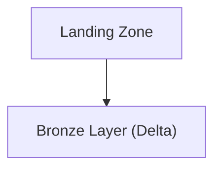
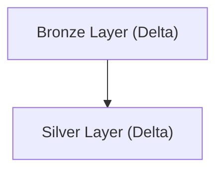
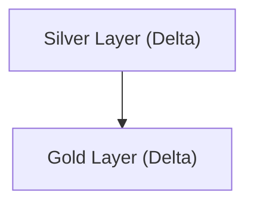
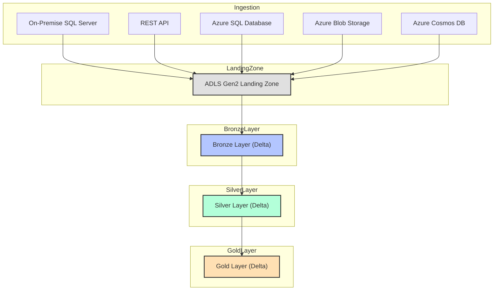

# Supply Chain Domain: Supplier Performance Scorecard Data Mart

## Project Overview

This project delivers a comprehensive Supplier Performance Scorecard Data Mart for the supply chain domain, leveraging Microsoft Azure’s data engineering capabilities. The solution is designed to aggregate, process, and analyze supplier performance data from multiple sources, enabling organizations to monitor, evaluate, and optimize supplier relationships. The architecture supports both batch and real-time analytics, providing actionable insights for procurement and supply chain management teams.

## Data Sources

The data mart integrates five essential data sources:

1. **On-Premise SQL Server**: Core supplier master data and historical performance metrics are sourced from an on-premise SQL Server, ensuring integration with legacy ERP systems.
2. **REST API**: External supplier risk ratings and compliance data are ingested via secure REST APIs from third-party providers.
3. **Azure SQL Database**: Internal procurement transactions and contract data are stored in Azure SQL, providing structured, cloud-native datasets.
4. **Azure Blob Storage**: Batch uploads of supplier scorecards, audit documents, and supporting files are stored in Azure Blob Storage for further analysis.
5. **Azure Cosmos DB**: Real-time event streams, such as delivery status updates and incident reports, are captured in Azure Cosmos DB, supporting high-velocity data ingestion.

## Azure Data Factory (ADF) for Ingestion and Orchestration

Azure Data Factory orchestrates the ingestion of data from all sources. The Self-Hosted Integration Runtime enables secure extraction from on-premise SQL Server, while native connectors and REST activities handle cloud and API sources. ADF pipelines manage data movement, scheduling, and error handling, ensuring reliable and auditable workflows.

## Data Lake Storage with Delta Format

All ingested data is stored in Azure Data Lake Storage Gen2, organized into Bronze, Silver, and Gold layers using Delta Lake:

- **Bronze Layer**: Raw supplier data, risk ratings, and event logs are stored as-is, preserving original fidelity for traceability.
- **Silver Layer**: Data is cleansed, deduplicated, and enriched with contract and performance metadata. Business logic is applied to standardize formats and validate records.
- **Gold Layer**: Curated datasets are prepared for advanced analytics, supplier scorecarding, and reporting.

Delta Lake provides ACID compliance, time travel for historical analysis, and schema enforcement, ensuring data quality and consistency.

## Data Processing with Azure Databricks

Azure Databricks notebooks (PySpark) process and transform data between layers. In the Silver Layer, supplier records are validated, duplicates are removed, and data is enriched with risk and contract information. Aggregations and performance scoring models are applied in the Gold Layer, supporting advanced analytics and reporting.

## Azure Synapse Analytics for Reporting

Curated Gold Layer data is loaded into Azure Synapse Analytics, where it is modeled for supplier performance dashboards and operational reporting. Synapse provides scalable analytics, supporting both ad-hoc queries and scheduled reports for procurement and supply chain managers.

## Power BI for Visualization

Power BI connects to Synapse Analytics, enabling interactive dashboards for supplier performance, risk monitoring, and compliance tracking. Real-time data refreshes ensure that stakeholders have up-to-date insights for decision-making.

## High-Level Architecture Flow

1. Data is ingested from on-premise SQL Server (via Self-Hosted IR), REST APIs, Azure SQL, Blob Storage, and Cosmos DB using ADF.
2. Raw data lands in the Bronze Layer of ADLS Gen2 (Delta Lake).
3. Azure Databricks processes data into Silver (cleansed, validated) and Gold (curated, scored) layers.
4. Gold Layer data is loaded into Azure Synapse Analytics for reporting.
5. Power BI dashboards provide real-time analytics and business insights for supplier management.

## Delta Lake Advantages

Delta Lake ensures data reliability with ACID transactions, supports historical analysis with time travel, and enforces schema consistency. These features are critical for supplier performance management, where data quality and traceability are essential.

## Scalability, Real-Time Analytics, and Business Insights

The solution is designed for scalability, supporting large volumes of supplier data and high-frequency event streams. Real-time analytics enable rapid response to supplier issues and performance trends. Power BI delivers actionable insights, improving supplier relationships and operational efficiency in the supply chain domain. 

## Azure Databricks Workflow: End-to-End Data Movement and Transformation

### Overview
This section details the full Azure Databricks workflow for ingesting supplier performance and supply chain data from five sources, landing it in ADLS Gen2, and transforming it through Bronze, Silver, and Gold layers using PySpark. Each stage includes code samples, flow diagrams, and explanations for best practices and architectural decisions.

---

### 1. Ingestion to Landing Zone (ADLS Gen2)

All five sources are ingested into a raw landing zone in ADLS Gen2. This is typically done using Databricks notebooks scheduled via jobs or orchestrated by ADF, but here we focus on the Databricks code.

#### PySpark Example: Ingesting from Multiple Sources
```python
from pyspark.sql import SparkSession
import requests

spark = SparkSession.builder.getOrCreate()

# On-Premise SQL Server (supplier master data)
sql_server_df = spark.read.format("jdbc").option("url", "jdbc:sqlserver://<server>:1433;databaseName=<db>") \
    .option("user", "<user>").option("password", "<password>") \
    .option("dbtable", "dbo.Suppliers").load()
sql_server_df.write.mode("overwrite").parquet("abfss://landing@<storage_account>.dfs.core.windows.net/sqlserver/")

# REST API (supplier risk ratings)
api_url = "https://api.supplier.com/risks"
api_data = requests.get(api_url).json()
api_df = spark.createDataFrame(api_data)
api_df.write.mode("overwrite").parquet("abfss://landing@<storage_account>.dfs.core.windows.net/api/")

# Azure SQL Database (procurement transactions)
az_sql_df = spark.read.format("jdbc").option("url", "jdbc:sqlserver://<azuresqlserver>.database.windows.net:1433;databaseName=<db>") \
    .option("user", "<user>").option("password", "<password>") \
    .option("dbtable", "dbo.Procurements").load()
az_sql_df.write.mode("overwrite").parquet("abfss://landing@<storage_account>.dfs.core.windows.net/azuresql/")

# Azure Blob Storage (scorecards)
blob_df = spark.read.text("abfss://data@<storage_account>.dfs.core.windows.net/scorecards/")
blob_df.write.mode("overwrite").parquet("abfss://landing@<storage_account>.dfs.core.windows.net/blob/")

# Azure Cosmos DB (delivery events)
cosmos_df = spark.read.format("cosmos.oltp").options(
    endpoint="<cosmos_endpoint>",
    key="<cosmos_key>",
    database="<db>",
    container="events"
).load()
cosmos_df.write.mode("overwrite").parquet("abfss://landing@<storage_account>.dfs.core.windows.net/cosmos/")
```

**Reasoning:**
- Using PySpark for all sources ensures scalability and parallelism.
- Data is written in Parquet format for efficient storage and downstream processing.
- Each source lands in a separate folder for traceability and schema evolution.

---

### 2. Landing Zone to Bronze Layer (Delta Lake)

The next step is to convert raw landing data into Delta format in the Bronze layer. This preserves raw data but enables ACID transactions and schema enforcement.

#### Flow Diagram: Ingestion to Bronze


#### PySpark Example: Convert to Delta Bronze
```python
from delta.tables import DeltaTable

landing_path = "abfss://landing@<storage_account>.dfs.core.windows.net/sqlserver/"
bronze_path = "abfss://bronze@<storage_account>.dfs.core.windows.net/sqlserver/"

raw_df = spark.read.parquet(landing_path)
raw_df.write.format("delta").mode("overwrite").save(bronze_path)
# Repeat for other sources...
```

**Reasoning:**
- Delta format enables ACID compliance, time travel, and scalable upserts.
- Keeping Bronze as a near-raw copy supports traceability and reprocessing.

---

### 3. Bronze to Silver Layer (Cleansing, Deduplication)

The Silver layer applies business logic, deduplication, and joins with reference data.

#### Flow Diagram: Bronze to Silver


#### PySpark Example: Cleansing and Deduplication
```python
bronze_path = "abfss://bronze@<storage_account>.dfs.core.windows.net/sqlserver/"
silver_path = "abfss://silver@<storage_account>.dfs.core.windows.net/suppliers/"

bronze_df = spark.read.format("delta").load(bronze_path)

# Deduplicate by supplier_id
silver_df = bronze_df.dropDuplicates(["supplier_id"])

# Enrich with risk ratings
risk_df = spark.read.format("delta").load("abfss://bronze@<storage_account>.dfs.core.windows.net/api/")
silver_df = silver_df.join(risk_df, "supplier_id", "left")

silver_df.write.format("delta").mode("overwrite").save(silver_path)
```

**Reasoning:**
- Deduplication ensures data quality for downstream analytics.
- Enrichment with risk ratings supports supplier performance analysis.

---

### 4. Silver to Gold Layer (Aggregation, Scorecarding)

The Gold layer contains curated, business-ready data for reporting and analytics.

#### Flow Diagram: Silver to Gold


#### PySpark Example: Scorecard Aggregation and Curation
```python
silver_path = "abfss://silver@<storage_account>.dfs.core.windows.net/suppliers/"
gold_path = "abfss://gold@<storage_account>.dfs.core.windows.net/scorecards/"

silver_df = spark.read.format("delta").load(silver_path)

# Aggregate by supplier and month
from pyspark.sql.functions import month, year

gold_df = silver_df.groupBy("supplier_id", year("event_date").alias("year"), month("event_date").alias("month")) \
    .agg({"score": "avg", "event_id": "count"}) \
    .withColumnRenamed("avg(score)", "avg_score") \
    .withColumnRenamed("count(event_id)", "event_count")

gold_df.write.format("delta").mode("overwrite").save(gold_path)
```

**Reasoning:**
- Aggregation prepares data for efficient reporting in Synapse and Power BI.
- Gold layer is optimized for business consumption and supplier management.

---

### 5. Why This Approach?
- **Delta Lake**: Ensures ACID compliance, time travel, and schema enforcement, which are critical for supply chain analytics.
- **Layered Architecture**: Supports traceability, reprocessing, and data quality at each stage.
- **PySpark**: Enables scalable, distributed processing for large supplier datasets.

---

### Full Workflow Diagram


---

Repeat this workflow for each project, adapting the business logic, enrichment, and aggregation steps to the specific domain and reporting requirements. 