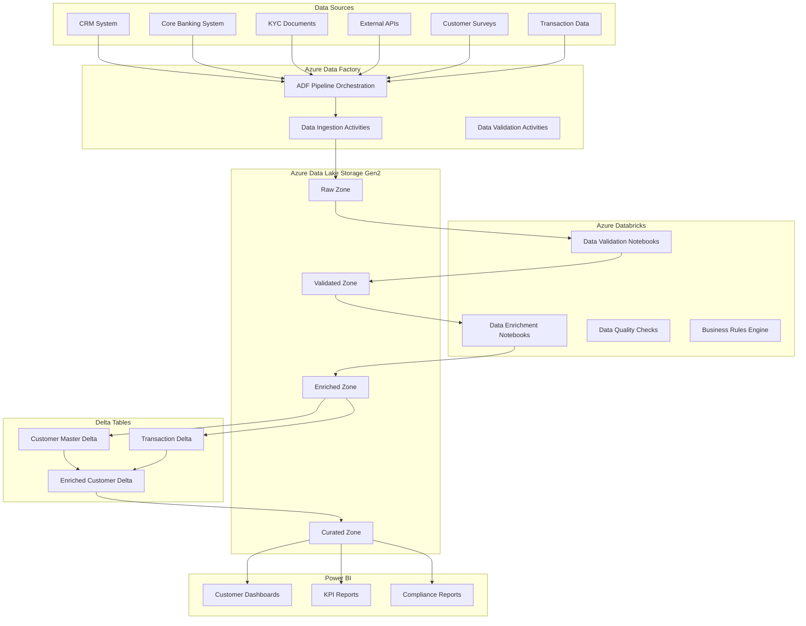

# Banking Customer Data Onboarding Pipeline Flow
## Data Validation and Enrichment Project

### Project Overview
This project implements a comprehensive data pipeline for banking customer data onboarding, validation, and enrichment using Azure Data Factory (ADF), Azure Databricks (ADB), Azure Data Lake Storage Gen2 (ADLS Gen2), and Delta tables, with Power BI as the final reporting destination.

---

## 1. Architecture Overview



---

## 2. Data Sources

### 2.1 Primary Data Sources
- **CRM System**: Customer profile information, contact details, preferences
- **Core Banking System**: Account information, transaction history, product holdings
- **KYC Documents**: Identity verification, address proof, income documents
- **External APIs**: Credit bureau data, address validation, risk scoring
- **Customer Surveys**: Feedback, satisfaction scores, product preferences
- **Transaction Data**: Real-time transaction feeds, spending patterns

### 2.2 Data Formats
- JSON files (API responses)
- CSV files (batch exports)
- XML files (legacy systems)
- Parquet files (optimized storage)
- Database tables (SQL Server, Oracle)

---

## 3. Azure Data Factory Pipeline Flow

### 3.1 Pipeline Structure

```yaml
# ADF Pipeline Configuration
pipeline_name: "Banking_Customer_Data_Pipeline"
description: "End-to-end customer data onboarding and enrichment pipeline"

triggers:
  - name: "Daily_Schedule"
    type: "Schedule"
    frequency: "Day"
    interval: 1
    start_time: "2024-01-01T02:00:00Z"
  
  - name: "Real_Time_Trigger"
    type: "Event"
    source: "EventGrid"
    events: ["Customer_Onboarding", "Transaction_Update"]

activities:
  - name: "Data_Ingestion"
    type: "Copy"
    source: "Multiple_Sources"
    sink: "ADLS_Gen2_Raw"
    
  - name: "Data_Validation"
    type: "DatabricksNotebook"
    notebook_path: "/Shared/DataValidation/CustomerDataValidation"
    
  - name: "Data_Enrichment"
    type: "DatabricksNotebook"
    notebook_path: "/Shared/DataEnrichment/CustomerEnrichment"
    
  - name: "Delta_Table_Load"
    type: "DatabricksNotebook"
    notebook_path: "/Shared/DeltaLoad/CustomerDeltaLoad"
```

### 3.2 Data Ingestion Activities

```python
# ADF Copy Activity Configuration
{
    "name": "Ingest_Customer_Data",
    "type": "Copy",
    "dependsOn": [],
    "policy": {
        "timeout": "7.00:00:00",
        "retry": 0,
        "retryIntervalInSeconds": 30,
        "secureOutput": false,
        "secureInput": false
    },
    "userProperties": [],
    "typeProperties": {
        "source": {
            "type": "RestSource",
            "httpRequestTimeout": "00:01:40",
            "requestInterval": "00.00:00.00.250"
        },
        "sink": {
            "type": "AzureBlobFSSink",
            "copyBehavior": "PreserveHierarchy"
        },
        "enableStaging": false,
        "translator": {
            "type": "TabularTranslator",
            "mappings": [
                {
                    "source": {
                        "type": "String",
                        "ordinal": "1"
                    },
                    "sink": {
                        "type": "String",
                        "ordinal": "1"
                    }
                }
            ]
        }
    }
}
```

---

## 4. Azure Databricks Data Validation

### 4.1 Data Validation Notebook Structure

```python
# /Shared/DataValidation/CustomerDataValidation
# Databricks Notebook for Customer Data Validation

# Import required libraries
from pyspark.sql import SparkSession
from pyspark.sql.functions import *
from pyspark.sql.types import *
import logging
from datetime import datetime

# Initialize Spark session
spark = SparkSession.builder \
    .appName("CustomerDataValidation") \
    .config("spark.sql.adaptive.enabled", "true") \
    .config("spark.sql.adaptive.coalescePartitions.enabled", "true") \
    .getOrCreate()

# Set up logging
logging.basicConfig(level=logging.INFO)
logger = logging.getLogger(__name__)

# Read raw data from ADLS Gen2
raw_data_path = "abfss://raw-zone@storageaccount.dfs.core.windows.net/customer-data/"
raw_df = spark.read.format("parquet").load(raw_data_path)

# Data Quality Validation Functions
def validate_customer_data(df):
    """
    Comprehensive customer data validation
    """
    validation_results = {}
    
    # 1. Completeness Check
    completeness_check = df.select([
        (count(when(col(c).isNull(), c)) / count("*") * 100).alias(f"{c}_null_percentage")
        for c in df.columns
    ])
    
    # 2. Format Validation
    format_validation = df.select(
        # Email format validation
        when(regexp_extract(col("email"), "^[A-Za-z0-9._%+-]+@[A-Za-z0-9.-]+\\.[A-Za-z]{2,}$", 0) == col("email"), "valid").otherwise("invalid").alias("email_valid"),
        
        # Phone number validation
        when(regexp_extract(col("phone"), "^[0-9]{10}$", 0) == col("phone"), "valid").otherwise("invalid").alias("phone_valid"),
        
        # Date format validation
        when(to_date(col("date_of_birth"), "yyyy-MM-dd").isNotNull(), "valid").otherwise("invalid").alias("dob_valid")
    )
    
    # 3. Business Rule Validation
    business_validation = df.select(
        # Age validation (must be 18+)
        when(datediff(current_date(), to_date(col("date_of_birth"), "yyyy-MM-dd")) / 365 >= 18, "valid").otherwise("invalid").alias("age_valid"),
        
        # Income validation (must be positive)
        when(col("annual_income") > 0, "valid").otherwise("invalid").alias("income_valid")
    )
    
    return validation_results

# Execute validation
validation_results = validate_customer_data(raw_df)

# Write validation results
validation_results_path = "abfss://validated-zone@storageaccount.dfs.core.windows.net/validation-results/"
validation_results.write.mode("overwrite").parquet(validation_results_path)

logger.info("Customer data validation completed successfully")
```

### 4.2 Data Quality Rules

```python
# Data Quality Rules Configuration
DATA_QUALITY_RULES = {
    "customer_profile": {
        "required_fields": ["customer_id", "first_name", "last_name", "email", "phone", "date_of_birth"],
        "format_rules": {
            "email": r"^[A-Za-z0-9._%+-]+@[A-Za-z0-9.-]+\.[A-Za-z]{2,}$",
            "phone": r"^[0-9]{10}$",
            "ssn": r"^\d{3}-\d{2}-\d{4}$"
        },
        "business_rules": {
            "min_age": 18,
            "max_age": 120,
            "min_income": 0,
            "max_income": 10000000
        }
    },
    "kyc_documents": {
        "required_fields": ["document_id", "document_type", "issue_date", "expiry_date"],
        "business_rules": {
            "document_not_expired": True,
            "issue_date_before_expiry": True
        }
    }
}
```

---

## 5. Data Enrichment Process

### 5.1 Data Enrichment Notebook

```python
# /Shared/DataEnrichment/CustomerEnrichment
# Databricks Notebook for Customer Data Enrichment

from pyspark.sql import SparkSession
from pyspark.sql.functions import *
from pyspark.sql.types import *
import requests
import json

# Initialize Spark session
spark = SparkSession.builder \
    .appName("CustomerDataEnrichment") \
    .config("spark.sql.adaptive.enabled", "true") \
    .getOrCreate()

# Read validated data
validated_data_path = "abfss://validated-zone@storageaccount.dfs.core.windows.net/customer-data/"
validated_df = spark.read.format("parquet").load(validated_data_path)

# Enrichment Functions
def enrich_customer_data(df):
    """
    Enrich customer data with external sources
    """
    
    # 1. Address Validation and Geocoding
    def validate_address(address):
        # Call external address validation API
        api_url = "https://api.address-validation.com/validate"
        payload = {"address": address}
        response = requests.post(api_url, json=payload)
        return response.json()
    
    # 2. Credit Score Enrichment
    def get_credit_score(ssn):
        # Call credit bureau API (masked for security)
        api_url = "https://api.credit-bureau.com/score"
        payload = {"ssn": ssn}
        response = requests.post(api_url, json=payload)
        return response.json()
    
    # 3. Risk Scoring
    def calculate_risk_score(customer_data):
        risk_factors = {
            "age": customer_data.get("age", 0),
            "income": customer_data.get("annual_income", 0),
            "credit_score": customer_data.get("credit_score", 0),
            "employment_status": customer_data.get("employment_status", "unknown")
        }
        
        # Risk calculation logic
        risk_score = 0
        if risk_factors["age"] < 25: risk_score += 10
        if risk_factors["income"] < 50000: risk_score += 15
        if risk_factors["credit_score"] < 650: risk_score += 20
        if risk_factors["employment_status"] == "unemployed": risk_score += 25
        
        return min(risk_score, 100)
    
    # Apply enrichment
    enriched_df = df.withColumn("address_validated", udf(validate_address, StringType())(col("address"))) \
                   .withColumn("credit_score", udf(get_credit_score, IntegerType())(col("ssn"))) \
                   .withColumn("risk_score", udf(calculate_risk_score, IntegerType())(struct("*")))
    
    return enriched_df

# Execute enrichment
enriched_df = enrich_customer_data(validated_df)

# Write enriched data
enriched_data_path = "abfss://enriched-zone@storageaccount.dfs.core.windows.net/customer-data/"
enriched_df.write.mode("overwrite").parquet(enriched_data_path)

print("Customer data enrichment completed successfully")
```

### 5.2 External API Integration

```python
# External API Configuration
EXTERNAL_APIS = {
    "address_validation": {
        "url": "https://api.address-validation.com/validate",
        "headers": {"Authorization": "Bearer ${ADDRESS_API_KEY}"},
        "timeout": 30
    },
    "credit_bureau": {
        "url": "https://api.credit-bureau.com/score",
        "headers": {"Authorization": "Bearer ${CREDIT_API_KEY}"},
        "timeout": 60
    },
    "risk_scoring": {
        "url": "https://api.risk-scoring.com/calculate",
        "headers": {"Authorization": "Bearer ${RISK_API_KEY}"},
        "timeout": 45
    }
}
```

---

## 6. Delta Table Implementation

### 6.1 Delta Table Schema

```sql
-- Customer Master Delta Table
CREATE TABLE IF NOT EXISTS customer_master_delta
(
    customer_id STRING,
    first_name STRING,
    last_name STRING,
    email STRING,
    phone STRING,
    date_of_birth DATE,
    ssn STRING,
    address STRING,
    city STRING,
    state STRING,
    zip_code STRING,
    annual_income DECIMAL(15,2),
    employment_status STRING,
    credit_score INTEGER,
    risk_score INTEGER,
    address_validated BOOLEAN,
    kyc_status STRING,
    onboarding_date TIMESTAMP,
    last_updated TIMESTAMP,
    data_quality_score DECIMAL(5,2),
    enrichment_status STRING
)
USING DELTA
PARTITIONED BY (state, year(onboarding_date))
LOCATION 'abfss://curated-zone@storageaccount.dfs.core.windows.net/delta-tables/customer-master/'

-- Transaction Delta Table
CREATE TABLE IF NOT EXISTS transaction_delta
(
    transaction_id STRING,
    customer_id STRING,
    transaction_date TIMESTAMP,
    transaction_type STRING,
    amount DECIMAL(15,2),
    currency STRING,
    merchant_name STRING,
    category STRING,
    risk_level STRING,
    fraud_score DECIMAL(5,2)
)
USING DELTA
PARTITIONED BY (year(transaction_date), month(transaction_date))
LOCATION 'abfss://curated-zone@storageaccount.dfs.core.windows.net/delta-tables/transactions/'

-- Enriched Customer Delta Table
CREATE TABLE IF NOT EXISTS enriched_customer_delta
(
    customer_id STRING,
    customer_segment STRING,
    lifetime_value DECIMAL(15,2),
    churn_probability DECIMAL(5,4),
    product_preferences ARRAY<STRING>,
    risk_category STRING,
    compliance_status STRING,
    last_activity_date TIMESTAMP,
    enrichment_timestamp TIMESTAMP
)
USING DELTA
PARTITIONED BY (customer_segment, risk_category)
LOCATION 'abfss://curated-zone@storageaccount.dfs.core.windows.net/delta-tables/enriched-customer/'
```

### 6.2 Delta Table Load Process

```python
# /Shared/DeltaLoad/CustomerDeltaLoad
# Databricks Notebook for Delta Table Loading

from pyspark.sql import SparkSession
from pyspark.sql.functions import *
from delta.tables import *

# Initialize Spark session with Delta support
spark = SparkSession.builder \
    .appName("CustomerDeltaLoad") \
    .config("spark.sql.extensions", "io.delta.sql.DeltaSparkSessionExtension") \
    .config("spark.sql.catalog.spark_catalog", "org.apache.spark.sql.delta.catalog.DeltaCatalog") \
    .getOrCreate()

# Read enriched data
enriched_data_path = "abfss://enriched-zone@storageaccount.dfs.core.windows.net/customer-data/"
enriched_df = spark.read.format("parquet").load(enriched_data_path)

# Load into Customer Master Delta Table
def load_customer_master_delta(df):
    """
    Load customer data into Delta table with upsert logic
    """
    
    # Prepare data for Delta table
    customer_delta_df = df.select(
        col("customer_id"),
        col("first_name"),
        col("last_name"),
        col("email"),
        col("phone"),
        to_date(col("date_of_birth"), "yyyy-MM-dd").alias("date_of_birth"),
        col("ssn"),
        col("address"),
        col("city"),
        col("state"),
        col("zip_code"),
        col("annual_income"),
        col("employment_status"),
        col("credit_score"),
        col("risk_score"),
        col("address_validated"),
        col("kyc_status"),
        current_timestamp().alias("onboarding_date"),
        current_timestamp().alias("last_updated"),
        col("data_quality_score"),
        col("enrichment_status")
    )
    
    # Write to Delta table with merge operation
    customer_delta_df.write \
        .format("delta") \
        .mode("overwrite") \
        .option("mergeSchema", "true") \
        .saveAsTable("customer_master_delta")
    
    return customer_delta_df

# Execute Delta table load
customer_delta_df = load_customer_master_delta(enriched_df)

print("Customer Master Delta table loaded successfully")

# Optimize Delta table
spark.sql("OPTIMIZE customer_master_delta ZORDER BY (customer_id, state)")

# Generate statistics
spark.sql("ANALYZE TABLE customer_master_delta COMPUTE STATISTICS FOR ALL COLUMNS")
```

---

## 7. Power BI Integration

### 7.1 Power BI Data Model

```dax
// Power BI Data Model Configuration

// Customer Master Table
Customer_Master = 
SELECTCOLUMNS(
    'customer_master_delta',
    "Customer_ID", customer_id,
    "First_Name", first_name,
    "Last_Name", last_name,
    "Full_Name", first_name & " " & last_name,
    "Email", email,
    "Phone", phone,
    "Date_of_Birth", date_of_birth,
    "Age", DATEDIFF(date_of_birth, TODAY(), YEAR),
    "Address", address,
    "City", city,
    "State", state,
    "Zip_Code", zip_code,
    "Annual_Income", annual_income,
    "Employment_Status", employment_status,
    "Credit_Score", credit_score,
    "Risk_Score", risk_score,
    "Address_Validated", address_validated,
    "KYC_Status", kyc_status,
    "Onboarding_Date", onboarding_date,
    "Last_Updated", last_updated,
    "Data_Quality_Score", data_quality_score,
    "Enrichment_Status", enrichment_status
)

// Transaction Table
Transaction_Data = 
SELECTCOLUMNS(
    'transaction_delta',
    "Transaction_ID", transaction_id,
    "Customer_ID", customer_id,
    "Transaction_Date", transaction_date,
    "Transaction_Type", transaction_type,
    "Amount", amount,
    "Currency", currency,
    "Merchant_Name", merchant_name,
    "Category", category,
    "Risk_Level", risk_level,
    "Fraud_Score", fraud_score
)

// Enriched Customer Table
Enriched_Customer = 
SELECTCOLUMNS(
    'enriched_customer_delta',
    "Customer_ID", customer_id,
    "Customer_Segment", customer_segment,
    "Lifetime_Value", lifetime_value,
    "Churn_Probability", churn_probability,
    "Product_Preferences", product_preferences,
    "Risk_Category", risk_category,
    "Compliance_Status", compliance_status,
    "Last_Activity_Date", last_activity_date,
    "Enrichment_Timestamp", enrichment_timestamp
)

// Calculated Measures
Total_Customers = COUNTROWS(Customer_Master)
Total_Transactions = COUNTROWS(Transaction_Data)
Average_Credit_Score = AVERAGE(Customer_Master[Credit_Score])
Average_Risk_Score = AVERAGE(Customer_Master[Risk_Score])
Total_Transaction_Value = SUM(Transaction_Data[Amount])
Customer_Churn_Rate = AVERAGE(Enriched_Customer[Churn_Probability])
```

### 7.2 Power BI Dashboard Configuration

```json
{
    "dashboard_name": "Banking_Customer_Onboarding_Dashboard",
    "refresh_schedule": "Every 4 hours",
    "data_sources": [
        {
            "name": "Customer_Master_Delta",
            "type": "Azure Data Lake Storage Gen2",
            "path": "abfss://curated-zone@storageaccount.dfs.core.windows.net/delta-tables/customer-master/",
            "format": "Delta"
        },
        {
            "name": "Transaction_Delta",
            "type": "Azure Data Lake Storage Gen2",
            "path": "abfss://curated-zone@storageaccount.dfs.core.windows.net/delta-tables/transactions/",
            "format": "Delta"
        },
        {
            "name": "Enriched_Customer_Delta",
            "type": "Azure Data Lake Storage Gen2",
            "path": "abfss://curated-zone@storageaccount.dfs.core.windows.net/delta-tables/enriched-customer/",
            "format": "Delta"
        }
    ],
    "pages": [
        {
            "name": "Customer_Overview",
            "visuals": [
                "Customer_Count_KPI",
                "Onboarding_Trend_Chart",
                "Geographic_Distribution_Map",
                "Risk_Score_Distribution"
            ]
        },
        {
            "name": "Data_Quality",
            "visuals": [
                "Data_Quality_Score_Gauge",
                "Validation_Errors_Table",
                "Enrichment_Status_Pie_Chart"
            ]
        },
        {
            "name": "Compliance_Reporting",
            "visuals": [
                "KYC_Status_Summary",
                "Compliance_Alerts",
                "Regulatory_Reporting_Table"
            ]
        }
    ]
}
```

---

## 8. Monitoring and Alerting

### 8.1 Pipeline Monitoring

```python
# Pipeline Monitoring Configuration
MONITORING_CONFIG = {
    "data_quality_thresholds": {
        "completeness": 95.0,
        "accuracy": 98.0,
        "timeliness": 99.0
    },
    "alert_conditions": {
        "pipeline_failure": True,
        "data_quality_below_threshold": True,
        "enrichment_failure": True,
        "delta_table_load_failure": True
    },
    "notification_channels": [
        "email",
        "teams_webhook",
        "slack_webhook"
    ]
}

# Monitoring Functions
def monitor_pipeline_health():
    """
    Monitor pipeline health and send alerts
    """
    # Check pipeline execution status
    # Monitor data quality metrics
    # Verify Delta table loads
    # Send notifications for failures
    pass

def generate_quality_report():
    """
    Generate data quality report
    """
    # Calculate completeness, accuracy, timeliness
    # Generate quality score
    # Create quality dashboard
    pass
```

### 8.2 Error Handling and Retry Logic

```python
# Error Handling Configuration
ERROR_HANDLING_CONFIG = {
    "retry_policy": {
        "max_retries": 3,
        "retry_interval": 300,  # 5 minutes
        "exponential_backoff": True
    },
    "dead_letter_queue": {
        "enabled": True,
        "storage_path": "abfss://error-zone@storageaccount.dfs.core.windows.net/dead-letter-queue/"
    },
    "error_notification": {
        "critical_errors": True,
        "warning_errors": False
    }
}
```

---

## 9. Security and Compliance

### 9.1 Data Security

```yaml
# Security Configuration
security:
  data_encryption:
    at_rest: true
    in_transit: true
    encryption_algorithm: "AES-256"
  
  access_control:
    authentication: "Azure AD"
    authorization: "RBAC"
    data_masking: true
    
  audit_logging:
    enabled: true
    retention_period: "7 years"
    log_categories:
      - "Data Access"
      - "Data Modification"
      - "Pipeline Execution"
      - "Security Events"
```

### 9.2 Compliance Framework

```python
# Compliance Configuration
COMPLIANCE_CONFIG = {
    "gdpr": {
        "data_retention": "7 years",
        "right_to_forget": True,
        "data_portability": True
    },
    "sox": {
        "audit_trail": True,
        "data_integrity": True,
        "access_controls": True
    },
    "pci_dss": {
        "card_data_encryption": True,
        "secure_transmission": True,
        "access_logging": True
    }
}
```

---

## 10. Performance Optimization

### 10.1 Performance Tuning

```python
# Performance Optimization Configuration
PERFORMANCE_CONFIG = {
    "spark_config": {
        "spark.sql.adaptive.enabled": True,
        "spark.sql.adaptive.coalescePartitions.enabled": True,
        "spark.sql.adaptive.skewJoin.enabled": True,
        "spark.sql.adaptive.localShuffleReader.enabled": True
    },
    "delta_optimization": {
        "auto_optimize": True,
        "optimize_write": True,
        "data_skipping": True
    },
    "partitioning_strategy": {
        "customer_master": ["state", "year(onboarding_date)"],
        "transactions": ["year(transaction_date)", "month(transaction_date)"],
        "enriched_customer": ["customer_segment", "risk_category"]
    }
}
```

---

## 11. Deployment and CI/CD

### 11.1 Azure DevOps Pipeline

```yaml
# azure-pipelines.yml
trigger:
  - main

pool:
  vmImage: 'ubuntu-latest'

variables:
  solution: '**/*.sln'
  buildPlatform: 'Any CPU'
  buildConfiguration: 'Release'

stages:
- stage: Build
  displayName: 'Build and Test'
  jobs:
  - job: Build
    steps:
    - task: DotNetCoreCLI@2
      inputs:
        command: 'build'
        projects: '**/*.csproj'
        arguments: '--configuration $(buildConfiguration)'
    
    - task: DotNetCoreCLI@2
      inputs:
        command: 'test'
        projects: '**/*Tests/*.csproj'
        arguments: '--configuration $(buildConfiguration)'

- stage: Deploy
  displayName: 'Deploy to Azure'
  dependsOn: Build
  condition: succeeded()
  jobs:
  - deployment: Deploy
    environment: 'production'
    strategy:
      runOnce:
        deploy:
          steps:
          - task: AzureResourceManagerTemplateDeployment@3
            inputs:
              deploymentScope: 'Resource Group'
              azureResourceManagerConnection: 'Azure-Connection'
              subscriptionId: '$(subscriptionId)'
              action: 'Create Or Update Resource Group'
              resourceGroupName: '$(resourceGroupName)'
              location: 'East US'
              templateLocation: 'Linked artifact'
              csmFile: '$(System.DefaultWorkingDirectory)/**/main.bicep'
              csmParametersFile: '$(System.DefaultWorkingDirectory)/**/main.parameters.json'
              overrideParameters: '-environment $(environment)'
              deploymentMode: 'Incremental'
```

---

## 12. Project Timeline and Milestones

### 12.1 Project Phases

| Phase | Duration | Deliverables |
|-------|----------|--------------|
| Phase 1: Foundation | 4 weeks | ADF pipelines, basic validation |
| Phase 2: Enrichment | 3 weeks | External API integration, enrichment logic |
| Phase 3: Delta Tables | 2 weeks | Delta table implementation, optimization |
| Phase 4: Power BI | 2 weeks | Dashboard development, reporting |
| Phase 5: Testing | 2 weeks | UAT, performance testing |
| Phase 6: Deployment | 1 week | Production deployment, go-live |

### 12.2 Success Metrics

- **Data Quality**: >98% accuracy and completeness
- **Performance**: Pipeline execution <30 minutes
- **Availability**: 99.9% uptime
- **Compliance**: 100% audit trail coverage
- **User Adoption**: >90% dashboard usage

---

## 13. Risk Mitigation

### 13.1 Identified Risks

1. **Data Quality Issues**: Implement comprehensive validation rules
2. **API Failures**: Implement retry logic and fallback mechanisms
3. **Performance Bottlenecks**: Optimize Delta tables and partitioning
4. **Security Breaches**: Implement encryption and access controls
5. **Compliance Violations**: Regular audit and monitoring

### 13.2 Mitigation Strategies

- **Redundancy**: Multiple data sources and backup systems
- **Monitoring**: Real-time alerting and health checks
- **Testing**: Comprehensive unit and integration testing
- **Documentation**: Detailed runbooks and procedures
- **Training**: Regular team training on new features

---
