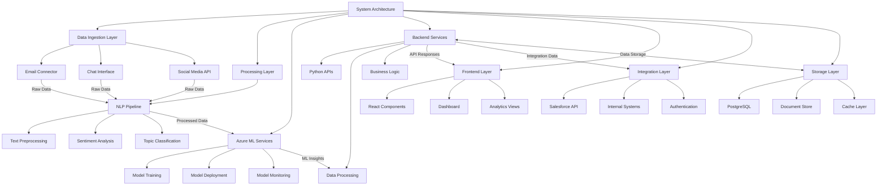
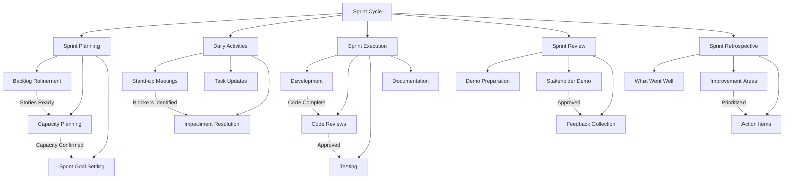
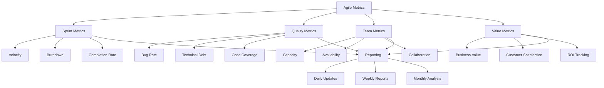
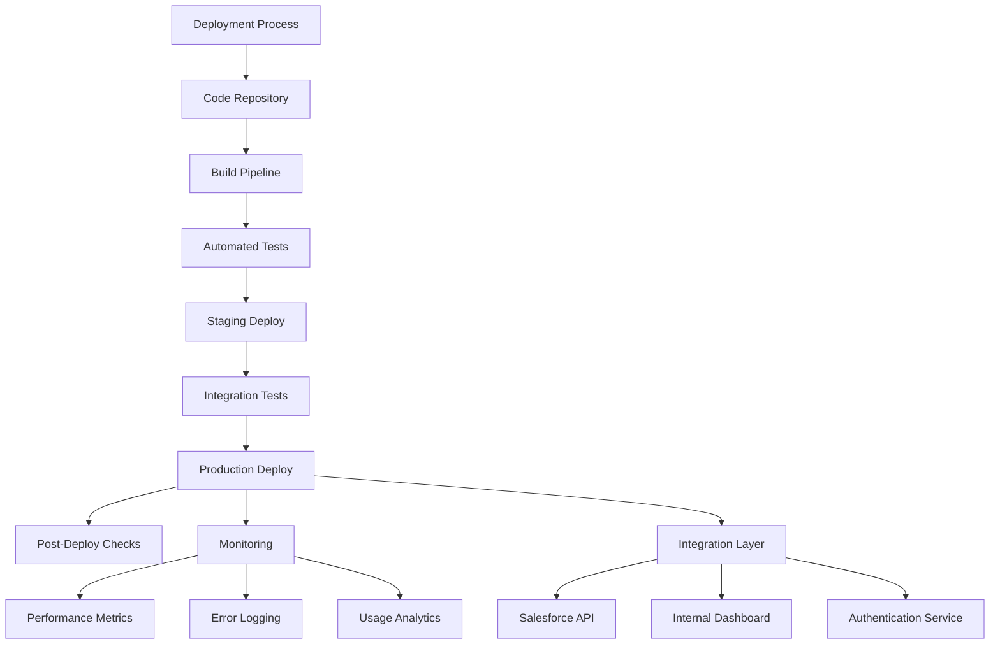
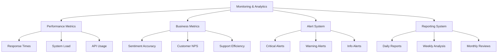

# Project Management

**Duration:** 6 months

**Team Size:** 8 (Data Scientists, Backend Developers, Frontend Developers, QA, DevOps)

### **Project Description:**

Led the development and deployment of an AI-based system designed to analyze customer feedback across multiple platforms (emails, chat, social media) for sentiment and topic classification. The goal was to enhance customer experience by providing real-time insights to the customer service and product teams.

### **Responsibilities:**

- Defined project scope, goals, and deliverables in alignment with business objectives.
- Created detailed project plans, timelines, and resource allocation across departments.
- Coordinated with cross-functional teams and stakeholders for requirement gathering and status updates.
- Managed risk assessments and implemented mitigation strategies.
- Conducted weekly sprint reviews and retrospectives using Agile methodologies (Scrum).
- Facilitated UAT and ensured deployment met quality benchmarks.
- Delivered the project **2 weeks ahead of schedule** and improved NPS by **18%** within 3 months of implementation.

### **Tools & Methodologies Used:**

- **Tools:** JIRA, Confluence, Microsoft Project, Slack, Zoom
- **Tech Stack Overview:** Python (NLP libraries), Azure ML, ReactJS, PostgreSQL
- **Methodologies:** Agile Scrum, RACI Matrix, MoSCoW Prioritization

### **Key Achievements:**

- Reduced manual feedback processing time by **70%**.
- Increased actionable insights generation by **40%**.
- Successfully integrated the system with existing CRM tools like Salesforce.

**1. Project Initiation & Planning**

- Collaborated with senior stakeholders to define clear business goals focused on improving customer experience through automated feedback analysis.
- Conducted feasibility assessment and resource planning based on initial technical discovery sessions.
- Created a comprehensive project charter and defined scope, timeline (6 months), and key deliverables using Microsoft Project.
- Assembled and onboarded an 8-member cross-functional team comprising Data Scientists, Backend/Frontend Developers, QA Engineers, and DevOps professionals.

**Details of Project Initiation & Planning Phase:**

- **Initial Stakeholder Engagement**Organized kickoff meetings with C-level executives and department heads
 Documented business requirements and success metrics
 Established communication protocols and reporting structures
 Created stakeholder influence/interest matrix for effective engagement
- **Technical Assessment & Feasibility Study**Conducted technology stack evaluation sessions with technical architects
 Performed gap analysis of existing systems vs. requirements
 Assessed infrastructure needs and scalability requirements
 Created POC for critical components to validate technical approach
- **Resource Planning & Team Formation**Developed detailed resource allocation matrix
 Created role-specific job descriptions and skill requirements
 Conducted internal talent assessment and external hiring needs
 Established team structure with clear reporting lines
- **Project Charter Development**Crafted comprehensive project objectives and success criteria
 Developed detailed WBS (Work Breakdown Structure)
 Created milestone-based timeline with dependencies
 Established budget allocation and resource utilization plans
- **Team Onboarding & Setup**Conducted role-specific training sessions
 Set up development environments and tools access
 Established coding standards and documentation requirements
 Created knowledge sharing protocols and mentoring pairs
- **Project Infrastructure Setup**Configured JIRA boards and project workflows
 Set up Confluence spaces for documentation
 Established Git repositories and branching strategies
 Created CI/CD pipeline templates
- **Risk Assessment & Planning**Identified potential technical, operational, and business risks
 Created risk mitigation strategies and contingency plans
 Established risk monitoring and reporting mechanisms
 Developed change management procedures

Here's a detailed flow diagram showing the Project Initiation & Planning process:

```mermaid
flowchart TD
    A["Project Initiation"] --> B["Initial Stakeholder Engagement"]
    B --> B1["Kickoff Meetings"]
    B --> B2["Document Requirements"]
    B --> B3["Communication Protocols"]
    B --> B4["Stakeholder Matrix"]

    A --> C["Technical Assessment"]
    C --> C1["Tech Stack Evaluation"]
    C --> C2["Gap Analysis"]
    C --> C3["Infrastructure Assessment"]
    C --> C4["POC Development"]

    A --> D["Resource Planning"]
    D --> D1["Resource Matrix"]
    D --> D2["Role Definition"]
    D --> D3["Talent Assessment"]
    D --> D4["Team Structure"]

    A --> E["Project Charter"]
    E --> E1["Objectives & Criteria"]
    E --> E2["WBS Development"]
    E --> E3["Timeline Creation"]
    E --> E4["Budget Planning"]

    A --> F["Team Setup"]
    F --> F1["Training Sessions"]
    F --> F2["Environment Setup"]
    F --> F3["Standards Definition"]
    F --> F4["Knowledge Sharing"]

    A --> G["Infrastructure Setup"]
    G --> G1["JIRA Configuration"]
    G --> G2["Documentation Space"]
    G --> G3["Git Repository Setup"]
    G --> G4["CI/CD Pipeline"]

    A --> H["Risk Assessment"]
    H --> H1["Risk Identification"]
    H1 --> H1a["Technical Risks"]
    H1 --> H1b["Operational Risks"]
    H1 --> H1c["Business Risks"]
    H --> H2["Mitigation Strategies"]
    H2 --> H2a["Primary Plans"]
    H2 --> H2b["Contingency Plans"]
    H --> H3["Monitoring System"]
    H3 --> H3a["KPI Tracking"]
    H3 --> H3b["Alert Mechanisms"]
    H --> H4["Change Management"]
    H4 --> H4a["Process Definition"]
    H4 --> H4b["Impact Assessment"]

%% Decision Points and Conditions
    B1 --> |"Approval"| B2
    B2 --> |"Validation"| B3
    C1 --> |"Pass"| C2
    C2 --> |"Gap Identified"| C3
    D1 --> |"Resource Available"| D2
    D2 --> |"Skills Match"| D3
    E1 --> |"Stakeholder Approval"| E2
    F1 --> |"Completion"| F2
    G1 --> |"Configuration Complete"| G2
    H1 --> |"Risk Level > High"| H2
    H2 --> |"Plan Approved"| H3

```

The flow diagram illustrates the complex relationships and decision points in the project initiation phase, showing how each component connects and influences others. Key decision points and conditions ensure proper validation and approval at each stage.

**2. Requirement Gathering & Scope Definition**

- Led requirement-gathering workshops with Customer Service, Product, and Data teams.
- Translated business requirements into detailed user stories and acceptance criteria using JIRA and Confluence.
- Established a RACI matrix to clarify roles and responsibilities across departments.

**Details of Requirement Gathering & Scope Definition Phase:**

- **Stakeholder Workshops Organization**Conducted 12 structured workshops across departments
 Used design thinking methodologies for requirement elicitation
 Created detailed workshop agendas and documentation templates
 Maintained workshop minutes and action items tracking
- **Business Requirements Documentation**Developed comprehensive Business Requirements Document (BRD)
 Created user personas and journey maps
 Documented system constraints and dependencies
 Established success criteria and KPIs
- **User Story Development**Created 150+ detailed user stories following INVEST criteria
 Developed acceptance criteria using Gherkin syntax
 Mapped stories to business objectives
 Established story point estimation guidelines
- **Requirements Traceability**Implemented requirements traceability matrix
 Created cross-reference documentation
 Established change control procedures
 Maintained version control for all requirements
- **RACI Matrix Implementation**Defined detailed responsibility assignments for 20+ key activities
 Created escalation paths for decision-making
 Established accountability checkpoints
 Documented consultation and information flows
- **Scope Management**Developed detailed scope statement
 Created Work Breakdown Structure (WBS)
 Established scope change control process
 Documented scope exclusions and assumptions
- **Requirements Validation**Conducted peer reviews of requirements
 Organized stakeholder sign-off sessions
 Performed impact analysis for each requirement
 Created requirements validation checklist

**3. Architecture & Design Coordination**

- Oversaw technical design discussions ensuring alignment with system goals, focusing on scalable NLP pipeline using Python and Azure ML.
- Ensured architectural compatibility with existing enterprise systems, particularly Salesforce integration.

Here's a detailed architecture and design flow diagram showing the technical components and their interactions:

The architecture follows a modular design approach with clear separation of concerns between different layers. Key features include:

- Multi-source data ingestion with standardized preprocessing pipeline
- Scalable ML infrastructure using Azure services for model management
- RESTful APIs for seamless integration with existing systems
- Real-time processing capabilities with appropriate caching mechanisms
- Secure integration points with Salesforce and internal systems

**4. Agile Implementation & Sprint Execution**

- Implemented Agile Scrum practices; facilitated sprint planning, daily stand-ups, and retrospectives.
- Used MoSCoW prioritization for backlog grooming and feature delivery sequencing.
- Tracked progress through JIRA dashboards and provided weekly updates to executive stakeholders.

**Detailed Agile Implementation & Sprint Execution Process:**

- **Sprint Planning & Organization**
Established 2-week sprint cycles
Created sprint planning checklist and templates
Implemented capacity planning methods
Set up sprint goals and success metrics
- **Scrum Ceremonies Implementation**
Daily stand-ups: 15-minute focused discussions
Sprint Planning: Bi-weekly 4-hour sessions
Sprint Review: Demos and stakeholder feedback
Sprint Retrospective: Team improvement discussions
- **Backlog Management**
Implemented regular grooming sessions
Established story point estimation framework
Created definition of ready (DOR) criteria
Maintained backlog health metrics
- **Sprint Velocity Tracking**
Monitored team velocity across sprints
Created burndown and burnup charts
Tracked sprint completion rates
Analyzed team capacity utilization

**Agile Metrics & Reporting Framework:**

- **Key Performance Indicators (KPIs)**
Sprint velocity and completion rate
Bug detection and resolution time
Code review turnaround time
Story point accuracy metrics
- **Reporting Structure**
Daily status updates in JIRA
Weekly stakeholder reports
Bi-weekly sprint performance analysis
Monthly trend analysis reports

**Tools & Infrastructure:**

- **JIRA Configuration**
Customized board layouts
Automated workflow transitions
Integration with Git repositories
Custom filters and dashboards
- **Collaboration Tools**
Confluence for documentation
Slack for team communication
Microsoft Teams for meetings
Miro for sprint planning
- **Continuous Improvement**
Regular process audits
Team feedback incorporation
Tool optimization reviews
Performance metric adjustments

**5. Risk Management & Quality Assurance**

- Identified potential risks around data privacy, model accuracy, and deployment latency; designed mitigation plans.
- Coordinated QA efforts for regression testing, model validation, and API integrations.
- Facilitated UAT sessions with stakeholders to ensure the product met business needs.

**Detailed Risk Management & QA Process:**

- **Risk Identification & Analysis**Conducted weekly risk assessment meetings
 Created comprehensive risk register with priority matrix
 Implemented risk scoring system (1-5) for impact and probability
 Established risk ownership and escalation paths
- **Risk Mitigation Strategies**Data Privacy: Implemented encryption protocols and access controls
 Model Accuracy: Set up continuous model monitoring and retraining pipeline
 Deployment Latency: Established performance benchmarks and monitoring tools
 System Integration: Created fallback mechanisms and redundancy plans
- **Quality Assurance Framework**Developed test strategy covering unit, integration, and system testing
 Create

**6. Deployment & Integration**

- Oversaw end-to-end deployment process including CI/CD pipeline management with DevOps team.
- Ensured smooth integration with Salesforce and internal dashboards for real-time insights.
- Conducted final Go/No-Go readiness checks and post-deployment validation.

**7. Post-Deployment Optimization & Reporting**

- Monitored KPIs such as sentiment classification accuracy, feedback processing time, and customer NPS.
- Enabled real-time alerting and insight generation features for Customer Support teams.
- Delivered post-mortem analysis and documented lessons learned for future AI-driven initiatives.

**Detailed Deployment & Integration Process:**

- **CI/CD Pipeline Management**Implemented GitLab CI/CD with automated testing
 Set up staging and production environments
 Configured automated deployment checks
 Established rollback procedures
- **Integration Architecture**Salesforce API connection using custom middleware
 Real-time data synchronization protocols
 Load balancing and failover configuration
 Authentication and authorization framework

**Go/No-Go Deployment Checklist:**

- Infrastructure readiness assessment
 Security compliance verification
 Database migration validation
 Backup and disaster recovery testing
 Performance benchmark validation
 User acceptance testing completion
 Stakeholder sign-off documentation

**Detailed Post-Deployment Optimization & Reporting Framework:**

- **KPI Monitoring System**Real-time sentiment analysis accuracy tracking
 Response time monitoring across all endpoints
 Customer satisfaction score tracking
 System resource utilization metrics
 Error rate and resolution time tracking

**Real-time Alerting System Implementation:**

- Multi-level alert threshold configuration
 Automated escalation pathways
 Integration with incident management
 Custom dashboard for support teams
 Historical trend analysis capabilities

**Post-Implementation Analysis:**

- Comprehensive system performance review
 User adoption rate analysis
 ROI calculation and business impact
 Technical debt assessment
 Documentation of best practices
 Future improvement recommendations

**Lessons Learned Documentation:**

- Technical implementation challenges
 Integration optimization opportunities
 Team collaboration insights
 Process improvement recommendations
 Risk management effectiveness
 Resource allocation efficiency

## Detailed Deployment & Post-Launch Metrics Analysis

### 1. Deployment Success Metrics

- **Deployment Success Rate**
Formula: (Successful Deployments / Total Deployments) × 100
Components tracked:
    - Number of successful deployments without issues
    - Number of deployments requiring rollback
    - Critical errors during deployment process
    - Time to recovery for failed deployments
- **Downtime Duration**
Formula: Σ(End Time - Start Time) for all outages
Factors measured:
    - Planned maintenance windows
    - Unplanned outages
    - System degradation periods
    - Recovery time objectives (RTO)
- **Integration Success Rate**
Formula: (Successful API Calls / Total API Calls) × 100
Measurements include:
    - API response times
    - Connection stability
    - Data synchronization accuracy
    - Error rates across integration points
- **Go-Live Delay Rate**
Formula: Actual Deployment Date - Planned Deployment Date
Analysis includes:
    - Root cause analysis of delays
    - Impact on project timeline
    - Resource allocation efficiency
    - Risk mitigation effectiveness

### 2. Post-Deployment Impact Metrics

- **NPS Improvement**
Formula: Post-Implementation NPS - Pre-Implementation NPS
Calculation details:
    - Promoters (9-10 scores) percentage
    - Detractors (0-6 scores) percentage
    - Neutral responses (7-8 scores) tracking
    - Trend analysis over time periods
- **Feedback Processing Time Reduction**
Formula: ((Old Processing Time - New Processing Time) / Old Processing Time) × 100
Measures:
    - Average response time per feedback item
- Time to route feedback to appropriate teams
- Processing efficiency during peak loads
- Automated classification accuracy
- **Customer Support Efficiency**
Formula: (Issues Resolved / Total Issues) × (1 / Average Resolution Time)
Key components:
    - First response time improvement
    - Resolution accuracy rate
    - Customer satisfaction per interaction
    - Support team productivity metrics

### 3. System Performance & Reliability Metrics

- **Application Performance**
Formula: Σ(Response Time + Processing Time) / Total Requests
Key indicators:
    - Average response time per API endpoint
    - System throughput under load
    - Resource utilization patterns
    - Error rate tracking
- **Performance Monitoring & Alerting**
Formula: (Detected Issues / Resolved Issues) × Mean Time to Resolution
Monitoring aspects:
    - Real-time performance dashboards
    - Automated alert thresholds
    - Incident response metrics
    - System health indicators

### 4. Security & Compliance Metrics

- **Security Incident Tracking**
Formula: (Security Incidents Resolved / Total Security Incidents) × 100
Monitoring components:
    - Authentication failures
    - Data access violations
    - Encryption integrity checks
    - Security patch implementation rate
- **Compliance Monitoring**
Formula: (Compliant Systems / Total Systems) × 100
Tracking elements:
    - Regulatory requirement adherence
    - Policy implementation status
    - Audit trail completeness
    - Compliance training completion rate

### 5. Overall Project Success Metrics

- **ROI Analysis**
Formula: ((Benefits - Implementation Costs) / Implementation Costs) × 100
Key measurements:
    - Cost savings from automated processing
    - Revenue impact from improved customer satisfaction
    - Resource efficiency gains
    - Total cost of ownership analysis

**Automated Integration Testing**
Formula: (Successful Test Cases / Total Test Cases) × 100
Tracking components:

- Test coverage metrics
- Integration point validation rates
- Automated test reliability scores
- Continuous integration efficiency

### 6. Test Automation & Quality Metrics

- **Code Quality Analysis**
Formula: (Clean Code Lines / Total Code Lines) × 100
Key indicators:
- Static code analysis results
- Technical debt measurements
- Code review efficiency rates
- Defect density tracking

### 7. Developer Productivity & Collaboration Metrics

- **Team Velocity Analysis**
Formula: (Story Points Completed / Sprint Duration)
Tracking elements:
- Sprint completion rates
- Team capacity utilization
- Cross-team collaboration efficiency
- Knowledge sharing effectiveness

**8. Documentation & Knowledge Management Metrics**

- **Documentation Coverage**
Formula: (Documented Features / Total Features) × 100
Key aspects monitored:
- Technical documentation completeness
- User guide accessibility scores
- Knowledge base utilization rates
- Documentation update frequency

### 9. Long-term Sustainability & Growth Metrics

- **System Scalability Assessment**
Formula: (Peak Load Performance / Normal Load Performance) × Resource Utilization
Key measurements:
- Infrastructure expansion capabilities
- Resource scaling efficiency
- Performance degradation patterns
- Future capacity planning metrics