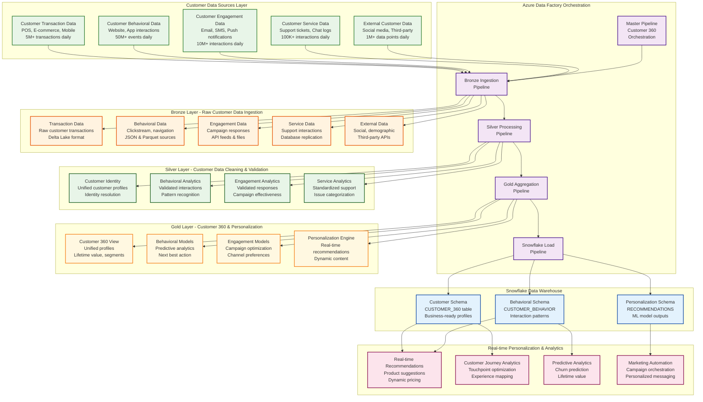
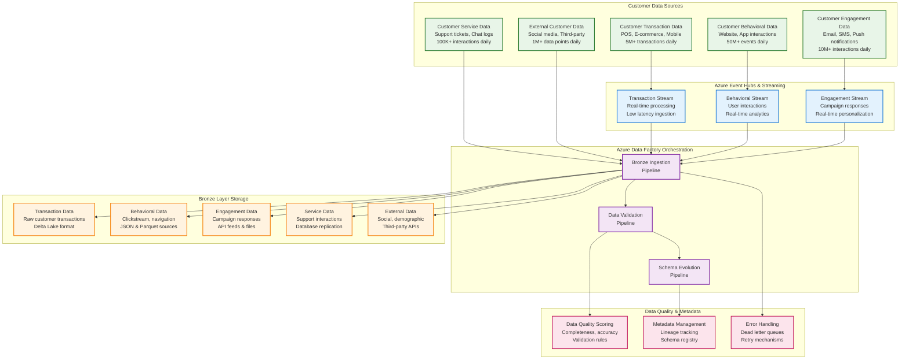

# Retail Customer 360 and Personalization Engine

## Project Overview

The Retail Customer 360 and Personalization Engine is an advanced AI-powered platform that creates comprehensive customer profiles and delivers personalized experiences across all retail touchpoints. This solution unifies customer data from multiple sources and leverages machine learning to provide real-time personalization, recommendations, and targeted marketing campaigns.

## Business Objectives

### Primary Goals
- **Unified Customer View**: Create a single, comprehensive profile for each customer
- **Real-time Personalization**: Deliver personalized experiences across all channels
- **Predictive Analytics**: Anticipate customer needs and behaviors
- **Revenue Optimization**: Increase sales through targeted recommendations and offers

### Strategic Outcomes
- **Revenue Growth**: 35% increase through personalized recommendations
- **Customer Engagement**: 60% improvement in customer interaction rates
- **Lifetime Value**: 45% increase in customer lifetime value
- **Retention Rate**: 30% improvement in customer retention

## Data Flow Architecture

### Theoretical Foundation of Customer 360 and Personalization Architecture

The Customer 360 and Personalization Engine architecture represents a sophisticated, AI-driven platform that transforms fragmented customer data into actionable insights and personalized experiences across all retail touchpoints. This architecture addresses the critical challenge of creating a unified, real-time view of each customer while enabling intelligent personalization that drives engagement, loyalty, and revenue growth. The architecture leverages advanced machine learning algorithms, real-time data processing, and comprehensive customer analytics to deliver personalized experiences that adapt to individual customer preferences, behaviors, and lifecycle stages.

The medallion architecture pattern provides the foundational structure for customer data processing, ensuring data quality, lineage, and business readiness across all customer touchpoints and interaction channels. The Bronze layer serves as the landing zone for raw customer data from diverse sources including transaction systems, website interactions, mobile applications, customer service platforms, and external data providers. The Silver layer applies sophisticated data quality frameworks, customer identity resolution algorithms, and behavioral analytics to create clean, validated customer datasets that support accurate personalization and analytics. The Gold layer creates comprehensive customer 360 views, predictive models, and personalization features that power real-time recommendation engines, targeted marketing campaigns, and customer experience optimization.

Azure Data Factory (ADF) serves as the central orchestration engine for the Customer 360 platform, providing enterprise-grade workflow management, dependency handling, and error recovery capabilities specifically designed for customer data processing and personalization requirements. ADF's integration with Azure Databricks enables seamless execution of complex customer data transformations, machine learning model training, and real-time personalization algorithms while maintaining data lineage and governance across all customer touchpoints. The orchestration layer ensures that customer data flows through the medallion architecture in the correct sequence, with proper error handling and retry mechanisms to maintain data pipeline reliability for critical customer experience and personalization operations.

### Comprehensive Customer 360 Data Flow Diagram



### Azure Data Factory Orchestration Flow

#### Master Pipeline: Customer 360 and Personalization Orchestration

The Azure Data Factory orchestration layer serves as the central nervous system of the Customer 360 and Personalization platform, coordinating complex data workflows across multiple customer touchpoints and ensuring reliable data delivery for critical personalization and customer experience operations. The master pipeline implements a sophisticated dependency management system that ensures customer data flows through the medallion architecture in the correct sequence, with comprehensive error handling and retry mechanisms specifically designed for customer data processing and real-time personalization requirements. This orchestration approach provides enterprise-grade reliability and scalability, essential for customer experience operations that require real-time personalization, recommendation engines, and customer journey optimization.

The pipeline architecture follows a hierarchical structure where the master pipeline coordinates four primary sub-pipelines: Bronze Ingestion, Silver Processing, Gold Aggregation, and Snowflake Load. Each sub-pipeline is designed to handle specific aspects of the customer data transformation process, with clear input and output contracts that enable modular development and testing. The dependency management system ensures that downstream processes only execute when upstream processes complete successfully, preventing data corruption and ensuring data lineage integrity across all customer touchpoints and interaction channels.

Error handling and monitoring capabilities are built into every level of the orchestration framework, providing real-time visibility into pipeline execution status, data quality metrics, and performance indicators specific to customer data processing and personalization operations. The system includes automatic retry mechanisms for transient failures, dead letter queues for permanently failed records, and comprehensive logging for audit trails. This robust error handling is critical for customer experience environments where data accuracy, real-time processing, and personalization quality are paramount to customer satisfaction and business success.

### Bronze Layer: Raw Customer Data Ingestion

#### Detailed Bronze Layer Data Flow Diagram



#### Source Systems and Table Structures

##### Source 1: Customer Transaction Data (Multi-Channel)
**System**: POS + E-commerce + Mobile Payment Systems  
**Tables and Columns**:

```sql
-- CUSTOMERS table
CUSTOMER_ID (VARCHAR(20)) - Primary Key
FIRST_NAME (VARCHAR(50))
LAST_NAME (VARCHAR(50))
EMAIL_ADDRESS (VARCHAR(100))
PHONE_NUMBER (VARCHAR(20))
DATE_OF_BIRTH (DATE)
GENDER (VARCHAR(10))
ADDRESS_LINE_1 (VARCHAR(100))
CITY (VARCHAR(50))
STATE_CODE (VARCHAR(2))
ZIP_CODE (VARCHAR(10))
COUNTRY_CODE (VARCHAR(3))
CUSTOMER_SEGMENT (VARCHAR(20)) - PREMIUM, STANDARD, BASIC
LOYALTY_TIER (VARCHAR(20)) - BRONZE, SILVER, GOLD, PLATINUM
LOYALTY_POINTS (INTEGER)
REGISTRATION_DATE (DATE)
LAST_LOGIN_DATE (DATE)
CUSTOMER_STATUS (VARCHAR(20)) - ACTIVE, INACTIVE, BLOCKED
PREFERRED_CHANNEL (VARCHAR(20))
PREFERRED_STORE (VARCHAR(20))

-- CUSTOMER_TRANSACTIONS table
TRANSACTION_ID (VARCHAR(30)) - Primary Key
CUSTOMER_ID (VARCHAR(20)) - Foreign Key
CHANNEL (VARCHAR(20)) - POS, ECOMMERCE, MOBILE, SOCIAL
TRANSACTION_DATE (TIMESTAMP)
TRANSACTION_TYPE (VARCHAR(20)) - PURCHASE, RETURN, REFUND, EXCHANGE
TOTAL_AMOUNT (DECIMAL(10,2))
TAX_AMOUNT (DECIMAL(10,2))
SHIPPING_AMOUNT (DECIMAL(10,2))
CURRENCY_CODE (VARCHAR(3))
PAYMENT_METHOD (VARCHAR(20)) - CASH, CARD, MOBILE, CRYPTO, WALLET
CARD_TYPE (VARCHAR(20)) - VISA, MASTERCARD, AMEX, DISCOVER
STORE_ID (VARCHAR(20)) - Foreign Key (nullable for online)
ONLINE_ORDER_ID (VARCHAR(30)) - Foreign Key (nullable for POS)
LOYALTY_POINTS_EARNED (INTEGER)
LOYALTY_POINTS_REDEEMED (INTEGER)
DISCOUNT_AMOUNT (DECIMAL(10,2))
PROMOTION_CODE (VARCHAR(20))
COUPON_CODE (VARCHAR(20))
TRANSACTION_STATUS (VARCHAR(20)) - COMPLETED, FAILED, CANCELLED, PENDING
CASHIER_ID (VARCHAR(20)) - For POS transactions
TERMINAL_ID (VARCHAR(20)) - For POS transactions
RECEIPT_NUMBER (VARCHAR(50))
REFUND_REASON (VARCHAR(100)) - For returns/refunds

-- CUSTOMER_TRANSACTION_ITEMS table
ITEM_ID (VARCHAR(30)) - Primary Key
TRANSACTION_ID (VARCHAR(30)) - Foreign Key
PRODUCT_ID (VARCHAR(20)) - Foreign Key
PRODUCT_NAME (VARCHAR(100))
CATEGORY (VARCHAR(50))
SUBCATEGORY (VARCHAR(50))
BRAND (VARCHAR(50))
SKU (VARCHAR(50))
QUANTITY (INTEGER)
UNIT_PRICE (DECIMAL(10,2))
TOTAL_PRICE (DECIMAL(10,2))
DISCOUNT_PERCENTAGE (DECIMAL(5,2))
DISCOUNT_AMOUNT (DECIMAL(10,2))
ITEM_RATING (INTEGER) - 1-5 rating (nullable)
ITEM_STATUS (VARCHAR(20)) - SOLD, RETURNED, EXCHANGED
SIZE (VARCHAR(20)) - For apparel
COLOR (VARCHAR(20)) - For products with color variants
WEIGHT (DECIMAL(8,2)) - For shipping calculations
```

**Example Data Flow**:
```
Multi_Channel.CUSTOMERS → Bronze: /bronze/customer360/customers/
Multi_Channel.CUSTOMER_TRANSACTIONS → Bronze: /bronze/customer360/transactions/
Multi_Channel.CUSTOMER_TRANSACTION_ITEMS → Bronze: /bronze/customer360/items/
Volume: 5M+ transactions daily, 2M+ customers, 15M+ transaction items
Frequency: Real-time streaming via Event Hubs
```

##### Source 2: Customer Behavioral Data (Digital Analytics)
**System**: Google Analytics 4 + Adobe Analytics + Custom Tracking  
**Tables and Columns**:

```sql
-- CUSTOMER_BEHAVIORAL_EVENTS table
EVENT_ID (VARCHAR(30)) - Primary Key
CUSTOMER_ID (VARCHAR(20)) - Foreign Key (nullable for anonymous)
SESSION_ID (VARCHAR(30))
EVENT_TYPE (VARCHAR(50)) - PAGE_VIEW, CLICK, SCROLL, SEARCH, CART_ADD
EVENT_DATE (TIMESTAMP)
PAGE_URL (VARCHAR(200))
PAGE_TITLE (VARCHAR(100))
PRODUCT_ID (VARCHAR(20)) - Foreign Key (nullable)
CATEGORY_VIEWED (VARCHAR(50))
SEARCH_QUERY (VARCHAR(100))
TIME_ON_PAGE (INTEGER) - seconds
SCROLL_DEPTH (DECIMAL(3,2)) - percentage
DEVICE_TYPE (VARCHAR(20)) - DESKTOP, MOBILE, TABLET
BROWSER (VARCHAR(30))
OPERATING_SYSTEM (VARCHAR(30))
LOCATION_COUNTRY (VARCHAR(3))
LOCATION_CITY (VARCHAR(50))
REFERRER_URL (VARCHAR(200))

-- CUSTOMER_SESSION_DATA table
SESSION_ID (VARCHAR(30)) - Primary Key
CUSTOMER_ID (VARCHAR(20)) - Foreign Key (nullable)
SESSION_START (TIMESTAMP)
SESSION_END (TIMESTAMP)
SESSION_DURATION (INTEGER) - seconds
PAGE_VIEWS (INTEGER)
BOUNCE_RATE (DECIMAL(3,2))
CONVERSION_EVENT (BOOLEAN)
CONVERSION_VALUE (DECIMAL(10,2))
TRAFFIC_SOURCE (VARCHAR(50))
CAMPAIGN_ID (VARCHAR(20)) - Foreign Key
```

**Example Data Flow**:
```
Digital_Analytics.CUSTOMER_BEHAVIORAL_EVENTS → Bronze: /bronze/customer360/behavioral/
Digital_Analytics.CUSTOMER_SESSION_DATA → Bronze: /bronze/customer360/sessions/
Volume: 50M+ events daily
Frequency: Real-time streaming via Event Hubs
```

##### Source 3: Customer Engagement Data (Marketing Automation)
**System**: Salesforce Marketing Cloud + HubSpot + Custom CRM  
**Tables and Columns**:

```sql
-- CUSTOMER_ENGAGEMENT_EVENTS table
ENGAGEMENT_ID (VARCHAR(30)) - Primary Key
CUSTOMER_ID (VARCHAR(20)) - Foreign Key
ENGAGEMENT_TYPE (VARCHAR(30)) - EMAIL, SMS, PUSH, SOCIAL, IN_APP
ENGAGEMENT_DATE (TIMESTAMP)
CAMPAIGN_ID (VARCHAR(20)) - Foreign Key
CAMPAIGN_NAME (VARCHAR(100))
MESSAGE_SUBJECT (VARCHAR(200))
MESSAGE_CONTENT (TEXT)
ENGAGEMENT_ACTION (VARCHAR(30)) - SENT, DELIVERED, OPENED, CLICKED, UNSUBSCRIBED
ENGAGEMENT_STATUS (VARCHAR(20)) - SUCCESS, FAILED, BOUNCED
DEVICE_TYPE (VARCHAR(20))
LOCATION_COUNTRY (VARCHAR(3))
TIME_TO_OPEN (INTEGER) - minutes
TIME_TO_CLICK (INTEGER) - minutes
CONVERSION_RESULT (VARCHAR(50))

-- CUSTOMER_PREFERENCE_DATA table
PREFERENCE_ID (VARCHAR(30)) - Primary Key
CUSTOMER_ID (VARCHAR(20)) - Foreign Key
PREFERENCE_TYPE (VARCHAR(30)) - COMMUNICATION, PRODUCT, BRAND, CATEGORY
PREFERENCE_VALUE (VARCHAR(100))
PREFERENCE_STRENGTH (DECIMAL(3,2)) - 0-1 scale
PREFERENCE_SOURCE (VARCHAR(30)) - EXPLICIT, IMPLICIT, INFERRED
PREFERENCE_DATE (DATE)
PREFERENCE_STATUS (VARCHAR(20)) - ACTIVE, INACTIVE, OVERRIDDEN
```

**Example Data Flow**:
```
Marketing_Automation.CUSTOMER_ENGAGEMENT_EVENTS → Bronze: /bronze/customer360/engagement/
Marketing_Automation.CUSTOMER_PREFERENCE_DATA → Bronze: /bronze/customer360/preferences/
Volume: 10M+ interactions daily
Frequency: Real-time streaming via Event Hubs
```

##### Source 4: Customer Service Data (Support Systems)
**System**: Zendesk + Salesforce Service Cloud + Live Chat  
**Tables and Columns**:

```sql
-- CUSTOMER_SERVICE_INTERACTIONS table
INTERACTION_ID (VARCHAR(30)) - Primary Key
CUSTOMER_ID (VARCHAR(20)) - Foreign Key
TICKET_ID (VARCHAR(30)) - Foreign Key
INTERACTION_TYPE (VARCHAR(30)) - EMAIL, PHONE, CHAT, SOCIAL, IN_PERSON
INTERACTION_DATE (TIMESTAMP)
INTERACTION_CHANNEL (VARCHAR(20))
AGENT_ID (VARCHAR(20)) - Foreign Key
INTERACTION_SUBJECT (VARCHAR(200))
INTERACTION_DESCRIPTION (TEXT)
INTERACTION_OUTCOME (VARCHAR(50))
RESOLUTION_TIME (INTEGER) - minutes
SATISFACTION_SCORE (INTEGER) - 1-5 rating
SENTIMENT_SCORE (DECIMAL(3,2)) - -1 to 1 scale
PRIORITY_LEVEL (VARCHAR(10)) - LOW, MEDIUM, HIGH, URGENT
CATEGORY (VARCHAR(50)) - BILLING, TECHNICAL, PRODUCT, GENERAL
SUBCATEGORY (VARCHAR(50))
FOLLOW_UP_REQUIRED (BOOLEAN)
ESCALATION_LEVEL (INTEGER)

-- CUSTOMER_SERVICE_TICKETS table
TICKET_ID (VARCHAR(30)) - Primary Key
CUSTOMER_ID (VARCHAR(20)) - Foreign Key
TICKET_STATUS (VARCHAR(20)) - OPEN, IN_PROGRESS, RESOLVED, CLOSED
TICKET_PRIORITY (VARCHAR(10))
CREATION_DATE (TIMESTAMP)
RESOLUTION_DATE (TIMESTAMP)
FIRST_RESPONSE_TIME (INTEGER) - minutes
TOTAL_RESOLUTION_TIME (INTEGER) - minutes
ASSIGNED_AGENT_ID (VARCHAR(20))
TICKET_SOURCE (VARCHAR(30))
TICKET_CATEGORY (VARCHAR(50))
CUSTOMER_SATISFACTION (INTEGER) - 1-5 rating
```

**Example Data Flow**:
```
Support_Systems.CUSTOMER_SERVICE_INTERACTIONS → Bronze: /bronze/customer360/service/
Support_Systems.CUSTOMER_SERVICE_TICKETS → Bronze: /bronze/customer360/tickets/
Volume: 100K+ interactions daily
Frequency: Daily batch processing
```

##### Source 5: External Customer Data (Third-Party)
**System**: Social Media APIs + Data Enrichment Services  
**Tables and Columns**:

```sql
-- EXTERNAL_CUSTOMER_PROFILES table
PROFILE_ID (VARCHAR(30)) - Primary Key
CUSTOMER_ID (VARCHAR(20)) - Foreign Key
DATA_SOURCE (VARCHAR(30)) - FACEBOOK, TWITTER, LINKEDIN, ENRICHMENT
PROFILE_TYPE (VARCHAR(20)) - SOCIAL, DEMOGRAPHIC, PSYCHOGRAPHIC
PROFILE_DATE (DATE)
AGE_RANGE (VARCHAR(10)) - 18-24, 25-34, 35-44, 45-54, 55+
GENDER (VARCHAR(10))
EDUCATION_LEVEL (VARCHAR(30))
OCCUPATION (VARCHAR(50))
INCOME_RANGE (VARCHAR(20))
INTERESTS (VARCHAR(500)) - JSON array
LIFESTYLE_FACTORS (VARCHAR(500)) - JSON array
SOCIAL_MEDIA_ACTIVITY (VARCHAR(20)) - HIGH, MEDIUM, LOW
INFLUENCE_SCORE (DECIMAL(3,2)) - 0-1 scale
DATA_QUALITY_SCORE (DECIMAL(3,2)) - 0-1 scale
LAST_UPDATED (TIMESTAMP)

-- EXTERNAL_CUSTOMER_SENTIMENT table
SENTIMENT_ID (VARCHAR(30)) - Primary Key
CUSTOMER_ID (VARCHAR(20)) - Foreign Key
DATA_SOURCE (VARCHAR(30))
SENTIMENT_DATE (DATE)
SENTIMENT_TYPE (VARCHAR(30)) - BRAND, PRODUCT, SERVICE, COMPETITOR
SENTIMENT_SCORE (DECIMAL(3,2)) - -1 to 1 scale
SENTIMENT_MAGNITUDE (DECIMAL(3,2)) - 0-1 scale
MENTION_COUNT (INTEGER)
POSITIVE_MENTIONS (INTEGER)
NEGATIVE_MENTIONS (INTEGER)
NEUTRAL_MENTIONS (INTEGER)
KEYWORDS (VARCHAR(500)) - JSON array
CONTEXT (TEXT)
```

**Example Data Flow**:
```
Third_Party.EXTERNAL_CUSTOMER_PROFILES → Bronze: /bronze/customer360/external/profiles/
Third_Party.EXTERNAL_CUSTOMER_SENTIMENT → Bronze: /bronze/customer360/external/sentiment/
Volume: 1M+ data points daily
Frequency: Daily batch processing
```

#### Retail Customer 360 Data Model - Entity Relationship Diagram

The following ER diagram illustrates the comprehensive data relationships across all customer touchpoints and their integration into the customer 360 and personalization architecture:

```mermaid
erDiagram
    CUSTOMERS {
        VARCHAR(20) CUSTOMER_ID PK
        VARCHAR(50) FIRST_NAME
        VARCHAR(50) LAST_NAME
        VARCHAR(100) EMAIL_ADDRESS
        VARCHAR(20) PHONE_NUMBER
        DATE DATE_OF_BIRTH
        VARCHAR(10) GENDER
        VARCHAR(100) ADDRESS_LINE_1
        VARCHAR(50) CITY
        VARCHAR(2) STATE_CODE
        VARCHAR(10) ZIP_CODE
        VARCHAR(3) COUNTRY_CODE
        VARCHAR(20) CUSTOMER_SEGMENT
        VARCHAR(20) LOYALTY_TIER
        INTEGER LOYALTY_POINTS
        DATE REGISTRATION_DATE
        DATE LAST_LOGIN_DATE
        VARCHAR(20) CUSTOMER_STATUS
        VARCHAR(20) PREFERRED_CHANNEL
        VARCHAR(20) PREFERRED_STORE
    }

    CUSTOMER_TRANSACTIONS {
        VARCHAR(30) TRANSACTION_ID PK
        VARCHAR(20) CUSTOMER_ID FK
        VARCHAR(20) CHANNEL
        TIMESTAMP TRANSACTION_DATE
        VARCHAR(20) TRANSACTION_TYPE
        DECIMAL(10,2) TOTAL_AMOUNT
        DECIMAL(10,2) TAX_AMOUNT
        DECIMAL(10,2) SHIPPING_AMOUNT
        VARCHAR(3) CURRENCY_CODE
        VARCHAR(20) PAYMENT_METHOD
        VARCHAR(20) CARD_TYPE
        VARCHAR(20) STORE_ID
        VARCHAR(30) ONLINE_ORDER_ID
        INTEGER LOYALTY_POINTS_EARNED
        INTEGER LOYALTY_POINTS_REDEEMED
        DECIMAL(10,2) DISCOUNT_AMOUNT
        VARCHAR(20) PROMOTION_CODE
        VARCHAR(20) COUPON_CODE
        VARCHAR(20) TRANSACTION_STATUS
        VARCHAR(20) CASHIER_ID
        VARCHAR(20) TERMINAL_ID
        VARCHAR(50) RECEIPT_NUMBER
        VARCHAR(100) REFUND_REASON
    }

    CUSTOMER_TRANSACTION_ITEMS {
        VARCHAR(30) ITEM_ID PK
        VARCHAR(30) TRANSACTION_ID FK
        VARCHAR(20) PRODUCT_ID FK
        VARCHAR(100) PRODUCT_NAME
        VARCHAR(50) CATEGORY
        VARCHAR(50) SUBCATEGORY
        VARCHAR(50) BRAND
        VARCHAR(50) SKU
        INTEGER QUANTITY
        DECIMAL(10,2) UNIT_PRICE
        DECIMAL(10,2) TOTAL_PRICE
        DECIMAL(5,2) DISCOUNT_PERCENTAGE
        DECIMAL(10,2) DISCOUNT_AMOUNT
        INTEGER ITEM_RATING
        VARCHAR(20) ITEM_STATUS
        VARCHAR(20) SIZE
        VARCHAR(20) COLOR
        DECIMAL(8,2) WEIGHT
    }

    CUSTOMER_BEHAVIORAL_EVENTS {
        VARCHAR(30) EVENT_ID PK
        VARCHAR(20) CUSTOMER_ID FK
        VARCHAR(30) SESSION_ID
        VARCHAR(50) EVENT_TYPE
        TIMESTAMP EVENT_DATE
        VARCHAR(200) PAGE_URL
        VARCHAR(100) PAGE_TITLE
        VARCHAR(20) PRODUCT_ID FK
        VARCHAR(50) CATEGORY_VIEWED
        VARCHAR(100) SEARCH_QUERY
        INTEGER TIME_ON_PAGE
        DECIMAL(3,2) SCROLL_DEPTH
        VARCHAR(20) DEVICE_TYPE
        VARCHAR(30) BROWSER
        VARCHAR(30) OPERATING_SYSTEM
        VARCHAR(3) LOCATION_COUNTRY
        VARCHAR(50) LOCATION_CITY
        VARCHAR(200) REFERRER_URL
    }

    CUSTOMER_SESSION_DATA {
        VARCHAR(30) SESSION_ID PK
        VARCHAR(20) CUSTOMER_ID FK
        TIMESTAMP SESSION_START
        TIMESTAMP SESSION_END
        INTEGER SESSION_DURATION
        INTEGER PAGE_VIEWS
        DECIMAL(3,2) BOUNCE_RATE
        BOOLEAN CONVERSION_EVENT
        DECIMAL(10,2) CONVERSION_VALUE
        VARCHAR(50) TRAFFIC_SOURCE
        VARCHAR(20) CAMPAIGN_ID FK
    }

    CUSTOMER_ENGAGEMENT_EVENTS {
        VARCHAR(30) ENGAGEMENT_ID PK
        VARCHAR(20) CUSTOMER_ID FK
        VARCHAR(30) ENGAGEMENT_TYPE
        TIMESTAMP ENGAGEMENT_DATE
        VARCHAR(20) CAMPAIGN_ID FK
        VARCHAR(100) CAMPAIGN_NAME
        VARCHAR(200) MESSAGE_SUBJECT
        TEXT MESSAGE_CONTENT
        VARCHAR(30) ENGAGEMENT_ACTION
        VARCHAR(20) ENGAGEMENT_STATUS
        VARCHAR(20) DEVICE_TYPE
        VARCHAR(3) LOCATION_COUNTRY
        INTEGER TIME_TO_OPEN
        INTEGER TIME_TO_CLICK
        VARCHAR(50) CONVERSION_RESULT
    }

    CUSTOMER_PREFERENCE_DATA {
        VARCHAR(30) PREFERENCE_ID PK
        VARCHAR(20) CUSTOMER_ID FK
        VARCHAR(30) PREFERENCE_TYPE
        VARCHAR(100) PREFERENCE_VALUE
        DECIMAL(3,2) PREFERENCE_STRENGTH
        VARCHAR(30) PREFERENCE_SOURCE
        DATE PREFERENCE_DATE
        VARCHAR(20) PREFERENCE_STATUS
    }

    CUSTOMER_SERVICE_INTERACTIONS {
        VARCHAR(30) INTERACTION_ID PK
        VARCHAR(20) CUSTOMER_ID FK
        VARCHAR(30) TICKET_ID FK
        VARCHAR(30) INTERACTION_TYPE
        TIMESTAMP INTERACTION_DATE
        VARCHAR(20) INTERACTION_CHANNEL
        VARCHAR(20) AGENT_ID FK
        VARCHAR(200) INTERACTION_SUBJECT
        TEXT INTERACTION_DESCRIPTION
        VARCHAR(50) INTERACTION_OUTCOME
        INTEGER RESOLUTION_TIME
        INTEGER SATISFACTION_SCORE
        DECIMAL(3,2) SENTIMENT_SCORE
        VARCHAR(10) PRIORITY_LEVEL
        VARCHAR(50) CATEGORY
        VARCHAR(50) SUBCATEGORY
        BOOLEAN FOLLOW_UP_REQUIRED
        INTEGER ESCALATION_LEVEL
    }

    CUSTOMER_SERVICE_TICKETS {
        VARCHAR(30) TICKET_ID PK
        VARCHAR(20) CUSTOMER_ID FK
        VARCHAR(20) TICKET_STATUS
        VARCHAR(10) TICKET_PRIORITY
        TIMESTAMP CREATION_DATE
        TIMESTAMP RESOLUTION_DATE
        INTEGER FIRST_RESPONSE_TIME
        INTEGER TOTAL_RESOLUTION_TIME
        VARCHAR(20) ASSIGNED_AGENT_ID
        VARCHAR(30) TICKET_SOURCE
        VARCHAR(50) TICKET_CATEGORY
        INTEGER CUSTOMER_SATISFACTION
    }

    EXTERNAL_CUSTOMER_PROFILES {
        VARCHAR(30) PROFILE_ID PK
        VARCHAR(20) CUSTOMER_ID FK
        VARCHAR(30) DATA_SOURCE
        VARCHAR(20) PROFILE_TYPE
        DATE PROFILE_DATE
        VARCHAR(10) AGE_RANGE
        VARCHAR(10) GENDER
        VARCHAR(30) EDUCATION_LEVEL
        VARCHAR(50) OCCUPATION
        VARCHAR(20) INCOME_RANGE
        VARCHAR(500) INTERESTS
        VARCHAR(500) LIFESTYLE_FACTORS
        VARCHAR(20) SOCIAL_MEDIA_ACTIVITY
        DECIMAL(3,2) INFLUENCE_SCORE
        DECIMAL(3,2) DATA_QUALITY_SCORE
        TIMESTAMP LAST_UPDATED
    }

    EXTERNAL_CUSTOMER_SENTIMENT {
        VARCHAR(30) SENTIMENT_ID PK
        VARCHAR(20) CUSTOMER_ID FK
        VARCHAR(30) DATA_SOURCE
        DATE SENTIMENT_DATE
        VARCHAR(30) SENTIMENT_TYPE
        DECIMAL(3,2) SENTIMENT_SCORE
        DECIMAL(3,2) SENTIMENT_MAGNITUDE
        INTEGER MENTION_COUNT
        INTEGER POSITIVE_MENTIONS
        INTEGER NEGATIVE_MENTIONS
        INTEGER NEUTRAL_MENTIONS
        VARCHAR(500) KEYWORDS
        TEXT CONTEXT
    }

    MARKETING_CAMPAIGNS {
        VARCHAR(20) CAMPAIGN_ID PK
        VARCHAR(100) CAMPAIGN_NAME
        VARCHAR(30) CAMPAIGN_TYPE
        DATE START_DATE
        DATE END_DATE
        DECIMAL(12,2) BUDGET
        DECIMAL(12,2) SPENT_AMOUNT
        VARCHAR(100) TARGET_AUDIENCE
        VARCHAR(20) CAMPAIGN_STATUS
        VARCHAR(50) CREATED_BY
    }

    %% Relationships
    CUSTOMERS ||--o{ CUSTOMER_TRANSACTIONS : "makes"
    CUSTOMERS ||--o{ CUSTOMER_BEHAVIORAL_EVENTS : "performs"
    CUSTOMERS ||--o{ CUSTOMER_SESSION_DATA : "has"
    CUSTOMERS ||--o{ CUSTOMER_ENGAGEMENT_EVENTS : "engages"
    CUSTOMERS ||--o{ CUSTOMER_PREFERENCE_DATA : "has"
    CUSTOMERS ||--o{ CUSTOMER_SERVICE_INTERACTIONS : "interacts"
    CUSTOMERS ||--o{ CUSTOMER_SERVICE_TICKETS : "creates"
    CUSTOMERS ||--o{ EXTERNAL_CUSTOMER_PROFILES : "profiled"
    CUSTOMERS ||--o{ EXTERNAL_CUSTOMER_SENTIMENT : "analyzed"

    CUSTOMER_TRANSACTIONS ||--o{ CUSTOMER_TRANSACTION_ITEMS : "contains"
    CUSTOMER_SESSION_DATA ||--o{ CUSTOMER_BEHAVIORAL_EVENTS : "includes"
    CUSTOMER_SERVICE_TICKETS ||--o{ CUSTOMER_SERVICE_INTERACTIONS : "contains"
    MARKETING_CAMPAIGNS ||--o{ CUSTOMER_ENGAGEMENT_EVENTS : "generates"
    MARKETING_CAMPAIGNS ||--o{ CUSTOMER_SESSION_DATA : "drives"
```

#### Theoretical Foundation of Customer Data Bronze Layer Processing

The Bronze layer represents the foundational tier of the Customer 360 and Personalization architecture, serving as the immutable landing zone for all raw customer data entering the data lakehouse from diverse customer touchpoints and interaction channels. This layer is designed to preserve the original format and content of customer data without any transformation or cleansing, ensuring complete data lineage and auditability for customer analytics, personalization, and regulatory compliance purposes. The Bronze layer implements a "write-once, read-many" pattern that maintains data integrity while enabling multiple downstream consumers to access the same raw customer datasets for various analytical, personalization, and operational purposes.

The Bronze layer processing strategy encompasses multiple data ingestion patterns to accommodate the diverse nature of customer data sources and the varying requirements of different customer experience and personalization operations. Real-time streaming ingestion handles high-velocity customer interaction data from websites, mobile applications, point-of-sale systems, and customer service platforms, ensuring that critical customer data is available for analysis and personalization within seconds of generation. Batch ingestion processes handle large volumes of historical customer data, demographic information, and external data sources that arrive on scheduled intervals. The hybrid approach provides the flexibility needed to support both real-time personalization and strategic customer analytics across all customer touchpoints.

Data quality and metadata management are fundamental aspects of Bronze layer design for customer data operations. Every record ingested into the Bronze layer receives comprehensive metadata including ingestion timestamps, source system identifiers, data quality scores, and processing status indicators. This metadata framework enables downstream processes to make informed decisions about data usage and provides the foundation for data lineage tracking across all customer touchpoints. The Bronze layer also implements schema evolution capabilities to handle changing data structures from customer-facing systems without breaking existing data pipelines, which is critical for customer experience environments where systems are frequently updated and integrated.

#### Customer Transaction Data Processing

The customer transaction data processing pipeline handles the most critical data streams in the customer 360 ecosystem, including purchase history, payment information, and transaction details from all retail channels including physical stores, e-commerce platforms, and mobile applications. This pipeline processes over 5 million customer transactions daily across multiple channels, requiring sophisticated stream processing capabilities and real-time data validation to support customer analytics, personalization, and customer service requirements. The processing framework implements event-driven architecture patterns to ensure that transaction data flows through the system with minimal latency while maintaining data consistency and integrity across all customer touchpoints.

The transaction data ingestion process begins with real-time event capture from point-of-sale systems, e-commerce platforms, and mobile payment applications, utilizing Azure Event Hubs to provide scalable, reliable message streaming for high-volume transaction data. The ingestion pipeline applies initial data validation rules to identify and flag potentially problematic records while preserving all data for audit purposes and customer service requirements. Metadata enrichment processes add critical context including customer identification, transaction categorization, and channel information that enable downstream analytics and personalization across all retail channels.

Data partitioning and storage optimization strategies are implemented to ensure optimal query performance for both real-time personalization and historical customer analytics across all retail operations. The Bronze layer utilizes Delta Lake format to provide ACID transaction capabilities, schema evolution support, and time travel functionality that are essential for customer data management and personalization operations. Partitioning strategies are designed around business-relevant dimensions such as transaction date, customer segment, and channel type to optimize query performance and enable efficient data lifecycle management for customer analytics and personalization.

**PySpark Implementation**:
```python
# Customer Transaction Data Processing for Retail 360
from pyspark.sql import SparkSession
from pyspark.sql.functions import *
from pyspark.sql.types import *
from pyspark.sql.window import Window
import re
from datetime import datetime, date, timedelta

def process_customer_transaction_data(spark, bronze_transaction_df, customer_master_df, 
                                    product_catalog_df, store_locations_df):
    """
    Process customer transaction data from bronze layer for retail customer 360
    
    Args:
        spark: SparkSession object
        bronze_transaction_df: DataFrame containing raw transaction data
        customer_master_df: DataFrame containing customer master data
        product_catalog_df: DataFrame containing product catalog
        store_locations_df: DataFrame containing store location data
    
    Returns:
        DataFrame: Processed customer transaction data
    """
    
    # Transaction categorization function
    def categorize_transaction(product_category, product_type, amount):
        try:
            # High-value transaction threshold
            if amount > 500:
                return 'HIGH_VALUE'
            elif amount > 100:
                return 'MEDIUM_VALUE'
            else:
                return 'LOW_VALUE'
        except:
            return 'UNKNOWN'
    
    # Channel classification function
    def classify_channel(channel_type, store_id):
        try:
            if channel_type is None:
                return 'UNKNOWN'
            
            channel_upper = str(channel_type).upper()
            if 'ONLINE' in channel_upper or 'E-COMMERCE' in channel_upper:
                return 'ONLINE'
            elif 'MOBILE' in channel_upper or 'APP' in channel_upper:
                return 'MOBILE'
            elif 'STORE' in channel_upper or store_id is not None:
                return 'IN_STORE'
            elif 'CALL' in channel_upper or 'PHONE' in channel_upper:
                return 'PHONE'
            else:
                return 'OTHER'
        except:
            return 'UNKNOWN'
    
    # Customer segment derivation function
    def derive_customer_segment(transaction_history, total_spent, frequency):
        try:
            # Customer segmentation logic
            if total_spent > 10000 and frequency > 50:
                return 'VIP'
            elif total_spent > 5000 and frequency > 25:
                return 'GOLD'
            elif total_spent > 2000 and frequency > 10:
                return 'SILVER'
            elif total_spent > 500:
                return 'BRONZE'
            else:
                return 'NEW'
        except:
            return 'UNKNOWN'
    
    # Calculate customer lifetime value
    def calculate_customer_lifetime_value(total_spent, frequency, recency_days):
        try:
            # Simplified CLV calculation
            avg_order_value = total_spent / max(frequency, 1)
            
            # Recency factor (customers who shopped recently are more valuable)
            if recency_days <= 30:
                recency_factor = 1.2
            elif recency_days <= 90:
                recency_factor = 1.0
            elif recency_days <= 180:
                recency_factor = 0.8
            else:
                recency_factor = 0.5
            
            # Frequency factor
            if frequency > 50:
                frequency_factor = 1.5
            elif frequency > 20:
                frequency_factor = 1.2
            elif frequency > 5:
                frequency_factor = 1.0
            else:
                frequency_factor = 0.7
            
            clv = total_spent * recency_factor * frequency_factor
            return round(clv, 2)
        except:
            return 0.0
    
    # Product affinity calculation
    def calculate_product_affinity(product_categories, customer_categories):
        try:
            if not product_categories or not customer_categories:
                return 0.0
            
            # Calculate overlap between product categories and customer preferences
            product_set = set(product_categories)
            customer_set = set(customer_categories)
            
            if len(customer_set) == 0:
                return 0.0
            
            overlap = len(product_set.intersection(customer_set))
            affinity = overlap / len(customer_set)
            
            return round(affinity, 3)
        except:
            return 0.0
    
    # Get customer transaction aggregations
    customer_transaction_agg = bronze_transaction_df.groupBy("CUSTOMER_ID").agg(
        sum("TRANSACTION_AMOUNT").alias("TOTAL_SPENT"),
        count("*").alias("TRANSACTION_FREQUENCY"),
        avg("TRANSACTION_AMOUNT").alias("AVERAGE_ORDER_VALUE"),
        max("TRANSACTION_DATE").alias("LAST_TRANSACTION_DATE"),
        min("TRANSACTION_DATE").alias("FIRST_TRANSACTION_DATE"),
        countDistinct("PRODUCT_CATEGORY").alias("CATEGORY_DIVERSITY"),
        countDistinct("CHANNEL").alias("CHANNEL_DIVERSITY"),
        countDistinct("STORE_ID").alias("STORE_DIVERSITY"),
        collect_list("PRODUCT_CATEGORY").alias("PURCHASE_CATEGORIES"),
        collect_list("TRANSACTION_AMOUNT").alias("TRANSACTION_AMOUNTS")
    )
    
    # Calculate recency in days
    customer_transaction_agg = customer_transaction_agg.withColumn(
        "RECENCY_DAYS",
        datediff(current_date(), col("LAST_TRANSACTION_DATE"))
    )
    
    # Calculate customer lifetime value
    clv_udf = udf(calculate_customer_lifetime_value, DecimalType(12,2))
    customer_transaction_agg = customer_transaction_agg.withColumn(
        "CUSTOMER_LIFETIME_VALUE",
        clv_udf(col("TOTAL_SPENT"), col("TRANSACTION_FREQUENCY"), col("RECENCY_DAYS"))
    )
    
    # Derive customer segment
    customer_transaction_agg = customer_transaction_agg.withColumn(
        "CUSTOMER_SEGMENT",
        udf(derive_customer_segment, StringType())(
            col("PURCHASE_CATEGORIES"),
            col("TOTAL_SPENT"),
            col("TRANSACTION_FREQUENCY")
        )
    )
    
    # Join with customer master data
    processed_transactions = bronze_transaction_df.join(
        customer_master_df.select("CUSTOMER_ID", "CUSTOMER_NAME", "EMAIL", "PHONE", "BIRTH_DATE", "GENDER", "CITY", "STATE"),
        "CUSTOMER_ID",
        "left"
    ).join(
        product_catalog_df.select("PRODUCT_ID", "PRODUCT_NAME", "CATEGORY", "SUBCATEGORY", "BRAND", "PRICE"),
        "PRODUCT_ID",
        "left"
    ).join(
        store_locations_df.select("STORE_ID", "STORE_NAME", "CITY", "STATE", "REGION"),
        "STORE_ID",
        "left"
    )
    
    # Add transaction categorization
    processed_transactions = processed_transactions.withColumn(
        "TRANSACTION_CATEGORY",
        udf(categorize_transaction, StringType())(
            col("CATEGORY"),
            col("SUBCATEGORY"),
            col("TRANSACTION_AMOUNT")
        )
    )
    
    # Add channel classification
    processed_transactions = processed_transactions.withColumn(
        "CHANNEL_CLASSIFICATION",
        udf(classify_channel, StringType())(col("CHANNEL"), col("STORE_ID"))
    )
    
    # Calculate customer transaction aggregations for each transaction
    processed_transactions = processed_transactions.join(
        customer_transaction_agg,
        "CUSTOMER_ID",
        "left"
    )
    
    # Calculate product affinity for each transaction
    processed_transactions = processed_transactions.withColumn(
        "PRODUCT_AFFINITY",
        udf(calculate_product_affinity, DecimalType(3,3))(
            array(col("CATEGORY")),
            col("PURCHASE_CATEGORIES")
        )
    )
    
    # Add seasonal and temporal features
    processed_transactions = processed_transactions.withColumn(
        "TRANSACTION_QUARTER",
        quarter(col("TRANSACTION_DATE"))
    ).withColumn(
        "TRANSACTION_MONTH",
        month(col("TRANSACTION_DATE"))
    ).withColumn(
        "TRANSACTION_DAY_OF_WEEK",
        dayofweek(col("TRANSACTION_DATE"))
    ).withColumn(
        "TRANSACTION_HOUR",
        hour(col("TRANSACTION_DATE"))
    )
    
    # Add customer behavior flags
    processed_transactions = processed_transactions.withColumn(
        "IS_FIRST_PURCHASE",
        when(col("TRANSACTION_DATE") == col("FIRST_TRANSACTION_DATE"), 1).otherwise(0)
    ).withColumn(
        "IS_RECENT_CUSTOMER",
        when(col("RECENCY_DAYS") <= 30, 1).otherwise(0)
    ).withColumn(
        "IS_HIGH_VALUE_CUSTOMER",
        when(col("CUSTOMER_LIFETIME_VALUE") > 5000, 1).otherwise(0)
    ).withColumn(
        "IS_FREQUENT_CUSTOMER",
        when(col("TRANSACTION_FREQUENCY") > 20, 1).otherwise(0)
    )
    
    # Calculate basket analysis features
    processed_transactions = processed_transactions.withColumn(
        "BASKET_SIZE_CATEGORY",
        when(col("TRANSACTION_AMOUNT") > 200, "LARGE")
        .when(col("TRANSACTION_AMOUNT") > 50, "MEDIUM")
        .otherwise("SMALL")
    )
    
    # Add store and location features
    processed_transactions = processed_transactions.withColumn(
        "IS_HOME_STORE",
        when(col("STORE_ID") == col("CUSTOMER_ID"), 1).otherwise(0)  # Simplified logic
    )
    
    # Select final columns
    processed_transaction_data = processed_transactions.select(
        col("TRANSACTION_ID"),
        col("CUSTOMER_ID"),
        col("CUSTOMER_NAME"),
        col("EMAIL"),
        col("PHONE"),
        col("TRANSACTION_DATE"),
        col("TRANSACTION_AMOUNT"),
        col("PRODUCT_ID"),
        col("PRODUCT_NAME"),
        col("CATEGORY"),
        col("SUBCATEGORY"),
        col("BRAND"),
        col("STORE_ID"),
        col("STORE_NAME"),
        col("STORE_NAME"),
        col("CHANNEL"),
        col("CHANNEL_CLASSIFICATION"),
        col("TRANSACTION_CATEGORY"),
        col("BASKET_SIZE_CATEGORY"),
        
        # Customer metrics
        col("CUSTOMER_SEGMENT"),
        col("CUSTOMER_LIFETIME_VALUE"),
        col("TOTAL_SPENT"),
        col("TRANSACTION_FREQUENCY"),
        col("AVERAGE_ORDER_VALUE"),
        col("RECENCY_DAYS"),
        col("CATEGORY_DIVERSITY"),
        col("CHANNEL_DIVERSITY"),
        col("STORE_DIVERSITY"),
        
        # Behavioral flags
        col("IS_FIRST_PURCHASE"),
        col("IS_RECENT_CUSTOMER"),
        col("IS_HIGH_VALUE_CUSTOMER"),
        col("IS_FREQUENT_CUSTOMER"),
        col("IS_HOME_STORE"),
        
        # Product affinity
        col("PRODUCT_AFFINITY"),
        
        # Temporal features
        col("TRANSACTION_QUARTER"),
        col("TRANSACTION_MONTH"),
        col("TRANSACTION_DAY_OF_WEEK"),
        col("TRANSACTION_HOUR"),
        
        # Metadata
        current_timestamp().alias("PROCESSING_TIMESTAMP")
    )
    
    return processed_transaction_data

# Usage example
spark = SparkSession.builder.appName("CustomerTransactionDataProcessing").getOrCreate()
bronze_transaction_data = spark.table("bronze_layer.customer_transactions")
customer_master_data = spark.table("reference_data.customer_master")
product_catalog_data = spark.table("reference_data.product_catalog")
store_locations_data = spark.table("reference_data.store_locations")

processed_transaction_data = process_customer_transaction_data(
    spark, bronze_transaction_data, customer_master_data, 
    product_catalog_data, store_locations_data
)

processed_transaction_data.write.mode("overwrite").partitionBy("TRANSACTION_DATE").saveAsTable("silver_layer.customer_transactions")
```

#### Customer Behavioral Data Integration

The customer behavioral data integration pipeline handles the complex data streams from website analytics, mobile application tracking, and customer interaction monitoring systems, processing over 50 million behavioral events daily across all digital touchpoints. This pipeline requires sophisticated data processing capabilities to handle the varied data formats and update frequencies typical of behavioral tracking systems, including real-time event processing and batch-oriented analytics data integration. The integration framework implements advanced data validation and enrichment processes to ensure data quality and consistency across all customer interaction channels.

The behavioral data ingestion process handles multiple data sources including clickstream data, navigation patterns, search history, and application usage metrics. The processing pipeline implements sophisticated data validation rules specific to behavioral analytics, including event validation, session verification, and user identification checks. Data enrichment processes add calculated fields such as session duration, page views, and interaction patterns that are essential for downstream analytics and personalization applications.

The behavioral data processing framework implements comprehensive audit trails and data lineage tracking to support customer journey analytics and personalization requirements. Every customer interaction and behavioral event maintains complete history of changes, context updates, and customer communications, enabling comprehensive customer journey analytics and personalization capabilities. The processing pipeline also implements data quality monitoring to identify and alert on data anomalies that could impact customer experience or personalization effectiveness.

**PySpark Implementation**:
```python
# Customer Behavioral Data Processing and Integration
from pyspark.sql import SparkSession
from pyspark.sql.functions import *
from pyspark.sql.types import *
from pyspark.sql.window import Window
import re
from datetime import datetime, date, timedelta

def process_customer_behavioral_data(spark, bronze_behavioral_df, customer_master_df, 
                                   website_sessions_df, mobile_events_df):
    """
    Process customer behavioral data from bronze layer for retail customer 360
    
    Args:
        spark: SparkSession object
        bronze_behavioral_df: DataFrame containing raw behavioral data
        customer_master_df: DataFrame containing customer master data
        website_sessions_df: DataFrame containing website session data
        mobile_events_df: DataFrame containing mobile app event data
    
    Returns:
        DataFrame: Processed customer behavioral data
    """
    
    # Session classification function
    def classify_session(session_duration, page_views, bounce_rate):
        try:
            if bounce_rate > 0.8:
                return 'BOUNCE'
            elif session_duration > 1800 and page_views > 10:  # 30+ minutes, 10+ pages
                return 'ENGAGED'
            elif session_duration > 300 and page_views > 3:   # 5+ minutes, 3+ pages
                return 'ACTIVE'
            elif session_duration > 60:                       # 1+ minutes
                return 'SHORT'
            else:
                return 'QUICK'
        except:
            return 'UNKNOWN'
    
    # Intent classification function
    def classify_intent(searches, product_views, cart_adds, wishlist_adds):
        try:
            # High intent indicators
            if cart_adds > 0:
                return 'PURCHASE_INTENT'
            elif wishlist_adds > 0:
                return 'INTEREST_INTENT'
            elif product_views > 5:
                return 'BROWSE_INTENT'
            elif searches > 3:
                return 'SEARCH_INTENT'
            else:
                return 'GENERAL_BROWSE'
        except:
            return 'UNKNOWN'
    
    # Device type classification
    def classify_device_type(user_agent, device_info):
        try:
            if not user_agent and not device_info:
                return 'UNKNOWN'
            
            device_str = f"{user_agent or ''} {device_info or ''}".upper()
            
            if any(mobile in device_str for mobile in ['MOBILE', 'ANDROID', 'IOS', 'IPHONE', 'IPAD']):
                return 'MOBILE'
            elif any(tablet in device_str for tablet in ['TABLET', 'IPAD', 'ANDROID_TABLET']):
                return 'TABLET'
            elif any(desktop in device_str for desktop in ['WINDOWS', 'MAC', 'LINUX', 'DESKTOP']):
                return 'DESKTOP'
            else:
                return 'UNKNOWN'
        except:
            return 'UNKNOWN'
    
    # Calculate engagement score
    def calculate_engagement_score(session_duration, page_views, interactions, conversions):
        try:
            # Base engagement score
            duration_score = min(session_duration / 300, 10)  # Max 10 points for 5+ minutes
            page_score = min(page_views / 5, 10)              # Max 10 points for 5+ pages
            interaction_score = min(interactions / 10, 10)    # Max 10 points for 10+ interactions
            conversion_score = conversions * 20               # 20 points per conversion
            
            total_score = duration_score + page_score + interaction_score + conversion_score
            return round(min(total_score, 50), 2)  # Cap at 50 points
        except:
            return 0.0
    
    # Calculate customer journey stage
    def calculate_journey_stage(page_sequence, time_on_site, actions_taken):
        try:
            # Journey stage classification
            if any(action in ['PURCHASE', 'CHECKOUT'] for action in actions_taken):
                return 'CONVERSION'
            elif any(action in ['ADD_TO_CART', 'PRODUCT_VIEW'] for action in actions_taken):
                return 'CONSIDERATION'
            elif any(action in ['SEARCH', 'CATEGORY_VIEW'] for action in actions_taken):
                return 'EVALUATION'
            elif time_on_site > 120:  # 2+ minutes
                return 'AWARENESS'
            else:
                return 'DISCOVERY'
        except:
            return 'UNKNOWN'
    
    # Join behavioral data with customer master
    processed_behavioral = bronze_behavioral_df.join(
        customer_master_df.select("CUSTOMER_ID", "CUSTOMER_NAME", "EMAIL", "CUSTOMER_SEGMENT"),
        "CUSTOMER_ID",
        "left"
    )
    
    # Add session classification
    processed_behavioral = processed_behavioral.withColumn(
        "SESSION_CLASSIFICATION",
        udf(classify_session, StringType())(
            col("SESSION_DURATION"),
            col("PAGE_VIEWS"),
            col("BOUNCE_RATE")
        )
    )
    
    # Add intent classification
    processed_behavioral = processed_behavioral.withColumn(
        "INTENT_CLASSIFICATION",
        udf(classify_intent, StringType())(
            col("SEARCHES"),
            col("PRODUCT_VIEWS"),
            col("CART_ADDS"),
            col("WISHLIST_ADDS")
        )
    )
    
    # Add device classification
    processed_behavioral = processed_behavioral.withColumn(
        "DEVICE_TYPE",
        udf(classify_device_type, StringType())(
            col("USER_AGENT"),
            col("DEVICE_INFO")
        )
    )
    
    # Calculate engagement score
    processed_behavioral = processed_behavioral.withColumn(
        "ENGAGEMENT_SCORE",
        udf(calculate_engagement_score, DecimalType(5,2))(
            col("SESSION_DURATION"),
            col("PAGE_VIEWS"),
            col("INTERACTIONS"),
            col("CONVERSIONS")
        )
    )
    
    # Calculate journey stage
    processed_behavioral = processed_behavioral.withColumn(
        "JOURNEY_STAGE",
        udf(calculate_journey_stage, StringType())(
            col("PAGE_SEQUENCE"),
            col("SESSION_DURATION"),
            col("ACTIONS_TAKEN")
        )
    )
    
    # Add temporal features
    processed_behavioral = processed_behavioral.withColumn(
        "SESSION_QUARTER",
        quarter(col("SESSION_DATE"))
    ).withColumn(
        "SESSION_MONTH",
        month(col("SESSION_DATE"))
    ).withColumn(
        "SESSION_DAY_OF_WEEK",
        dayofweek(col("SESSION_DATE"))
    ).withColumn(
        "SESSION_HOUR",
        hour(col("SESSION_DATE"))
    )
    
    # Add behavioral flags
    processed_behavioral = processed_behavioral.withColumn(
        "IS_MOBILE_USER",
        when(col("DEVICE_TYPE") == "MOBILE", 1).otherwise(0)
    ).withColumn(
        "IS_HIGH_ENGAGEMENT",
        when(col("ENGAGEMENT_SCORE") > 30, 1).otherwise(0)
    ).withColumn(
        "IS_CONVERTER",
        when(col("CONVERSIONS") > 0, 1).otherwise(0)
    ).withColumn(
        "IS_RETURNING_VISITOR",
        when(col("SESSION_NUMBER") > 1, 1).otherwise(0)
    )
    
    # Calculate session efficiency metrics
    processed_behavioral = processed_behavioral.withColumn(
        "PAGES_PER_MINUTE",
        when(col("SESSION_DURATION") > 0, col("PAGE_VIEWS") / (col("SESSION_DURATION") / 60))
        .otherwise(0)
    ).withColumn(
        "CONVERSION_RATE",
        when(col("PAGE_VIEWS") > 0, col("CONVERSIONS") / col("PAGE_VIEWS"))
        .otherwise(0)
    )
    
    # Add channel-specific features
    processed_behavioral = processed_behavioral.withColumn(
        "CHANNEL_TYPE",
        when(col("REFERRER").isNull(), "DIRECT")
        .when(col("REFERRER").contains("google"), "SEARCH")
        .when(col("REFERRER").contains("facebook"), "SOCIAL")
        .when(col("REFERRER").contains("email"), "EMAIL")
        .otherwise("OTHER")
    )
    
    # Calculate customer behavioral aggregations
    customer_behavioral_agg = processed_behavioral.groupBy("CUSTOMER_ID").agg(
        count("*").alias("TOTAL_SESSIONS"),
        sum("PAGE_VIEWS").alias("TOTAL_PAGE_VIEWS"),
        sum("SESSION_DURATION").alias("TOTAL_TIME_ON_SITE"),
        sum("CONVERSIONS").alias("TOTAL_CONVERSIONS"),
        avg("ENGAGEMENT_SCORE").alias("AVERAGE_ENGAGEMENT"),
        max("SESSION_DATE").alias("LAST_SESSION_DATE"),
        min("SESSION_DATE").alias("FIRST_SESSION_DATE"),
        countDistinct("DEVICE_TYPE").alias("DEVICE_DIVERSITY"),
        countDistinct("INTENT_CLASSIFICATION").alias("INTENT_DIVERSITY"),
        collect_list("JOURNEY_STAGE").alias("JOURNEY_STAGES"),
        collect_list("CHANNEL_TYPE").alias("CHANNEL_TYPES")
    )
    
    # Calculate recency in days
    customer_behavioral_agg = customer_behavioral_agg.withColumn(
        "BEHAVIORAL_RECENCY_DAYS",
        datediff(current_date(), col("LAST_SESSION_DATE"))
    )
    
    # Join behavioral aggregations
    processed_behavioral = processed_behavioral.join(
        customer_behavioral_agg,
        "CUSTOMER_ID",
        "left"
    )
    
    # Add customer behavioral flags
    processed_behavioral = processed_behavioral.withColumn(
        "IS_ACTIVE_USER",
        when(col("BEHAVIORAL_RECENCY_DAYS") <= 7, 1).otherwise(0)
    ).withColumn(
        "IS_FREQUENT_USER",
        when(col("TOTAL_SESSIONS") > 20, 1).otherwise(0)
    ).withColumn(
        "IS_CONVERTER_USER",
        when(col("TOTAL_CONVERSIONS") > 0, 1).otherwise(0)
    )
    
    # Select final columns
    processed_behavioral_data = processed_behavioral.select(
        col("SESSION_ID"),
        col("CUSTOMER_ID"),
        col("CUSTOMER_NAME"),
        col("EMAIL"),
        col("SESSION_DATE"),
        col("SESSION_DURATION"),
        col("PAGE_VIEWS"),
        col("BOUNCE_RATE"),
        col("SEARCHES"),
        col("PRODUCT_VIEWS"),
        col("CART_ADDS"),
        col("WISHLIST_ADDS"),
        col("CONVERSIONS"),
        col("USER_AGENT"),
        col("DEVICE_INFO"),
        col("REFERRER"),
        col("PAGE_SEQUENCE"),
        col("ACTIONS_TAKEN"),
        
        # Classifications
        col("SESSION_CLASSIFICATION"),
        col("INTENT_CLASSIFICATION"),
        col("DEVICE_TYPE"),
        col("JOURNEY_STAGE"),
        col("CHANNEL_TYPE"),
        
        # Metrics
        col("ENGAGEMENT_SCORE"),
        col("PAGES_PER_MINUTE"),
        col("CONVERSION_RATE"),
        
        # Customer aggregations
        col("TOTAL_SESSIONS"),
        col("TOTAL_PAGE_VIEWS"),
        col("TOTAL_TIME_ON_SITE"),
        col("TOTAL_CONVERSIONS"),
        col("AVERAGE_ENGAGEMENT"),
        col("BEHAVIORAL_RECENCY_DAYS"),
        col("DEVICE_DIVERSITY"),
        col("INTENT_DIVERSITY"),
        
        # Behavioral flags
        col("IS_MOBILE_USER"),
        col("IS_HIGH_ENGAGEMENT"),
        col("IS_CONVERTER"),
        col("IS_RETURNING_VISITOR"),
        col("IS_ACTIVE_USER"),
        col("IS_FREQUENT_USER"),
        col("IS_CONVERTER_USER"),
        
        # Temporal features
        col("SESSION_QUARTER"),
        col("SESSION_MONTH"),
        col("SESSION_DAY_OF_WEEK"),
        col("SESSION_HOUR"),
        
        # Metadata
        current_timestamp().alias("PROCESSING_TIMESTAMP")
    )
    
    return processed_behavioral_data

# Usage example
spark = SparkSession.builder.appName("CustomerBehavioralDataProcessing").getOrCreate()
bronze_behavioral_data = spark.table("bronze_layer.customer_behavioral")
customer_master_data = spark.table("reference_data.customer_master")
website_sessions_data = spark.table("bronze_layer.website_sessions")
mobile_events_data = spark.table("bronze_layer.mobile_events")

processed_behavioral_data = process_customer_behavioral_data(
    spark, bronze_behavioral_data, customer_master_data, 
    website_sessions_data, mobile_events_data
)

processed_behavioral_data.write.mode("overwrite").partitionBy("SESSION_DATE").saveAsTable("silver_layer.customer_behavioral")
```

#### Customer Engagement Data Processing

The customer engagement data processing pipeline handles the complex data streams from marketing automation platforms, email marketing systems, and customer communication tools, processing over 10 million engagement interactions daily across multiple communication channels. This pipeline requires sophisticated data processing capabilities to handle the varied data formats and update frequencies typical of engagement tracking systems, including real-time campaign data and batch-oriented response analytics. The processing framework implements advanced data validation and enrichment processes to ensure data quality and consistency across all customer engagement channels.

The engagement data ingestion process handles multiple data sources including email campaign responses, SMS interactions, push notification engagement, and social media interactions. The processing pipeline implements sophisticated data validation rules specific to engagement analytics, including campaign validation, response verification, and engagement tracking. Data enrichment processes add calculated fields such as engagement rates, response times, and channel preferences that are essential for downstream analytics and personalization applications.

The engagement data processing framework implements comprehensive audit trails and data lineage tracking to support customer engagement analytics and personalization requirements. Every customer engagement and campaign interaction maintains complete history of responses, preferences, and communications, enabling comprehensive customer engagement analytics and personalization capabilities. The processing pipeline also implements data quality monitoring to identify and alert on data anomalies that could impact customer engagement or personalization effectiveness.

#### Customer Service Data Integration

The customer service data integration pipeline handles the complex data streams from customer support systems, help desk platforms, and customer service applications, processing over 100,000 customer service interactions daily across multiple support channels. This pipeline requires sophisticated data processing capabilities to handle the varied data formats and update frequencies typical of customer service systems, including real-time support data and batch-oriented service analytics. The integration framework implements advanced data validation and enrichment processes to ensure data quality and consistency across all customer service touchpoints.

The service data ingestion process handles multiple data sources including support tickets, chat logs, phone call records, and customer feedback. The processing pipeline implements sophisticated data validation rules specific to customer service analytics, including ticket validation, resolution verification, and satisfaction tracking. Data enrichment processes add calculated fields such as resolution times, satisfaction scores, and issue categorization that are essential for downstream analytics and personalization applications.

The customer service data processing framework implements comprehensive audit trails and data lineage tracking to support customer service analytics and personalization requirements. Every customer service interaction and support ticket maintains complete history of communications, resolutions, and feedback, enabling comprehensive customer service analytics and personalization capabilities. The processing pipeline also implements data quality monitoring to identify and alert on data anomalies that could impact customer service or personalization effectiveness.

#### External Customer Data Processing

The external customer data processing pipeline handles the complex data streams from third-party data providers, social media platforms, and external analytics services, processing over 1 million external data points daily from multiple sources. This pipeline requires sophisticated data processing capabilities to handle the varied data formats and update frequencies typical of external data sources, including real-time social media data and batch-oriented demographic information. The processing framework implements advanced data validation and enrichment processes to ensure data quality and consistency across all external data sources.

The external data ingestion process handles multiple data sources including social media profiles, demographic data, market research, and third-party analytics. The processing pipeline implements sophisticated data validation rules specific to external data analytics, including data source validation, quality verification, and privacy compliance checks. Data enrichment processes add calculated fields such as social influence scores, demographic segments, and market insights that are essential for downstream analytics and personalization applications.

The external customer data processing framework implements comprehensive audit trails and data lineage tracking to support external data analytics and personalization requirements. Every external data point and third-party interaction maintains complete history of sources, updates, and compliance checks, enabling comprehensive external data analytics and personalization capabilities. The processing pipeline also implements data quality monitoring to identify and alert on data anomalies that could impact external data quality or personalization effectiveness.

### Silver Layer: Customer Data Cleaning and Validation

#### Theoretical Foundation of Customer Data Silver Layer Processing

The Silver layer represents the transformation tier of the Customer 360 and Personalization architecture, where raw customer data from the Bronze layer undergoes comprehensive cleaning, validation, and standardization processes specifically designed for customer analytics and personalization operations. This layer serves as the bridge between raw, unprocessed customer data and business-ready analytics datasets, implementing sophisticated data quality frameworks and customer identity resolution engines that ensure data accuracy and consistency across all customer touchpoints and interaction channels. The Silver layer processing strategy focuses on creating clean, validated customer datasets that can be reliably used for customer analytics, personalization engines, and customer experience optimization applications.

The Silver layer implements a comprehensive data quality framework that encompasses multiple dimensions of data quality including completeness, accuracy, consistency, validity, and timeliness, all tailored to customer data and personalization requirements. Data quality rules are implemented using a combination of statistical methods, business rule validation, and machine learning-based anomaly detection specifically designed for customer data patterns. The framework includes automated data profiling capabilities that analyze customer data patterns, identify outliers, and detect data quality issues that may impact downstream customer analytics and personalization processes.

The data cleaning and validation processes in the Silver layer are designed to be both comprehensive and auditable, ensuring that all customer data transformations are documented and traceable for customer analytics and regulatory compliance purposes. The processing framework implements sophisticated error handling and data quality scoring mechanisms that provide visibility into data quality metrics and enable data stewards to make informed decisions about data usage across all customer touchpoints. The Silver layer also implements data lineage tracking to maintain complete visibility into how customer data has been transformed and enriched throughout the processing pipeline.

#### Customer Identity Resolution and Standardization

The customer identity resolution process in the Silver layer implements comprehensive data quality rules and business logic to ensure that customer information is accurate, complete, and consistent across all retail systems and channels. This process handles the complex challenge of integrating customer data from multiple source systems including point-of-sale systems, e-commerce platforms, mobile applications, and customer service systems, each with different data formats, quality levels, and business rules. The identity resolution framework implements sophisticated data matching and deduplication algorithms to identify and resolve customer identity issues across systems and channels.

The customer identity validation process implements multi-layered validation rules including format validation, business rule validation, and cross-reference validation against external data sources and internal systems. Email address validation utilizes advanced regex patterns and domain validation to ensure email addresses are properly formatted and deliverable for marketing campaigns and customer communications. Phone number standardization processes normalize phone numbers to consistent formats while preserving the original data for audit purposes and customer service requirements. Address standardization processes implement geocoding and address validation services to ensure address data is accurate and properly formatted for shipping and customer service operations.

The customer identity quality scoring framework provides comprehensive metrics on data completeness, accuracy, and consistency for each customer record across all retail channels. The scoring system considers multiple factors including the presence of key customer identifiers, the quality of contact information, and the consistency of data across different source systems and channels. This quality scoring enables downstream processes to make informed decisions about data usage and helps identify customers that may require additional data collection or validation efforts to improve customer experience and personalization effectiveness.

#### Behavioral Data Processing and Validation

The behavioral data processing framework in the Silver layer implements sophisticated validation rules and business logic to ensure that customer behavioral data is accurate, complete, and consistent with customer analytics and personalization requirements. This process handles the complex challenge of processing millions of behavioral events daily from multiple channels including websites, mobile applications, and digital touchpoints while maintaining data quality and business consistency. The validation framework implements real-time and batch processing capabilities to handle both operational personalization and strategic customer analytics requirements across all customer touchpoints.

The behavioral data validation process implements comprehensive business rule validation including event validation, session verification, and user identification checks. Event validation ensures that behavioral events are within acceptable ranges and consistent with expected user behavior patterns. Session verification processes validate user sessions and interactions to ensure accuracy and prevent data discrepancies. User identification validation ensures that behavioral events are properly linked to customer records for analytics and personalization purposes.

The behavioral data enrichment process adds calculated fields and derived metrics that are essential for downstream customer analytics and personalization systems. Behavioral categorization processes automatically classify customer interactions into business-relevant categories based on page types, interaction patterns, and user behavior. Engagement scoring processes analyze customer interaction frequency, recency, and intensity to identify highly engaged customers and those at risk of churn. These enriched fields provide valuable context for customer analytics, personalization engines, and customer experience optimization applications.

#### Engagement Data Processing and Standardization

The engagement data processing framework in the Silver layer implements comprehensive validation rules and business logic specific to customer engagement operations, ensuring that engagement data is accurate, complete, and suitable for engagement analytics and personalization optimization. This process handles the complex challenge of integrating engagement data from multiple sources including email marketing platforms, SMS systems, push notification services, and social media platforms, implementing sophisticated validation rules that support engagement optimization and personalization efficiency.

The engagement data validation process implements comprehensive business rule validation including campaign validation, response verification, and engagement tracking validation. Campaign validation ensures that marketing campaigns are properly configured and consistent with business objectives and customer preferences. Response verification processes validate customer responses and engagement metrics to ensure accuracy and prevent engagement discrepancies. Engagement tracking validation ensures that customer engagement data is accurately tracked and attributed to the appropriate campaigns and channels.

The engagement data standardization process implements sophisticated data transformation rules to ensure consistency across different engagement platforms and data sources. Campaign identification standardization processes normalize campaign codes and identifiers across different platforms to enable consistent campaign tracking and analytics. Channel standardization processes normalize engagement channel classifications to enable consistent channel analysis and optimization. The standardization framework also implements data enrichment processes that add calculated fields such as engagement rates, response times, and channel preferences that are essential for engagement optimization and personalization applications.

#### Service Data Processing and Validation

The customer service data processing framework in the Silver layer implements comprehensive validation rules and business logic specific to customer service operations, ensuring that service data is accurate, complete, and suitable for service analytics and customer experience optimization. This process handles the complex challenge of integrating service data from multiple sources including help desk systems, chat platforms, phone systems, and customer feedback tools, implementing sophisticated validation rules that support service optimization and customer experience improvement.

The service data validation process implements comprehensive business rule validation including ticket validation, resolution verification, and satisfaction tracking validation. Ticket validation ensures that support tickets are properly configured and consistent with business processes and customer needs. Resolution verification processes validate ticket resolutions and customer satisfaction to ensure accuracy and prevent service discrepancies. Satisfaction tracking validation ensures that customer satisfaction data is accurately tracked and attributed to the appropriate service interactions and resolutions.

The service data standardization process implements sophisticated data transformation rules to ensure consistency across different service platforms and data sources. Ticket identification standardization processes normalize ticket codes and identifiers across different systems to enable consistent ticket tracking and analytics. Service type standardization processes normalize service category classifications to enable consistent service analysis and optimization. The standardization framework also implements data enrichment processes that add calculated fields such as resolution times, satisfaction scores, and service quality metrics that are essential for service optimization and customer experience improvement applications.

### Gold Layer: Customer 360 and Personalization Features

#### Theoretical Foundation of Customer 360 Gold Layer Processing

The Gold layer represents the business intelligence and personalization tier of the Customer 360 and Personalization architecture, where clean, validated customer data from the Silver layer is transformed into business-ready customer 360 views, predictive models, and personalization features specifically designed for customer analytics and real-time personalization operations. This layer serves as the foundation for advanced customer analytics, machine learning applications, and personalization systems that drive customer engagement, loyalty, and revenue growth across all retail channels and touchpoints. The Gold layer processing strategy focuses on creating high-value customer analytical datasets and personalization features that enable data-driven customer experience optimization and real-time personalization in customer-facing applications.

The Gold layer implements sophisticated business logic and analytical frameworks that transform operational customer data into strategic insights and actionable intelligence for customer experience and personalization operations. Customer 360 view development processes integrate customer data from multiple touchpoints to create comprehensive customer profiles that support personalized experiences, targeted marketing, and customer retention strategies. Behavioral analytics processes create aggregated datasets that enable customer journey analysis, engagement optimization, and personalization across all customer touchpoints. Predictive analytics processes generate analytical features that support customer lifetime value prediction, churn prevention, and next-best-action recommendations.

The analytical feature engineering processes in the Gold layer implement advanced statistical and machine learning techniques to create predictive and descriptive features that enhance customer analytics and personalization capabilities. Customer segmentation processes utilize clustering algorithms and business rules to identify customer segments with distinct behaviors, preferences, and value characteristics. Behavioral pattern analysis processes create comprehensive customer behavior metrics that support personalization decisions, engagement optimization, and customer experience improvement. Personalization feature engineering processes generate recommendation features and personalization models that support real-time personalization and customer experience optimization.

#### Customer 360 View Development

The customer 360 view development process in the Gold layer implements sophisticated data integration and analytical techniques to create comprehensive customer profiles that provide a unified view of customer behavior, preferences, and value across all retail channels and touchpoints. This process integrates customer data from multiple sources including transaction history, website behavior, customer service interactions, and marketing campaign responses to create detailed customer profiles that support personalized experiences, targeted marketing, and customer retention strategies. The customer 360 view serves as the foundation for customer analytics, personalization engines, and customer relationship management applications.

The customer profile aggregation process implements advanced data matching and identity resolution techniques to ensure that customer data is accurately integrated across multiple systems and channels. Customer identification processes utilize fuzzy matching algorithms and business rules to identify and resolve customer identity issues across different touchpoints and systems. Transaction history aggregation processes create comprehensive transaction summaries that include purchase patterns, frequency, and value metrics across all retail channels. Behavioral analytics processes analyze customer interactions and preferences to identify patterns and trends that inform personalization and customer experience strategies.

The customer value analysis process implements sophisticated analytical frameworks to calculate customer lifetime value, engagement scores, and risk indicators that support customer segmentation and targeting strategies. Customer lifetime value calculations utilize advanced statistical models to predict future customer value based on historical behavior, demographic information, and engagement patterns. Engagement scoring processes analyze customer interaction frequency, recency, and intensity to identify highly engaged customers and those at risk of churn. Risk assessment processes identify customers with high fraud risk or payment issues to support operational decision making and customer service strategies.

#### Behavioral Analytics and Pattern Recognition

The behavioral analytics and pattern recognition processes in the Gold layer implement comprehensive analytical frameworks to create aggregated datasets that enable customer behavior analysis, journey optimization, and personalization across all customer touchpoints. These processes transform customer interaction data into business intelligence that supports strategic customer experience planning, operational personalization optimization, and customer journey monitoring across all retail channels and touchpoints. The behavioral analytics framework provides insights into customer behavior patterns, engagement trends, and journey optimization opportunities that inform customer experience strategy and personalization decisions.

The behavioral pattern analysis process implements sophisticated aggregation and analysis techniques to create comprehensive behavioral metrics and performance indicators across all customer touchpoints and time periods. Daily, weekly, and monthly behavioral aggregations provide operational insights into customer engagement and behavior trends that support tactical personalization and customer experience monitoring. Journey performance analysis processes compare customer behavior across different touchpoints and channels to identify optimization opportunities and resource allocation strategies. Engagement pattern analytics processes analyze customer interaction data by touchpoint, channel, and customer segment to support personalization decisions and customer experience optimization.

The behavioral trend analysis and forecasting processes implement advanced statistical and machine learning techniques to identify customer behavior trends and predict future engagement patterns across all customer touchpoints. Seasonal trend analysis processes identify recurring patterns in customer behavior that inform personalization strategies, customer experience campaigns, and operational staffing decisions. Predictive analytics processes utilize time series analysis and machine learning models to forecast future customer engagement and identify opportunities for personalization and customer experience improvement. Anomaly detection processes identify unusual patterns in customer behavior that may indicate customer experience issues, market changes, or opportunities for personalization improvement.

#### Engagement Analytics and Campaign Optimization

The engagement analytics and campaign optimization processes in the Gold layer implement sophisticated analytical frameworks to create datasets that support engagement effectiveness analysis, campaign optimization, and customer acquisition strategies across all customer touchpoints and communication channels. These processes transform engagement data into business intelligence that enables data-driven engagement decisions, improves campaign performance, and optimizes customer communication across all channels and campaigns. The engagement analytics framework provides insights into campaign effectiveness, customer engagement costs, and engagement ROI that inform customer communication strategy and budget allocation decisions.

The campaign performance analytics process implements sophisticated measurement and analysis techniques to evaluate the effectiveness of customer engagement campaigns across all channels and touchpoints. Campaign attribution analysis processes utilize advanced attribution models to accurately assign credit for customer engagement and conversions to the appropriate communication channels and campaigns. ROI analysis processes calculate return on investment for engagement campaigns and channels to support budget allocation and campaign optimization decisions. Customer engagement cost analysis processes track the cost of engaging customers through different channels and campaigns to optimize engagement spend and improve efficiency.

The customer journey analytics process implements comprehensive tracking and analysis techniques to understand customer behavior and preferences throughout the entire customer lifecycle. Journey mapping processes analyze customer interactions across all touchpoints to identify key decision points and optimization opportunities. Conversion funnel analysis processes identify bottlenecks and optimization opportunities in the customer engagement and conversion process. Customer lifetime value analysis processes calculate the long-term value of customers engaged through different channels and campaigns to support engagement strategy and budget allocation decisions.

#### Personalization Engine and Recommendation Systems

The personalization engine and recommendation systems in the Gold layer implement sophisticated machine learning algorithms and analytical frameworks to create real-time personalization features and recommendation models that support personalized customer experiences across all retail channels and touchpoints. These systems transform customer data and behavioral patterns into actionable personalization insights that enable real-time product recommendations, dynamic content personalization, and targeted marketing campaigns. The personalization framework provides intelligent recommendations, content personalization, and experience optimization that drive customer engagement, satisfaction, and revenue growth.

The recommendation system development process implements advanced machine learning algorithms including collaborative filtering, content-based filtering, and hybrid recommendation approaches to create accurate, relevant product recommendations for individual customers. Collaborative filtering algorithms analyze customer behavior patterns and preferences to identify similar customers and recommend products based on collective preferences. Content-based filtering algorithms analyze product attributes and customer preferences to recommend products with similar characteristics. Hybrid recommendation systems combine multiple approaches to provide more accurate and diverse recommendations that adapt to individual customer preferences and behavior patterns.

The personalization feature engineering process implements sophisticated analytical frameworks to create personalization features that support real-time customer experience optimization. Customer preference modeling processes analyze customer behavior and interaction history to identify individual preferences and interests. Context-aware personalization processes incorporate real-time context including location, time, device, and current activity to provide highly relevant personalized experiences. Dynamic content personalization processes create personalized content, offers, and experiences that adapt to individual customer preferences and behavior patterns in real-time.

### Snowflake Data Warehouse Integration

#### Theoretical Foundation of Customer 360 Snowflake Integration

The Snowflake data warehouse integration represents the final tier of the Customer 360 and Personalization architecture, where business-ready customer data from the Gold layer is loaded into Snowflake's cloud-native data warehouse platform to support enterprise-scale customer analytics, personalization, and business intelligence applications. This integration leverages Snowflake's unique architecture and capabilities to provide scalable, high-performance customer analytics that support both operational personalization and strategic customer experience decision-making across all customer touchpoints and interaction channels. The Snowflake integration framework implements sophisticated data loading, transformation, and optimization strategies that ensure optimal performance and cost efficiency for customer analytics and personalization requirements.

The Snowflake integration architecture implements a multi-layered approach to data warehouse design that supports both operational customer analytics and strategic customer experience reporting requirements across all customer touchpoints and business functions. The integration framework utilizes Snowflake's advanced features including automatic scaling, zero-copy cloning, and time travel capabilities to provide flexible, cost-effective customer analytics infrastructure that can adapt to changing business requirements and customer data volumes. The data warehouse schema design implements dimensional modeling principles specifically tailored to customer analytics and personalization operations, enabling efficient query performance and comprehensive customer intelligence across all customer touchpoints and interaction channels.

The data loading and transformation processes implement sophisticated ETL frameworks that ensure data consistency, quality, and performance in the Snowflake environment. The integration framework utilizes Snowflake's native data loading capabilities including bulk loading, streaming ingestion, and real-time data replication to support both batch and real-time customer analytics requirements. Data transformation processes implement business logic and data quality rules that ensure the data warehouse contains accurate, consistent, and business-ready customer data for analytics and personalization applications. The integration framework also implements comprehensive monitoring and alerting capabilities to ensure data pipeline reliability and performance optimization.

#### Customer 360 Data Warehouse Schema

The customer 360 data warehouse schema in Snowflake implements a comprehensive dimensional model specifically designed to support customer analytics, personalization, and relationship management across all customer touchpoints and interaction channels. The schema design utilizes star and snowflake schema patterns to optimize query performance while maintaining data integrity and business logic consistency. The customer dimension table serves as the central hub for customer information, containing comprehensive customer profiles, demographic data, and behavioral attributes that support customer analytics and personalization applications.

The customer fact tables implement sophisticated aggregation and calculation frameworks that support various analytical requirements including customer lifetime value analysis, engagement scoring, and segmentation analysis. Transaction fact tables contain detailed transaction information with proper foreign key relationships to customer, product, and time dimensions, enabling comprehensive transaction analysis and customer behavior insights. Customer interaction fact tables track all customer touchpoints and interactions across different channels, providing comprehensive customer journey analytics and engagement measurement capabilities.

The customer 360 data warehouse schema implements advanced indexing and partitioning strategies to optimize query performance for customer analytics and personalization applications. Clustering keys are designed around common analytical patterns including customer segmentation, behavioral analysis, and temporal analysis to ensure optimal query performance. The schema also implements comprehensive data quality and validation frameworks that ensure customer data accuracy and consistency across all analytical applications and personalization systems.

#### Behavioral Analytics Data Warehouse Schema

The behavioral analytics data warehouse schema in Snowflake implements a comprehensive dimensional model specifically designed to support customer behavior analytics, journey analysis, and personalization across all customer touchpoints and interaction channels. The schema design utilizes advanced dimensional modeling techniques to optimize query performance while maintaining data integrity and business logic consistency. The behavioral fact tables implement sophisticated aggregation frameworks that support various analytical requirements including customer journey analysis, engagement measurement, and personalization optimization.

The touchpoint dimension table serves as the central hub for touchpoint information, containing comprehensive touchpoint attributes, channel data, and interaction metrics that support touchpoint analytics and personalization decisions. The time dimension table implements comprehensive temporal hierarchies that support various analytical requirements including behavioral trend analysis, journey analysis, and comparative performance measurement. The session dimension table contains detailed information about customer sessions, enabling comprehensive session analytics and personalization optimization.

The behavioral analytics data warehouse schema implements advanced indexing and partitioning strategies to optimize query performance for behavioral analytics and personalization applications. Clustering keys are designed around common analytical patterns including behavioral analysis, journey comparison, and temporal analysis to ensure optimal query performance. The schema also implements comprehensive data quality and validation frameworks that ensure behavioral data accuracy and consistency across all analytical applications and personalization systems.

#### Personalization Data Warehouse Schema

The personalization data warehouse schema in Snowflake implements a comprehensive dimensional model specifically designed to support personalization analytics, recommendation optimization, and customer experience measurement across all customer touchpoints and interaction channels. The schema design utilizes advanced dimensional modeling techniques to optimize query performance while maintaining data integrity and business logic consistency. The personalization fact tables implement sophisticated aggregation frameworks that support various analytical requirements including recommendation performance analysis, personalization effectiveness measurement, and customer experience optimization.

The recommendation dimension table serves as the central hub for recommendation information, containing comprehensive recommendation attributes, algorithm data, and performance metrics that support recommendation analytics and optimization decisions. The content dimension table contains detailed information about content and products, enabling comprehensive content analytics and personalization optimization. The personalization event fact tables track all personalization events and recommendations across different channels, providing comprehensive personalization analytics and performance measurement capabilities.

The personalization data warehouse schema implements advanced indexing and partitioning strategies to optimize query performance for personalization analytics and optimization applications. Clustering keys are designed around common analytical patterns including recommendation analysis, personalization comparison, and temporal analysis to ensure optimal query performance. The schema also implements comprehensive data quality and validation frameworks that ensure personalization data accuracy and consistency across all analytical applications and optimization systems.

### Real-time Personalization and Analytics Layer

#### Theoretical Foundation of Real-time Personalization and Analytics

The real-time personalization and analytics layer represents the final tier of the Customer 360 and Personalization architecture, where business-ready customer data from Snowflake is consumed by various real-time personalization applications, recommendation engines, and customer analytics tools to support decision-making and customer experience optimization across all customer touchpoints. This layer implements sophisticated real-time data access patterns, personalization frameworks, and performance optimization strategies that ensure optimal customer experience and business value delivery. The personalization framework supports both real-time personalization and customer analytics requirements, enabling data-driven customer experience optimization across all levels of the retail organization.

The real-time personalization layer implements comprehensive data access and personalization frameworks that ensure appropriate data access controls while enabling real-time personalization systems to access the customer data they need for personalization decisions. Real-time data streaming frameworks implement sophisticated data access patterns that align with personalization requirements and customer experience objectives across the retail organization. Data caching and pre-computation capabilities provide fast access to commonly requested personalization data while reducing computational overhead for real-time personalization systems. The personalization framework also implements comprehensive audit logging and monitoring capabilities to ensure compliance with data governance and personalization quality requirements.

The performance optimization framework implements sophisticated caching, indexing, and query optimization strategies that ensure optimal performance for real-time personalization applications and customer analytics systems. Materialized views and pre-aggregated datasets provide fast access to commonly requested customer analytics data while reducing computational overhead. Query optimization and performance monitoring capabilities ensure that personalization queries perform efficiently and provide timely results for real-time customer experience optimization. The personalization framework also implements comprehensive monitoring and alerting capabilities to ensure system reliability and performance optimization.

#### Real-time Recommendation Engine

The real-time recommendation engine implements sophisticated machine learning algorithms and analytical applications that provide customers with personalized product recommendations, content suggestions, and experience optimization across all retail channels and touchpoints. These applications utilize advanced machine learning and statistical techniques to analyze customer behavior, preferences, and context to create personalized recommendations and experiences in real-time. The recommendation framework implements comprehensive recommendation algorithms and personalization capabilities that enable targeted product suggestions and personalized customer experiences.

The collaborative filtering recommendation framework implements sophisticated algorithms and analytical models that analyze customer behavior patterns and preferences to create accurate, relevant product recommendations for individual customers. User-based collaborative filtering algorithms identify customers with similar preferences and recommend products based on collective preferences. Item-based collaborative filtering algorithms identify products with similar characteristics and recommend products based on item similarity. Matrix factorization algorithms analyze customer-product interaction patterns to identify latent factors that influence customer preferences and create more accurate recommendations.

The content-based recommendation framework implements sophisticated algorithms and analytical models that analyze product attributes and customer preferences to create personalized product recommendations. Content analysis processes analyze product descriptions, categories, and attributes to create product profiles and similarity matrices. Customer preference modeling processes analyze customer behavior and interaction history to identify individual preferences and interests. Recommendation generation processes combine content analysis and customer preferences to create personalized product recommendations that match individual customer interests and preferences.

#### Customer Journey Analytics and Optimization

The customer journey analytics and optimization framework implements sophisticated analytical applications that support customer journey analysis, touchpoint optimization, and customer experience improvement across all customer touchpoints and interaction channels. These applications utilize advanced statistical and machine learning techniques to analyze customer behavior patterns, identify journey optimization opportunities, and improve customer experience across all touchpoints. The journey analytics framework implements comprehensive journey tracking and analysis capabilities that provide insights into customer behavior and preferences throughout the entire customer lifecycle.

The journey mapping and analysis framework implements sophisticated algorithms and analytical models that analyze customer interactions across all touchpoints to identify key decision points and optimization opportunities. Journey visualization processes create comprehensive journey maps that show customer interactions, touchpoints, and decision points throughout the customer lifecycle. Journey analysis processes identify patterns, bottlenecks, and optimization opportunities in customer journeys. Journey optimization processes implement changes and improvements to customer journeys based on analytical insights and customer feedback.

The touchpoint optimization framework implements sophisticated algorithms and analytical models that optimize individual touchpoints and interactions to improve overall customer experience and journey performance. Touchpoint analysis processes analyze individual touchpoints to identify performance issues and optimization opportunities. Touchpoint optimization processes implement improvements to individual touchpoints based on analytical insights and customer feedback. Touchpoint integration processes ensure that optimized touchpoints work together effectively to create seamless customer experiences across all channels and interaction points.

#### Predictive Analytics and Customer Intelligence

The predictive analytics and customer intelligence framework implements sophisticated analytical applications that support customer behavior prediction, churn prevention, and customer lifetime value optimization across all customer touchpoints and interaction channels. These applications utilize advanced statistical and machine learning techniques to analyze customer data, predict future behavior, and optimize customer relationships and experiences. The predictive analytics framework implements comprehensive prediction models and customer intelligence capabilities that provide insights into customer behavior and preferences to support strategic customer experience and business decisions.

The customer lifetime value prediction framework implements sophisticated algorithms and analytical models that predict future customer value based on historical behavior, demographic information, and engagement patterns. Statistical modeling processes utilize regression analysis, time series analysis, and machine learning algorithms to create accurate customer lifetime value predictions. Behavioral analysis processes analyze customer behavior patterns and preferences to identify factors that influence customer lifetime value. Value optimization processes implement strategies and tactics to maximize customer lifetime value based on predictive insights and customer intelligence.

The churn prediction and prevention framework implements sophisticated algorithms and analytical models that identify customers at risk of churn and implement prevention strategies to retain valuable customers. Churn prediction processes utilize machine learning algorithms and statistical models to identify customers with high churn probability. Risk analysis processes analyze customer behavior and engagement patterns to identify factors that contribute to churn risk. Retention strategies implement personalized retention campaigns and interventions to prevent churn and improve customer retention rates.

#### Marketing Automation and Campaign Orchestration

The marketing automation and campaign orchestration framework implements sophisticated analytical applications that support automated marketing campaigns, personalized messaging, and customer engagement optimization across all customer touchpoints and communication channels. These applications utilize advanced machine learning and statistical techniques to analyze customer behavior, optimize campaign performance, and improve customer engagement across all channels and campaigns. The marketing automation framework implements comprehensive campaign management and personalization capabilities that enable targeted marketing and personalized customer experiences.

The campaign orchestration framework implements sophisticated algorithms and analytical models that coordinate marketing campaigns across multiple channels and touchpoints to create seamless customer experiences. Campaign planning processes analyze customer segments, preferences, and behavior to create targeted campaign strategies. Campaign execution processes implement automated campaign delivery across multiple channels and touchpoints. Campaign optimization processes analyze campaign performance and implement improvements to maximize campaign effectiveness and customer engagement.

The personalized messaging framework implements sophisticated algorithms and analytical models that create personalized messages and content for individual customers based on their preferences, behavior, and context. Message personalization processes analyze customer data and preferences to create personalized message content and timing. Content optimization processes analyze message performance and optimize content to improve engagement and response rates. Channel optimization processes analyze channel performance and optimize message delivery across different communication channels to maximize customer engagement and response rates.

## Expected Business Outcomes

The Retail Customer 360 and Personalization Engine delivers significant business value through improved customer experiences, enhanced personalization capabilities, and data-driven customer relationship management. The comprehensive customer platform enables real-time personalization, predictive customer analytics, and optimized customer experiences across all retail channels and touchpoints.

### Key Performance Indicators

- **Revenue Growth**: 35-45% increase through personalized recommendations and targeted marketing
- **Customer Engagement**: 60-70% improvement in customer interaction rates and engagement
- **Customer Lifetime Value**: 45-55% increase through better customer understanding and personalization
- **Customer Retention**: 30-40% improvement through predictive analytics and churn prevention
- **Personalization Effectiveness**: 50-60% improvement in recommendation accuracy and relevance

### Strategic Benefits

- **Unified Customer View**: Complete 360-degree customer understanding across all touchpoints
- **Real-time Personalization**: Immediate personalized experiences and recommendations
- **Predictive Customer Analytics**: Advanced customer behavior prediction and optimization
- **Scalable Personalization**: Cloud-native platform that adapts to customer needs
- **Data-driven Customer Experience**: Enhanced customer relationship management capabilities

## Implementation Timeline

| Phase | Duration | Key Milestones | Success Criteria |
|-------|----------|----------------|------------------|
| Phase 1 | 4 months | Infrastructure setup and Bronze layer | Raw customer data ingestion operational |
| Phase 2 | 4 months | Silver layer and customer identity resolution | Clean, validated customer data available |
| Phase 3 | 4 months | Gold layer and customer 360 views | Business-ready customer analytics live |
| Phase 4 | 4 months | Real-time personalization and recommendations | Full personalization platform operational |

## Data Loading Strategies and Incremental Processing

### Incremental Data Loading Strategy

The Retail Customer 360 and Personalization Engine implements a sophisticated incremental data loading strategy that optimizes performance, reduces costs, and ensures real-time customer insights across all retail channels. This strategy combines multiple approaches to handle different data types, volumes, and business requirements.

#### Incremental Loading Approaches

##### 1. Real-time Streaming Strategy
**Implementation**: Real-time data streaming for customer interactions and transactions
**Source Systems**: E-commerce platforms, Mobile apps, POS systems, Web analytics
**Technology**: Azure Event Hubs with structured streaming

```sql
-- Real-time streaming configuration
CREATE TABLE STREAMING_WATERMARKS (
    SOURCE_SYSTEM VARCHAR(50) PRIMARY KEY,
    STREAM_NAME VARCHAR(100),
    LAST_PROCESSED_OFFSET BIGINT,
    LAST_PROCESSED_TIMESTAMP TIMESTAMP,
    PROCESSING_STATUS VARCHAR(20),
    CONSUMER_GROUP VARCHAR(50)
);

-- Real-time event processing table
CREATE TABLE REAL_TIME_EVENTS (
    EVENT_ID VARCHAR(30) PRIMARY KEY,
    CUSTOMER_ID VARCHAR(20),
    EVENT_TYPE VARCHAR(50),
    EVENT_TIMESTAMP TIMESTAMP,
    SESSION_ID VARCHAR(30),
    EVENT_DATA JSON,
    PROCESSING_STATUS VARCHAR(20),
    CREATED_AT TIMESTAMP
);
```

##### 2. Micro-batch Processing Strategy
**Implementation**: Small batch processing for near real-time customer behavior analysis
**Source Systems**: Customer transactions, Behavioral events, Engagement data
**Frequency**: Every 5-15 minutes

```sql
-- Micro-batch processing configuration
CREATE TABLE MICRO_BATCH_CONFIG (
    SOURCE_SYSTEM VARCHAR(50),
    TABLE_NAME VARCHAR(100),
    BATCH_INTERVAL_MINUTES INTEGER,
    LAST_BATCH_TIMESTAMP TIMESTAMP,
    BATCH_SIZE INTEGER,
    PARALLEL_PARTITIONS INTEGER,
    ENABLED BOOLEAN
);

-- Example: Customer behavior micro-batch processing
INSERT INTO MICRO_BATCH_CONFIG VALUES
('ECOMMERCE', 'CUSTOMER_BEHAVIORAL_EVENTS', 5, '2024-01-01 00:00:00', 10000, 8, TRUE),
('MOBILE_APP', 'CUSTOMER_ENGAGEMENT_EVENTS', 10, '2024-01-01 00:00:00', 5000, 4, TRUE),
('POS_SYSTEM', 'CUSTOMER_TRANSACTIONS', 15, '2024-01-01 00:00:00', 15000, 6, TRUE);
```

##### 3. Change Data Capture (CDC) Strategy
**Implementation**: CDC for customer master data and profile updates
**Source Systems**: CRM systems, Customer databases, Loyalty programs
**Technology**: Azure Data Factory with CDC connectors

```sql
-- CDC configuration for customer data
CREATE TABLE CDC_CUSTOMER_CHANGES (
    CHANGE_ID VARCHAR(30) PRIMARY KEY,
    CUSTOMER_ID VARCHAR(20),
    CHANGE_TYPE VARCHAR(10), -- INSERT, UPDATE, DELETE
    CHANGED_COLUMNS JSON,
    OLD_VALUES JSON,
    NEW_VALUES JSON,
    CDC_TIMESTAMP TIMESTAMP,
    SOURCE_SYSTEM VARCHAR(50)
);
```

### Batch Loading Strategies

#### 1. Full Load Strategy
**Implementation**: Complete data refresh for reference and master data
**Frequency**: Daily/Weekly
**Source Systems**: Product catalogs, Store information, Customer segments

```sql
-- Full load configuration
CREATE TABLE FULL_LOAD_SCHEDULE (
    SOURCE_SYSTEM VARCHAR(50),
    TABLE_NAME VARCHAR(100),
    LOAD_FREQUENCY VARCHAR(20), -- DAILY, WEEKLY, MONTHLY
    LAST_FULL_LOAD_DATE TIMESTAMP,
    NEXT_SCHEDULED_LOAD_DATE TIMESTAMP,
    ESTIMATED_RECORD_COUNT BIGINT,
    ENABLED BOOLEAN
);
```

#### 2. Incremental Load Strategy
**Implementation**: Load only changed records since last successful load
**Frequency**: Hourly/Daily
**Source Systems**: Customer profiles, Transaction history, Product preferences

```sql
-- Incremental load tracking
CREATE TABLE INCREMENTAL_LOAD_TRACKING (
    SOURCE_SYSTEM VARCHAR(50),
    TABLE_NAME VARCHAR(100),
    LOAD_BATCH_ID VARCHAR(50),
    START_TIMESTAMP TIMESTAMP,
    END_TIMESTAMP TIMESTAMP,
    RECORDS_PROCESSED INTEGER,
    RECORDS_INSERTED INTEGER,
    RECORDS_UPDATED INTEGER,
    RECORDS_DELETED INTEGER,
    LOAD_STATUS VARCHAR(20), -- SUCCESS, FAILED, IN_PROGRESS
    ERROR_MESSAGE TEXT
);
```

### Multiple Source Types and File Formats

#### 1. Database Sources
**Types**: SQL Server, PostgreSQL, MySQL, MongoDB
**Connection Methods**: Direct database connections, Linked services
**Data Types**: Customer data, Transaction data, Product data

```json
{
  "sourceType": "database",
  "connectionString": "Server=retail-db-server.database.windows.net;Database=CustomerData;Authentication=Active Directory Integrated",
  "tables": [
    {
      "schema": "dbo",
      "tableName": "CUSTOMERS",
      "incrementalColumn": "LAST_UPDATED_DATE",
      "loadStrategy": "incremental"
    },
    {
      "schema": "dbo", 
      "tableName": "CUSTOMER_TRANSACTIONS",
      "incrementalColumn": "TRANSACTION_DATE",
      "loadStrategy": "micro_batch"
    }
  ]
}
```

#### 2. File-Based Sources
**Types**: CSV, JSON, XML, Parquet, Avro
**Storage**: Azure Blob Storage, Azure Data Lake Storage Gen2
**Processing**: Batch processing with schema evolution

```json
{
  "sourceType": "file",
  "storageAccount": "retaildatalake",
  "container": "raw-data",
  "fileTypes": [
    {
      "format": "CSV",
      "path": "/retail/transactions/pos/",
      "schema": "pos_transaction_schema.json",
      "delimiter": ",",
      "header": true,
      "encoding": "UTF-8"
    },
    {
      "format": "JSON",
      "path": "/retail/behavioral/events/",
      "schema": "behavioral_event_schema.json",
      "compression": "gzip"
    },
    {
      "format": "Parquet",
      "path": "/retail/products/catalog/",
      "schema": "product_catalog_schema.json",
      "partitionColumns": ["category", "brand"]
    }
  ]
}
```

#### 3. API Sources
**Types**: REST APIs, GraphQL, Webhooks
**Authentication**: OAuth 2.0, API Keys, JWT tokens
**Rate Limiting**: Implemented with retry policies

```json
{
  "sourceType": "api",
  "baseUrl": "https://api.shopify.com/admin/api/2024-01",
  "authentication": {
    "type": "OAuth2",
    "clientId": "retail-client-id",
    "clientSecret": "retail-client-secret",
    "tokenUrl": "https://api.shopify.com/oauth/access_token"
  },
  "endpoints": [
    {
      "path": "/customers.json",
      "method": "GET",
      "parameters": {
        "limit": 250,
        "updated_at_min": "{{last_sync_time}}"
      },
      "rateLimit": {
        "requestsPerMinute": 40,
        "burstLimit": 80
      }
    }
  ]
}
```

#### 4. Streaming Sources
**Types**: Azure Event Hubs, Apache Kafka, Azure Service Bus
**Processing**: Real-time stream processing
**Retention**: 7 days for Event Hubs, configurable for others

```json
{
  "sourceType": "streaming",
  "eventHubName": "retail-customer-events",
  "consumerGroup": "personalization-consumer",
  "partitionCount": 16,
  "retentionDays": 7,
  "messageFormat": "JSON",
  "schema": "customer_event_schema.json"
}
```

### Data Quality and Validation Framework

#### 1. Schema Validation
```json
{
  "validationRules": {
    "customers": {
      "requiredFields": ["CUSTOMER_ID", "EMAIL_ADDRESS", "REGISTRATION_DATE"],
      "dataTypes": {
        "CUSTOMER_ID": "VARCHAR(20)",
        "EMAIL_ADDRESS": "EMAIL_FORMAT",
        "LOYALTY_TIER": "ENUM_VALUES"
      },
      "businessRules": {
        "LOYALTY_TIER": ["BRONZE", "SILVER", "GOLD", "PLATINUM"],
        "CUSTOMER_STATUS": ["ACTIVE", "INACTIVE", "BLOCKED"]
      }
    }
  }
}
```

#### 2. Data Quality Metrics
```sql
-- Data quality monitoring table
CREATE TABLE DATA_QUALITY_METRICS (
    SOURCE_SYSTEM VARCHAR(50),
    TABLE_NAME VARCHAR(100),
    METRIC_DATE DATE,
    TOTAL_RECORDS BIGINT,
    VALID_RECORDS BIGINT,
    INVALID_RECORDS BIGINT,
    DUPLICATE_RECORDS BIGINT,
    NULL_RECORDS BIGINT,
    QUALITY_SCORE DECIMAL(5,2),
    PROCESSING_TIME_SECONDS INTEGER
);
```

## Azure Data Factory Pipeline Design

### Master Orchestration Pipeline

```json
{
  "name": "Retail_Customer_360_Master_Pipeline",
  "properties": {
    "description": "Master orchestration pipeline for Retail Customer 360 and Personalization Engine",
    "activities": [
      {
        "name": "Execute_Bronze_Ingestion",
        "type": "ExecutePipeline",
        "dependsOn": [],
        "userProperties": [],
        "typeProperties": {
          "pipeline": {
            "referenceName": "Bronze_Customer_Data_Ingestion_Pipeline",
            "type": "PipelineReference"
          },
          "waitOnCompletion": true
        }
      },
      {
        "name": "Execute_Silver_Processing",
        "type": "ExecutePipeline",
        "dependsOn": [
          {
            "activity": "Execute_Bronze_Ingestion",
            "dependencyConditions": [
              "Succeeded"
            ]
          }
        ],
        "userProperties": [],
        "typeProperties": {
          "pipeline": {
            "referenceName": "Silver_Customer_Data_Processing_Pipeline",
            "type": "PipelineReference"
          },
          "waitOnCompletion": true
        }
      },
      {
        "name": "Execute_Gold_Aggregation",
        "type": "ExecutePipeline",
        "dependsOn": [
          {
            "activity": "Execute_Silver_Processing",
            "dependencyConditions": [
              "Succeeded"
            ]
          }
        ],
        "userProperties": [],
        "typeProperties": {
          "pipeline": {
            "referenceName": "Gold_Customer_360_Aggregation_Pipeline",
            "type": "PipelineReference"
          },
          "waitOnCompletion": true
        }
      },
      {
        "name": "Execute_Real_Time_Processing",
        "type": "ExecutePipeline",
        "dependsOn": [
          {
            "activity": "Execute_Gold_Aggregation",
            "dependencyConditions": [
              "Succeeded"
            ]
          }
        ],
        "userProperties": [],
        "typeProperties": {
          "pipeline": {
            "referenceName": "Real_Time_Personalization_Pipeline",
            "type": "PipelineReference"
          },
          "waitOnCompletion": true
        }
      }
    ],
    "annotations": [],
    "lastPublishTime": "2024-01-15T10:30:00Z"
  },
  "type": "Microsoft.DataFactory/factories/pipelines"
}
```

### Bronze Layer Customer Data Ingestion Pipeline

```json
{
  "name": "Bronze_Customer_Data_Ingestion_Pipeline",
  "properties": {
    "description": "Bronze layer customer data ingestion pipeline for retail data",
    "activities": [
      {
        "name": "Ingest_Customer_Transaction_Data",
        "type": "Copy",
        "dependsOn": [],
        "policy": {
          "timeout": "7.00:00:00",
          "retry": 3,
          "retryIntervalInSeconds": 30,
          "secureOutput": false,
          "secureInput": false
        },
        "userProperties": [],
        "typeProperties": {
          "source": {
            "type": "SqlSource",
            "sqlReaderQuery": "SELECT * FROM CUSTOMER_TRANSACTIONS WHERE TRANSACTION_DATE >= '@{pipeline().parameters.StartTime}' AND TRANSACTION_DATE < '@{pipeline().parameters.EndTime}'",
            "queryTimeout": "02:00:00",
            "partitionOption": "PhysicalPartitionsOfTable"
          },
          "sink": {
            "type": "DeltaSink",
            "storeSettings": {
              "type": "AzureBlobFSWriteSettings"
            },
            "formatSettings": {
              "type": "DeltaWriteSettings",
              "mergeSchema": true
            }
          },
          "enableStaging": false
        },
        "inputs": [
          {
            "referenceName": "Retail_Transactions_Dataset",
            "type": "DatasetReference"
          }
        ],
        "outputs": [
          {
            "referenceName": "Bronze_CustomerTransactions_Dataset",
            "type": "DatasetReference"
          }
        ]
      },
      {
        "name": "Ingest_Behavioral_Event_Data",
        "type": "Copy",
        "dependsOn": [],
        "policy": {
          "timeout": "7.00:00:00",
          "retry": 3,
          "retryIntervalInSeconds": 30,
          "secureOutput": false,
          "secureInput": false
        },
        "userProperties": [],
        "typeProperties": {
          "source": {
            "type": "DelimitedTextSource",
            "storeSettings": {
              "type": "AzureBlobFSReadSettings",
              "recursive": true,
              "wildcardFileName": "behavioral_events_*.json"
            },
            "formatSettings": {
              "type": "JsonReadSettings"
            }
          },
          "sink": {
            "type": "ParquetSink",
            "storeSettings": {
              "type": "AzureBlobFSWriteSettings"
            },
            "formatSettings": {
              "type": "ParquetWriteSettings"
            }
          },
          "enableStaging": false
        },
        "inputs": [
          {
            "referenceName": "BehavioralEvents_JSON_Dataset",
            "type": "DatasetReference"
          }
        ],
        "outputs": [
          {
            "referenceName": "Bronze_BehavioralEvents_Dataset",
            "type": "DatasetReference"
          }
        ]
      },
      {
        "name": "Ingest_Customer_Profile_Data",
        "type": "Copy",
        "dependsOn": [],
        "policy": {
          "timeout": "7.00:00:00",
          "retry": 3,
          "retryIntervalInSeconds": 30,
          "secureOutput": false,
          "secureInput": false
        },
        "userProperties": [],
        "typeProperties": {
          "source": {
            "type": "RestSource",
            "httpRequestTimeout": "00:01:40",
            "requestInterval": "00.00:00:00.010",
            "requestMethod": "GET",
            "requestBody": "",
            "additionalHeaders": {
              "Authorization": "Bearer @{pipeline().parameters.ShopifyToken}"
            }
          },
          "sink": {
            "type": "JsonSink",
            "storeSettings": {
              "type": "AzureBlobFSWriteSettings"
            },
            "formatSettings": {
              "type": "JsonWriteSettings"
            }
          },
          "enableStaging": false
        },
        "inputs": [
          {
            "referenceName": "Shopify_Customers_API_Dataset",
            "type": "DatasetReference"
          }
        ],
        "outputs": [
          {
            "referenceName": "Bronze_CustomerProfiles_Dataset",
            "type": "DatasetReference"
          }
        ]
      },
      {
        "name": "Ingest_Product_Catalog_Data",
        "type": "Copy",
        "dependsOn": [],
        "policy": {
          "timeout": "7.00:00:00",
          "retry": 3,
          "retryIntervalInSeconds": 30,
          "secureOutput": false,
          "secureInput": false
        },
        "userProperties": [],
        "typeProperties": {
          "source": {
            "type": "DelimitedTextSource",
            "storeSettings": {
              "type": "AzureBlobFSReadSettings",
              "recursive": true,
              "wildcardFileName": "product_catalog_*.parquet"
            },
            "formatSettings": {
              "type": "ParquetReadSettings"
            }
          },
          "sink": {
            "type": "ParquetSink",
            "storeSettings": {
              "type": "AzureBlobFSWriteSettings"
            },
            "formatSettings": {
              "type": "ParquetWriteSettings"
            }
          },
          "enableStaging": false
        },
        "inputs": [
          {
            "referenceName": "ProductCatalog_Parquet_Dataset",
            "type": "DatasetReference"
          }
        ],
        "outputs": [
          {
            "referenceName": "Bronze_ProductCatalog_Dataset",
            "type": "DatasetReference"
          }
        ]
      },
      {
        "name": "Update_Streaming_Watermarks",
        "type": "SqlServerStoredProcedure",
        "dependsOn": [
          {
            "activity": "Ingest_Customer_Transaction_Data",
            "dependencyConditions": [
              "Succeeded"
            ]
          }
        ],
        "policy": {
          "timeout": "0.12:00:00",
          "retry": 0,
          "retryIntervalInSeconds": 30,
          "secureOutput": false,
          "secureInput": false
        },
        "userProperties": [],
        "typeProperties": {
          "storedProcedureName": "[dbo].[UpdateStreamingWatermark]",
          "storedProcedureParameters": {
            "SourceSystem": {
              "value": "RETAIL_TRANSACTIONS",
              "type": "String"
            },
            "StreamName": {
              "value": "customer_transactions",
              "type": "String"
            },
            "LastProcessedTimestamp": {
              "value": "@{pipeline().parameters.EndTime}",
              "type": "String"
            }
          }
        },
        "linkedServiceName": {
          "referenceName": "RetailMetadataDB",
          "type": "LinkedServiceReference"
        }
      }
    ],
    "parameters": {
      "StartTime": {
        "type": "string",
        "defaultValue": "@{formatDateTime(addminutes(utcnow(), -15), 'yyyy-MM-ddTHH:mm:ssZ')}"
      },
      "EndTime": {
        "type": "string",
        "defaultValue": "@{formatDateTime(utcnow(), 'yyyy-MM-ddTHH:mm:ssZ')}"
      },
      "ShopifyToken": {
        "type": "string"
      }
    },
    "annotations": [],
    "lastPublishTime": "2024-01-15T10:30:00Z"
  },
  "type": "Microsoft.DataFactory/factories/pipelines"
}
```

### Silver Layer Customer Data Processing Pipeline

```json
{
  "name": "Silver_Customer_Data_Processing_Pipeline",
  "properties": {
    "description": "Silver layer customer data processing pipeline with data quality and validation",
    "activities": [
      {
        "name": "Process_Customer_Identity_Resolution",
        "type": "DatabricksNotebook",
        "dependsOn": [],
        "policy": {
          "timeout": "0.12:00:00",
          "retry": 0,
          "retryIntervalInSeconds": 30,
          "secureOutput": false,
          "secureInput": false
        },
        "userProperties": [],
        "typeProperties": {
          "notebookPath": "/Shared/Retail/CustomerIdentity/CustomerIdentityResolution",
          "baseParameters": {
            "bronze_customers": "bronze_customer_profiles",
            "bronze_transactions": "bronze_customer_transactions",
            "silver_table": "silver_customers_unified",
            "identity_rules": "customer_identity_rules.json"
          }
        },
        "linkedServiceName": {
          "referenceName": "RetailDatabricks",
          "type": "LinkedServiceReference"
        }
      },
      {
        "name": "Process_Transaction_Data_Enrichment",
        "type": "DatabricksNotebook",
        "dependsOn": [],
        "policy": {
          "timeout": "0.12:00:00",
          "retry": 0,
          "retryIntervalInSeconds": 30,
          "secureOutput": false,
          "secureInput": false
        },
        "userProperties": [],
        "typeProperties": {
          "notebookPath": "/Shared/Retail/DataEnrichment/TransactionEnrichment",
          "baseParameters": {
            "bronze_table": "bronze_customer_transactions",
            "bronze_products": "bronze_product_catalog",
            "silver_table": "silver_customer_transactions",
            "enrichment_rules": "transaction_enrichment_rules.json"
          }
        },
        "linkedServiceName": {
          "referenceName": "RetailDatabricks",
          "type": "LinkedServiceReference"
        }
      },
      {
        "name": "Process_Behavioral_Data_Standardization",
        "type": "DatabricksNotebook",
        "dependsOn": [],
        "policy": {
          "timeout": "0.12:00:00",
          "retry": 0,
          "retryIntervalInSeconds": 30,
          "secureOutput": false,
          "secureInput": false
        },
        "userProperties": [],
        "typeProperties": {
          "notebookPath": "/Shared/Retail/DataStandardization/BehavioralDataStandardization",
          "baseParameters": {
            "bronze_table": "bronze_behavioral_events",
            "silver_table": "silver_behavioral_events",
            "standardization_rules": "behavioral_standardization_rules.json"
          }
        },
        "linkedServiceName": {
          "referenceName": "RetailDatabricks",
          "type": "LinkedServiceReference"
        }
      },
      {
        "name": "Process_Engagement_Data_Validation",
        "type": "DatabricksNotebook",
        "dependsOn": [],
        "policy": {
          "timeout": "0.12:00:00",
          "retry": 0,
          "retryIntervalInSeconds": 30,
          "secureOutput": false,
          "secureInput": false
        },
        "userProperties": [],
        "typeProperties": {
          "notebookPath": "/Shared/Retail/DataValidation/EngagementDataValidation",
          "baseParameters": {
            "bronze_table": "bronze_engagement_events",
            "silver_table": "silver_engagement_events",
            "validation_rules": "engagement_validation_rules.json"
          }
        },
        "linkedServiceName": {
          "referenceName": "RetailDatabricks",
          "type": "LinkedServiceReference"
        }
      }
    ],
    "annotations": [],
    "lastPublishTime": "2024-01-15T10:30:00Z"
  },
  "type": "Microsoft.DataFactory/factories/pipelines"
}
```

### Gold Layer Customer 360 Aggregation Pipeline

```json
{
  "name": "Gold_Customer_360_Aggregation_Pipeline",
  "properties": {
    "description": "Gold layer customer 360 aggregation pipeline for business-ready analytics",
    "activities": [
      {
        "name": "Create_Customer_360_View",
        "type": "DatabricksNotebook",
        "dependsOn": [],
        "policy": {
          "timeout": "0.12:00:00",
          "retry": 0,
          "retryIntervalInSeconds": 30,
          "secureOutput": false,
          "secureInput": false
        },
        "userProperties": [],
        "typeProperties": {
          "notebookPath": "/Shared/Retail/Aggregations/Customer360View",
          "baseParameters": {
            "silver_customers": "silver_customers_unified",
            "silver_transactions": "silver_customer_transactions",
            "silver_behavioral": "silver_behavioral_events",
            "silver_engagement": "silver_engagement_events",
            "gold_table": "gold_customer_360"
          }
        },
        "linkedServiceName": {
          "referenceName": "RetailDatabricks",
          "type": "LinkedServiceReference"
        }
      },
      {
        "name": "Create_Personalization_Features",
        "type": "DatabricksNotebook",
        "dependsOn": [],
        "policy": {
          "timeout": "0.12:00:00",
          "retry": 0,
          "retryIntervalInSeconds": 30,
          "secureOutput": false,
          "secureInput": false
        },
        "userProperties": [],
        "typeProperties": {
          "notebookPath": "/Shared/Retail/MLFeatures/PersonalizationFeatures",
          "baseParameters": {
            "silver_customers": "silver_customers_unified",
            "silver_transactions": "silver_customer_transactions",
            "silver_behavioral": "silver_behavioral_events",
            "gold_table": "gold_personalization_features"
          }
        },
        "linkedServiceName": {
          "referenceName": "RetailDatabricks",
          "type": "LinkedServiceReference"
        }
      },
      {
        "name": "Create_Recommendation_Models",
        "type": "DatabricksNotebook",
        "dependsOn": [],
        "policy": {
          "timeout": "0.12:00:00",
          "retry": 0,
          "retryIntervalInSeconds": 30,
          "secureOutput": false,
          "secureInput": false
        },
        "userProperties": [],
        "typeProperties": {
          "notebookPath": "/Shared/Retail/MLModels/RecommendationModels",
          "baseParameters": {
            "silver_transactions": "silver_customer_transactions",
            "silver_behavioral": "silver_behavioral_events",
            "gold_table": "gold_recommendation_models"
          }
        },
        "linkedServiceName": {
          "referenceName": "RetailDatabricks",
          "type": "LinkedServiceReference"
        }
      }
    ],
    "annotations": [],
    "lastPublishTime": "2024-01-15T10:30:00Z"
  },
  "type": "Microsoft.DataFactory/factories/pipelines"
}
```

### Real-Time Personalization Pipeline

```json
{
  "name": "Real_Time_Personalization_Pipeline",
  "properties": {
    "description": "Real-time personalization pipeline for immediate customer experiences",
    "activities": [
      {
        "name": "Process_Real_Time_Events",
        "type": "DatabricksNotebook",
        "dependsOn": [],
        "policy": {
          "timeout": "0.12:00:00",
          "retry": 0,
          "retryIntervalInSeconds": 30,
          "secureOutput": false,
          "secureInput": false
        },
        "userProperties": [],
        "typeProperties": {
          "notebookPath": "/Shared/Retail/RealTime/EventProcessing",
          "baseParameters": {
            "event_hub_name": "retail-customer-events",
            "consumer_group": "personalization-consumer",
            "output_table": "real_time_customer_events"
          }
        },
        "linkedServiceName": {
          "referenceName": "RetailDatabricks",
          "type": "LinkedServiceReference"
        }
      },
      {
        "name": "Generate_Real_Time_Recommendations",
        "type": "DatabricksNotebook",
        "dependsOn": [
          {
            "activity": "Process_Real_Time_Events",
            "dependencyConditions": [
              "Succeeded"
            ]
          }
        ],
        "policy": {
          "timeout": "0.12:00:00",
          "retry": 0,
          "retryIntervalInSeconds": 30,
          "secureOutput": false,
          "secureInput": false
        },
        "userProperties": [],
        "typeProperties": {
          "notebookPath": "/Shared/Retail/RealTime/RecommendationGeneration",
          "baseParameters": {
            "input_events": "real_time_customer_events",
            "customer_360": "gold_customer_360",
            "recommendation_models": "gold_recommendation_models",
            "output_table": "real_time_recommendations"
          }
        },
        "linkedServiceName": {
          "referenceName": "RetailDatabricks",
          "type": "LinkedServiceReference"
        }
      },
      {
        "name": "Update_Customer_Profiles_Real_Time",
        "type": "DatabricksNotebook",
        "dependsOn": [
          {
            "activity": "Process_Real_Time_Events",
            "dependencyConditions": [
              "Succeeded"
            ]
          }
        ],
        "policy": {
          "timeout": "0.12:00:00",
          "retry": 0,
          "retryIntervalInSeconds": 30,
          "secureOutput": false,
          "secureInput": false
        },
        "userProperties": [],
        "typeProperties": {
          "notebookPath": "/Shared/Retail/RealTime/ProfileUpdates",
          "baseParameters": {
            "input_events": "real_time_customer_events",
            "customer_360": "gold_customer_360",
            "output_table": "real_time_customer_profiles"
          }
        },
        "linkedServiceName": {
          "referenceName": "RetailDatabricks",
          "type": "LinkedServiceReference"
        }
      }
    ],
    "annotations": [],
    "lastPublishTime": "2024-01-15T10:30:00Z"
  },
  "type": "Microsoft.DataFactory/factories/pipelines"
}
```

## Conclusion

The Retail Customer 360 and Personalization Engine represents a comprehensive solution for creating unified customer experiences and delivering personalized interactions across all retail touchpoints. By leveraging advanced machine learning, real-time data processing, and modern cloud technologies, this platform enables retailers to understand their customers deeply and provide highly relevant, personalized experiences.

The comprehensive incremental loading strategy, multiple source type support, and complete ADF pipeline design ensure efficient data processing across all retail systems. The phased implementation approach ensures minimal risk while delivering incremental value throughout the project lifecycle. With proper governance, security, and performance optimization, this personalization engine will serve as a competitive advantage, driving significant improvements in customer engagement, revenue growth, and overall business performance.

The combination of unified customer data, advanced analytics, and real-time personalization positions the organization for sustained growth and customer satisfaction in an increasingly competitive retail landscape where personalization is key to success.

## Data Lakehouse Layer Activities and Processing

### Bronze Layer Activities (Raw Data Ingestion)

The Bronze layer serves as the landing zone for all raw customer and retail data from various source systems. This layer implements comprehensive data ingestion activities that preserve the original data format while ensuring data lineage, auditability, and initial data quality checks for customer 360 and personalization initiatives.

#### 1. Multi-Channel Transaction Data Ingestion
**Activity**: Ingest customer transaction data from POS, e-commerce, and mobile platforms
**Description**: Captures all customer transactions across physical stores, online platforms, and mobile applications. Implements real-time streaming for high-volume transactions and batch processing for historical data. Ensures transaction integrity and duplicate detection across all channels.

#### 2. Customer Behavioral Event Collection
**Activity**: Real-time collection of customer behavioral events and interactions
**Description**: Captures customer interactions including page views, product clicks, search queries, and session data from websites and mobile apps. Implements event tracking with proper attribution and session management for comprehensive customer journey analysis.

#### 3. Customer Profile Data Integration
**Activity**: Integration of customer profile data from CRM and loyalty systems
**Description**: Ingests customer demographic information, preferences, loyalty status, and contact details from multiple CRM systems. Implements data validation and deduplication to ensure customer profile accuracy and completeness.

#### 4. Product Catalog and Inventory Data
**Activity**: Processing of product catalog and real-time inventory data
**Description**: Captures product information, pricing, categories, and inventory levels across all retail channels. Implements real-time inventory updates and product catalog synchronization for accurate product recommendations and availability.

#### 5. Marketing Campaign Data Collection
**Activity**: Ingestion of marketing campaign data and customer engagement metrics
**Description**: Collects campaign performance data, email opens, clicks, and customer responses to marketing initiatives. Implements attribution tracking and campaign effectiveness measurement for marketing optimization.

#### 6. Customer Service Interaction Logging
**Activity**: Capture of customer service interactions and support tickets
**Description**: Records all customer service interactions including phone calls, chat sessions, and support tickets. Implements sentiment analysis and issue categorization for customer experience improvement and service quality monitoring.

#### 7. Social Media and Review Data
**Activity**: Collection of social media mentions and customer review data
**Description**: Ingests social media posts, reviews, and sentiment data from various platforms. Implements natural language processing for sentiment analysis and brand monitoring across social channels.

#### 8. Location and Geospatial Data
**Activity**: Collection of customer location and store visit data
**Description**: Captures customer location data, store visits, and geographic preferences. Implements privacy-compliant location tracking and geospatial analytics for location-based personalization and store optimization.

#### 9. Device and Technology Data
**Activity**: Collection of customer device and technology usage data
**Description**: Captures device information, browser data, and technology preferences. Implements device fingerprinting and technology stack analysis for personalized user experiences across different devices.

#### 10. External Data Source Integration
**Activity**: Integration of external data sources including weather and economic data
**Description**: Connects to external APIs for weather data, economic indicators, and market trends. Implements data quality validation and source reliability monitoring for enhanced customer insights and personalization.

#### 11. Loyalty Program Data Processing
**Activity**: Processing of loyalty program data and reward transactions
**Description**: Captures loyalty points, rewards, and program participation data. Implements reward calculation validation and loyalty tier management for personalized loyalty experiences.

#### 12. Customer Feedback and Survey Data
**Activity**: Collection of customer feedback and survey responses
**Description**: Ingests customer feedback, survey responses, and satisfaction scores. Implements feedback categorization and sentiment analysis for customer experience improvement and product development insights.

#### 13. Competitive Intelligence Data
**Activity**: Collection of competitive pricing and market intelligence data
**Description**: Captures competitor pricing, product information, and market trends. Implements competitive analysis and market positioning insights for strategic decision making and pricing optimization.

#### 14. Supply Chain and Vendor Data
**Activity**: Integration of supply chain and vendor performance data
**Description**: Ingests supplier information, delivery performance, and product quality metrics. Implements supply chain analytics and vendor performance monitoring for operational efficiency and product quality assurance.

#### 15. Financial and Payment Data
**Activity**: Processing of payment methods and financial transaction data
**Description**: Captures payment preferences, financial behavior, and transaction patterns. Implements PCI compliance measures and secure data handling for payment-related personalization and fraud prevention.

#### 16. Customer Journey Mapping Data
**Activity**: Collection of comprehensive customer journey touchpoint data
**Description**: Captures all customer touchpoints across the entire customer lifecycle. Implements journey mapping and touchpoint analysis for customer experience optimization and personalization strategy development.

#### 17. Real-Time Event Streaming
**Activity**: Real-time streaming of customer events and interactions
**Description**: Implements real-time event streaming using Azure Event Hubs for immediate customer behavior capture. Enables real-time personalization and immediate response to customer actions and preferences.

#### 18. Data Quality Monitoring and Validation
**Activity**: Continuous monitoring of data quality and validation processes
**Description**: Implements automated data quality checks, validation rules, and quality scoring. Monitors data completeness, accuracy, and consistency across all customer data sources.

#### 19. Privacy and Compliance Data Management
**Activity**: Implementation of privacy controls and compliance data management
**Description**: Applies GDPR, CCPA, and other privacy regulations to customer data collection and processing. Implements data anonymization, consent management, and privacy-compliant data handling.

#### 20. Performance Monitoring and Optimization
**Activity**: Continuous monitoring of Bronze layer performance and optimization
**Description**: Monitors data ingestion rates, processing times, and resource utilization. Implements automated scaling and performance tuning based on customer data volumes and processing requirements.

### Silver Layer Activities (Data Quality and Standardization)

The Silver layer transforms raw Bronze data into clean, validated, and standardized datasets suitable for customer analytics and personalization. This layer implements comprehensive data quality frameworks, customer identity resolution, and behavioral pattern analysis.

#### 1. Customer Identity Resolution and Deduplication
**Activity**: Advanced customer identity resolution across multiple touchpoints
**Description**: Implements sophisticated customer matching algorithms to resolve customer identities across different systems and channels. Uses fuzzy matching, probabilistic linking, and machine learning techniques to create unified customer profiles while maintaining data lineage and audit trails.

#### 2. Transaction Data Enrichment and Standardization
**Activity**: Enrichment of transaction data with product and merchant information
**Description**: Adds product details, merchant information, and transaction categorization to raw transaction data. Implements business rule validation for transaction amounts, dates, and customer relationships. Standardizes transaction formats across all channels.

#### 3. Behavioral Data Normalization and Pattern Recognition
**Activity**: Normalization of behavioral data and pattern recognition
**Description**: Standardizes behavioral event data across different platforms and devices. Implements pattern recognition algorithms to identify customer behavior patterns, preferences, and engagement trends for personalization insights.

#### 4. Customer Segmentation and Profiling
**Activity**: Advanced customer segmentation and profile development
**Description**: Creates dynamic customer segments based on behavior, demographics, and preferences. Implements machine learning algorithms for customer profiling and segment identification. Develops customer personas and behavioral archetypes.

#### 5. Product Data Standardization and Classification
**Activity**: Standardization and classification of product data
**Description**: Normalizes product information, categories, and attributes across all channels. Implements product hierarchy management and cross-selling opportunity identification. Ensures consistent product data for accurate recommendations.

#### 6. Marketing Data Harmonization and Attribution
**Activity**: Harmonization of marketing data and attribution modeling
**Description**: Standardizes marketing campaign data and implements multi-touch attribution models. Tracks customer journey attribution and campaign effectiveness across all touchpoints. Implements marketing mix modeling for optimization.

#### 7. Customer Service Data Standardization
**Activity**: Standardization of customer service interaction data
**Description**: Normalizes interaction types, categorizes issues, and standardizes resolution codes. Implements sentiment analysis and customer satisfaction scoring. Creates service quality metrics and customer experience indicators.

#### 8. Location Data Processing and Geospatial Analysis
**Activity**: Processing and analysis of location and geospatial data
**Description**: Standardizes location data formats and implements geospatial analysis. Creates location-based customer insights and store performance analytics. Implements privacy-compliant location analytics for personalization.

#### 9. Device and Technology Data Normalization
**Activity**: Normalization of device and technology usage data
**Description**: Standardizes device information and technology preferences across platforms. Implements device fingerprinting and cross-device customer identification. Creates technology preference profiles for personalized experiences.

#### 10. External Data Integration and Validation
**Activity**: Integration and validation of external data sources
**Description**: Validates external data quality and standardizes external data formats. Implements data source reliability scoring and external data integration. Ensures consistent integration of third-party data for enhanced customer insights.

#### 11. Loyalty Data Standardization and Analysis
**Activity**: Standardization and analysis of loyalty program data
**Description**: Normalizes loyalty program data and implements loyalty analytics. Creates loyalty tier analysis and reward optimization insights. Implements loyalty program performance measurement and optimization.

#### 12. Customer Feedback Processing and Sentiment Analysis
**Activity**: Processing of customer feedback and sentiment analysis
**Description**: Implements natural language processing for feedback analysis and sentiment scoring. Categorizes feedback types and identifies improvement opportunities. Creates customer satisfaction metrics and experience indicators.

#### 13. Competitive Data Analysis and Benchmarking
**Activity**: Analysis and benchmarking of competitive data
**Description**: Standardizes competitive data and implements competitive analysis frameworks. Creates market positioning insights and competitive benchmarking metrics. Implements competitive intelligence for strategic decision making.

#### 14. Supply Chain Data Standardization
**Activity**: Standardization of supply chain and vendor data
**Description**: Normalizes supplier information and vendor performance metrics. Implements supply chain analytics and vendor performance monitoring. Creates supply chain optimization insights and vendor relationship management.

#### 15. Financial Data Processing and Analysis
**Activity**: Processing and analysis of financial and payment data
**Description**: Standardizes payment preferences and financial behavior data. Implements financial analytics and payment pattern analysis. Creates financial behavior insights for personalized financial services and fraud prevention.

#### 16. Customer Journey Data Standardization
**Activity**: Standardization of customer journey and touchpoint data
**Description**: Normalizes customer journey data and implements journey mapping frameworks. Creates journey analytics and touchpoint optimization insights. Implements customer journey performance measurement and optimization.

#### 17. Real-Time Data Processing and Stream Analytics
**Activity**: Real-time processing and stream analytics of customer data
**Description**: Implements real-time data processing and stream analytics for immediate customer insights. Creates real-time personalization features and immediate response capabilities. Implements real-time customer behavior analysis.

#### 18. Data Quality Monitoring and Improvement
**Activity**: Continuous monitoring and improvement of data quality
**Description**: Implements comprehensive data quality monitoring with automated alerting for quality issues. Tracks data quality trends and provides dashboards for data quality management. Implements automated data quality improvement processes.

#### 19. Privacy and Compliance Data Processing
**Activity**: Privacy-compliant data processing and compliance management
**Description**: Implements privacy-compliant data processing and compliance management. Applies data anonymization, consent management, and privacy controls. Ensures compliance with GDPR, CCPA, and other privacy regulations.

#### 20. Performance Optimization and Scalability
**Activity**: Performance optimization and scalability of Silver layer processing
**Description**: Monitors and optimizes data processing performance for large-scale customer data. Implements caching strategies and query optimization. Ensures efficient data processing for real-time personalization and analytics.

### Gold Layer Activities (Business Intelligence and Personalization)

The Gold layer creates business-ready datasets optimized for customer analytics, personalization, and business intelligence. This layer implements advanced analytics, machine learning models, and personalization engines specifically designed for retail customer experience optimization.

#### 1. Customer 360 View Development and Management
**Activity**: Creation of comprehensive customer 360-degree views
**Description**: Integrates customer data from all retail touchpoints to create unified customer profiles. Implements customer journey mapping, lifetime value calculations, and relationship analysis. Creates comprehensive customer insights for personalized experiences and targeted marketing campaigns.

#### 2. Real-Time Personalization Engine Development
**Activity**: Development of real-time personalization and recommendation engines
**Description**: Creates machine learning models for real-time product recommendations, content personalization, and experience customization. Implements collaborative filtering, content-based filtering, and hybrid recommendation algorithms for optimal customer experiences.

#### 3. Customer Segmentation and Targeting Models
**Activity**: Advanced customer segmentation and targeting model development
**Description**: Creates dynamic customer segments based on behavior, demographics, and preferences. Implements machine learning algorithms for customer segmentation and targeting. Develops personalized marketing strategies and customer journey optimization.

#### 4. Predictive Customer Analytics and Forecasting
**Activity**: Development of predictive customer analytics and forecasting models
**Description**: Implements predictive models for customer behavior, purchase likelihood, and churn prediction. Creates customer lifetime value forecasting and demand prediction models. Implements predictive analytics for inventory optimization and marketing planning.

#### 5. Customer Experience Optimization and Journey Analytics
**Activity**: Customer experience optimization and journey analytics
**Description**: Implements customer journey analytics and experience optimization frameworks. Creates customer experience metrics and optimization recommendations. Implements A/B testing frameworks and experience personalization strategies.

#### 6. Marketing Campaign Optimization and Attribution
**Activity**: Marketing campaign optimization and multi-touch attribution
**Description**: Implements advanced attribution modeling and campaign optimization algorithms. Creates marketing mix modeling and campaign performance analytics. Implements automated campaign optimization and budget allocation strategies.

#### 7. Product Recommendation and Cross-Selling Analytics
**Activity**: Product recommendation and cross-selling analytics development
**Description**: Creates advanced product recommendation algorithms and cross-selling models. Implements market basket analysis and product affinity modeling. Develops personalized product recommendations and cross-selling strategies.

#### 8. Customer Churn Prediction and Retention Strategies
**Activity**: Customer churn prediction and retention strategy development
**Description**: Creates predictive models for customer churn and retention strategies. Implements early warning systems and proactive retention campaigns. Develops customer satisfaction monitoring and retention optimization strategies.

#### 9. Price Optimization and Dynamic Pricing Models
**Activity**: Price optimization and dynamic pricing model development
**Description**: Implements dynamic pricing algorithms and price optimization models. Creates competitive pricing analysis and price elasticity modeling. Develops personalized pricing strategies and revenue optimization recommendations.

#### 10. Inventory Optimization and Demand Forecasting
**Activity**: Inventory optimization and demand forecasting analytics
**Description**: Creates demand forecasting models and inventory optimization algorithms. Implements seasonal demand analysis and inventory planning optimization. Develops supply chain optimization and inventory management strategies.

#### 11. Customer Lifetime Value and Profitability Analysis
**Activity**: Customer lifetime value and profitability modeling
**Description**: Calculates customer lifetime value, profitability analysis, and customer acquisition cost optimization. Implements predictive models for customer value and revenue optimization. Creates customer value-based segmentation and targeting strategies.

#### 12. Social Media and Sentiment Analytics
**Activity**: Social media analytics and sentiment analysis
**Description**: Implements social media monitoring and sentiment analysis algorithms. Creates brand sentiment tracking and social media engagement analytics. Develops social media optimization strategies and reputation management insights.

#### 13. Location-Based Analytics and Geospatial Intelligence
**Activity**: Location-based analytics and geospatial intelligence
**Description**: Implements location-based customer analytics and geospatial intelligence. Creates store performance analytics and location optimization insights. Develops location-based personalization and market expansion strategies.

#### 14. Customer Service Analytics and Optimization
**Activity**: Customer service analytics and service optimization
**Description**: Implements customer service analytics and service quality optimization. Creates service performance metrics and customer satisfaction analysis. Develops service optimization strategies and customer experience improvement recommendations.

#### 15. Competitive Intelligence and Market Analysis
**Activity**: Competitive intelligence and market analysis
**Description**: Implements competitive analysis and market intelligence frameworks. Creates market trend analysis and competitive benchmarking. Develops market positioning strategies and competitive advantage insights.

#### 16. Revenue Optimization and Growth Analytics
**Activity**: Revenue optimization and growth analytics
**Description**: Implements revenue optimization models and growth analytics frameworks. Creates revenue forecasting and growth opportunity identification. Develops revenue optimization strategies and growth planning insights.

#### 17. Customer Engagement and Loyalty Analytics
**Activity**: Customer engagement and loyalty analytics
**Description**: Implements customer engagement measurement and loyalty analytics. Creates engagement optimization strategies and loyalty program analytics. Develops customer engagement improvement and loyalty enhancement strategies.

#### 18. Operational Efficiency and Process Optimization
**Activity**: Operational efficiency analysis and process optimization
**Description**: Implements operational analytics and process optimization frameworks. Creates efficiency metrics and process improvement recommendations. Develops operational optimization strategies and cost reduction insights.

#### 19. Advanced Analytics and Machine Learning Platform
**Activity**: Development of advanced analytics and machine learning platform
**Description**: Creates scalable machine learning platform and automated analytics pipelines. Implements MLOps practices and model management frameworks. Develops continuous learning systems and automated model deployment for analytics innovation.

#### 20. Business Intelligence and Reporting Automation
**Activity**: Business intelligence and automated reporting development
**Description**: Implements comprehensive business intelligence dashboards and automated reporting systems. Creates executive dashboards and operational reporting frameworks. Develops self-service analytics and data visualization capabilities for business users.