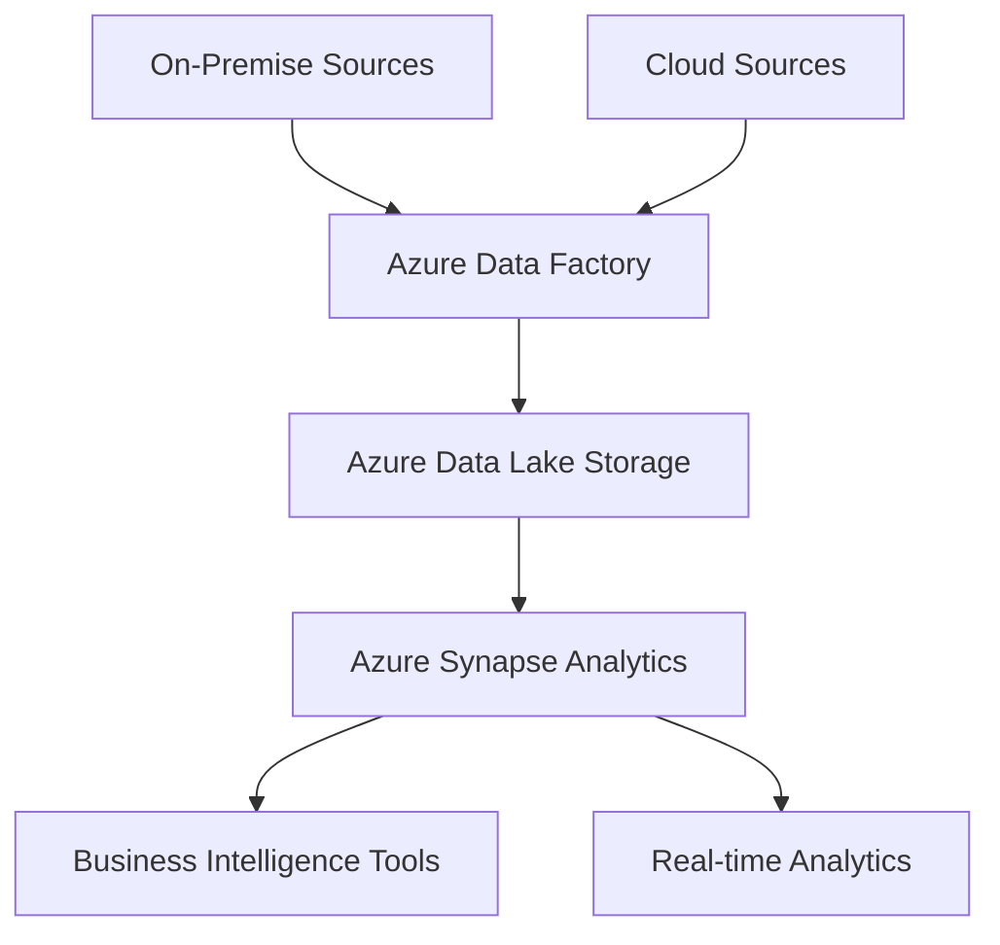
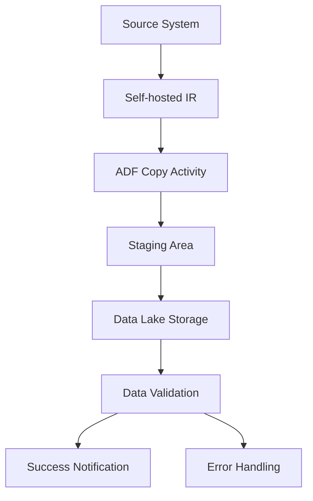
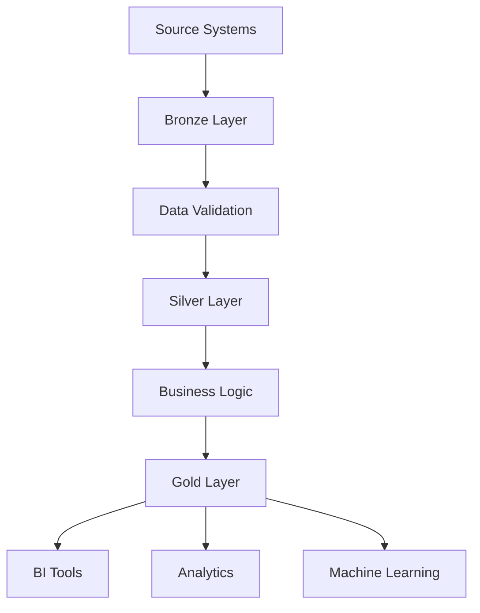

# 01 Azure Data Engineering Retail Workflow

This comprehensive Azure Data Engineering project focuses on transforming retail operations through advanced data integration and analytics. The project aims to consolidate diverse data sources from traditional retail operations, e-commerce platforms, and IoT devices into a unified, scalable Azure platform.

The solution implements a robust three-tier Medallion architecture (Bronze, Silver, and Gold) for data processing, ensuring data quality and reliability. Through Azure Data Factory workflows and Unity Catalog implementation, the project establishes secure, governed data pipelines that handle both batch and real-time data processing.

The end goal is to create an interactive Power BI dashboard that will:

- **Enable Real-time Decision Making:** Provide immediate insights into sales performance, inventory levels, and customer behavior
- **Predictive Analytics:** Utilize historical data patterns to forecast sales trends and optimize inventory management
- **Customer Insights:** Analyze customer preferences and shopping patterns to enhance personalization and marketing strategies
- **Operational Efficiency:** Monitor and optimize store operations through IoT sensor data and sales metrics
- **Financial Performance:** Track key performance indicators (KPIs) and financial metrics in real-time

The Power BI dashboard will connect directly to the Gold layer of the data architecture, ensuring that business users have access to clean, validated, and business-ready data for making informed decisions. This integration will enable stakeholders at all levels to leverage data-driven insights for strategic planning and daily operations.

# Project Objectives

- **Data Centralization:** Consolidate retail data from various sources into a unified Azure data platform
- **Real-time Analytics:** Enable real-time data processing and analytics capabilities
- **Scalability:** Design infrastructure to handle growing data volumes and seasonal peaks
- **Cost Optimization:** Implement cost-effective storage and processing solutions
- **Security Compliance:** Ensure data protection and regulatory compliance

# Azure Migration Considerations

- **Data Assessment:** Evaluate current data volumes, types, and quality
- **Network Bandwidth:** Analyze network requirements for data transfer
- **Legacy System Integration:** Plan for compatibility with existing systems
- **Business Continuity:** Minimize disruption during migration
- **Skills Gap:** Address training needs for Azure technologies

# Data Sources

## On-Premise Sources

- **Point of Sale (POS) Systems:** Transaction data, customer purchases, payment information
- **Inventory Management Systems:** Stock levels, product movement, warehouse data
- **CRM Databases:** Customer information, loyalty programs, purchase history
- **ERP Systems:** Financial data, supply chain information, HR data
- **Legacy Systems:** Historical data from older retail management systems

## Cloud Sources

- **E-commerce Platforms:** Online sales data, customer browsing behavior
- **Social Media APIs:** Customer sentiment, brand mentions, social engagement
- **IoT Devices:** Store sensors, smart shelf systems, footfall counters
- **Third-party Analytics:** Market research data, competitor analysis
- **Mobile Applications:** App usage data, mobile purchases, customer location data

## Database Schema Design

### 1. Transaction Management

```sql
-- POS Transactions
CREATE TABLE pos_transactions (
    transaction_id BIGINT PRIMARY KEY,
    store_id INT,
    customer_id INT,
    transaction_date TIMESTAMP,
    total_amount DECIMAL(10,2),
    payment_method VARCHAR(50),
    cashier_id INT
);

-- Transaction Items
CREATE TABLE transaction_items (
    item_id BIGINT PRIMARY KEY,
    transaction_id BIGINT,
    product_id INT,
    quantity INT,
    unit_price DECIMAL(10,2),
    discount_amount DECIMAL(10,2)
);
```

### 2. Inventory Management

```sql
-- Products
CREATE TABLE products (
    product_id INT PRIMARY KEY,
    product_name VARCHAR(100),
    category_id INT,
    supplier_id INT,
    unit_cost DECIMAL(10,2),
    retail_price DECIMAL(10,2),
    reorder_level INT
);

-- Inventory
CREATE TABLE inventory (
    inventory_id BIGINT PRIMARY KEY,
    product_id INT,
    warehouse_id INT,
    quantity_on_hand INT,
    last_restock_date TIMESTAMP,
    next_restock_date TIMESTAMP
);
```

### 3. Customer Relationship Management

```sql
-- Customers
CREATE TABLE customers (
    customer_id INT PRIMARY KEY,
    first_name VARCHAR(50),
    last_name VARCHAR(50),
    email VARCHAR(100),
    phone VARCHAR(20),
    join_date DATE,
    loyalty_tier VARCHAR(20)
);

-- Customer Preferences
CREATE TABLE customer_preferences (
    preference_id BIGINT PRIMARY KEY,
    customer_id INT,
    category_id INT,
    preference_type VARCHAR(50),
    last_updated TIMESTAMP
);
```

### 4. E-commerce Platform

```sql
-- Online Orders
CREATE TABLE online_orders (
    order_id BIGINT PRIMARY KEY,
    customer_id INT,
    order_date TIMESTAMP,
    shipping_address TEXT,
    order_status VARCHAR(50),
    delivery_date TIMESTAMP
);

-- Shopping Cart
CREATE TABLE shopping_cart (
    cart_id BIGINT PRIMARY KEY,
    customer_id INT,
    product_id INT,
    quantity INT,
    added_date TIMESTAMP
);
```

### 5. Social Media Analytics

```sql
-- Social Media Mentions
CREATE TABLE social_mentions (
    mention_id BIGINT PRIMARY KEY,
    platform VARCHAR(50),
    content TEXT,
    sentiment_score DECIMAL(3,2),
    mention_date TIMESTAMP,
    engagement_count INT
);

-- Brand Analytics
CREATE TABLE brand_analytics (
    analytics_id BIGINT PRIMARY KEY,
    metric_name VARCHAR(100),
    metric_value DECIMAL(10,2),
    measurement_date TIMESTAMP,
    source VARCHAR(50)
);
```

### 6. IoT Device Data

```sql
-- Store Sensors
CREATE TABLE store_sensors (
    sensor_id BIGINT PRIMARY KEY,
    store_id INT,
    sensor_type VARCHAR(50),
    location VARCHAR(100),
    reading_value DECIMAL(10,2),
    reading_timestamp TIMESTAMP
);

-- Footfall Data
CREATE TABLE footfall_data (
    footfall_id BIGINT PRIMARY KEY,
    store_id INT,
    count INT,
    hour_of_day INT,
    date DATE
);
```

### 7. Third-party Analytics

```sql
-- Market Research
CREATE TABLE market_research (
    research_id BIGINT PRIMARY KEY,
    research_type VARCHAR(100),
    data_point VARCHAR(100),
    value DECIMAL(10,2),
    collection_date DATE
);

-- Competitor Analysis
CREATE TABLE competitor_analysis (
    analysis_id BIGINT PRIMARY KEY,
    competitor_name VARCHAR(100),
    metric_name VARCHAR(100),
    metric_value DECIMAL(10,2),
    analysis_date DATE
);
```

### 8. Mobile Application Data

```sql
-- App Usage
CREATE TABLE app_usage (
    usage_id BIGINT PRIMARY KEY,
    customer_id INT,
    feature_accessed VARCHAR(100),
    access_timestamp TIMESTAMP,
    session_duration INT
);

-- Mobile Purchases
CREATE TABLE mobile_purchases (
    purchase_id BIGINT PRIMARY KEY,
    customer_id INT,
    product_id INT,
    purchase_amount DECIMAL(10,2),
    purchase_timestamp TIMESTAMP,
    location_data GEOMETRY
);
```

### 9. Legacy System Data

```sql
-- Historical Sales
CREATE TABLE historical_sales (
    history_id BIGINT PRIMARY KEY,
    sale_date DATE,
    product_id INT,
    quantity_sold INT,
    historical_price DECIMAL(10,2),
    store_id INT
);

-- Legacy Customer Data
CREATE TABLE legacy_customer_data (
    legacy_id BIGINT PRIMARY KEY,
    customer_id INT,
    historical_segment VARCHAR(50),
    registration_date DATE,
    last_activity_date DATE
);
```

### 10. ERP Integration

```sql
-- Financial Transactions
CREATE TABLE financial_transactions (
    finance_id BIGINT PRIMARY KEY,
    transaction_type VARCHAR(50),
    amount DECIMAL(10,2),
    transaction_date TIMESTAMP,
    account_code VARCHAR(20)
);

-- Supply Chain Events
CREATE TABLE supply_chain_events (
    event_id BIGINT PRIMARY KEY,
    event_type VARCHAR(50),
    supplier_id INT,
    event_date TIMESTAMP,
    impact_level VARCHAR(20)
);
```

## Integration Architecture



# Azure Data Factory (ADF) Workflow Details

## 1. Local to Cloud Migration Process

- **Setup Self-hosted Integration Runtime:**
    - Download and install Integration Runtime on local server
    - Register IR with your Azure Data Factory instance
    - Configure network security and firewall rules
- **Source System Configuration:**
    - Create linked service for on-premises data sources
    - Configure authentication methods (Windows/SQL)
    - Test connection to verify connectivity
- **Dataset Configuration:**
    - Create source datasets for each data type
    - Define schema and data format (CSV, JSON, etc.)
    - Set file path patterns and partitioning
- **Pipeline Development:**
    - Create copy activity for data movement
    - Configure source and sink settings
    - Set up parallel copy options for performance
    - Implement error handling and logging

## 2. Cloud to Cloud Migration Process

- **Source Cloud Service Configuration:**
    - Create linked services for cloud sources
    - Set up service principal authentication
    - Configure access policies and permissions
- **Destination Storage Setup:**
    - Create Azure Data Lake Storage Gen2 containers
    - Configure hierarchical namespace
    - Set up access control (RBAC/ACL)
- **Data Movement Pipeline:**
    - Use Copy Activity with cloud optimized connectors
    - Enable staged copy for better performance
    - Configure compression and column mapping

## 3. Monitoring and Optimization

- **Performance Monitoring:**
    - Configure Azure Monitor integration
    - Set up alerts for pipeline failures
    - Track data movement metrics
- **Cost Optimization:**
    - Implement incremental loading patterns
    - Configure pipeline concurrency limits
    - Optimize Integration Runtime sizing

## 4. Sample ADF Pipeline Structure



## 5. Best Practices

- **Security:**
    - Use managed identities for authentication
    - Implement network isolation
    - Enable encryption in transit and at rest
- **Performance:**
    - Use partition copy strategy for large datasets
    - Implement appropriate trigger mechanisms
    - Configure optimal batch sizes
- **Maintenance:**
    - Implement proper logging and monitoring
    - Set up automated cleanup processes
    - Document pipeline dependencies

# Medallion Architecture Implementation

## 1. Bronze Layer (Raw)

The Bronze layer stores raw data exactly as received from source systems with minimal transformations.

- **Data Ingestion Steps:**
    - 1. Configure raw data landing zone in ADLS Gen2
    - 2. Set up file monitoring triggers
    - 3. Implement batch ingestion patterns
    - 4. Configure streaming ingestion
    - 5. Set up error handling for failed loads
    - 6. Implement data validation checks
    - 7. Configure metadata logging
    - 8. Set up partitioning strategy
    - 9. Implement file format standardization
    - 10. Configure data retention policies
    - 11. Set up access control (RBAC)
    - 12. Implement audit logging
    - 13. Configure data encryption
    - 14. Set up data quality monitoring
    - 15. Implement source system tracking
    - 16. Configure load balancing
    - 17. Set up failover mechanisms
    - 18. Implement backup strategies
    - 19. Configure network security
    - 20. Set up monitoring alerts

```sql
-- Bronze Layer Sample Code
CREATE EXTERNAL TABLE bronze.sales_raw (
    raw_data STRING
)
STORED AS PARQUET
LOCATION '/bronze/sales/raw/'
TBLPROPERTIES (
    'delta.minReaderVersion' = '1',
    'delta.minWriterVersion' = '2'
);
```

## 2. Silver Layer (Standardized)

The Silver layer contains cleansed, standardized, and validated data with enforced schema.

- **Data Processing Steps:**
    - 1. Implement schema enforcement
    - 2. Set up data type validation
    - 3. Configure duplicate removal
    - 4. Implement null handling
    - 5. Set up data cleansing rules
    - 6. Configure data quality checks
    - 7. Implement reference data validation
    - 8. Set up error handling
    - 9. Configure data standardization
    - 10. Implement data masking
    - 11. Set up data enrichment
    - 12. Configure change data capture
    - 13. Implement slowly changing dimensions
    - 14. Set up data versioning
    - 15. Configure data lineage tracking
    - 16. Implement business rule validation
    - 17. Set up performance monitoring
    - 18. Configure incremental processing
    - 19. Implement data reconciliation
    - 20. Set up automated testing

```sql
-- Silver Layer Sample Code
CREATE TABLE silver.sales_standardized (
    sale_id BIGINT,
    transaction_date TIMESTAMP,
    customer_id STRING,
    product_id STRING,
    quantity INT,
    unit_price DECIMAL(10,2),
    total_amount DECIMAL(10,2),
    processed_timestamp TIMESTAMP,
    source_system STRING,
    CONSTRAINT pk_sales PRIMARY KEY (sale_id)
)
USING DELTA
PARTITIONED BY (CAST(transaction_date AS DATE));
```

## 3. Gold Layer (Business)

The Gold layer contains business-level aggregates and curated datasets ready for consumption.

- **Data Transformation Steps:**
    - 1. Create dimensional models
    - 2. Implement aggregation logic
    - 3. Set up business metrics calculation
    - 4. Configure KPI generation
    - 5. Implement time-based analysis
    - 6. Set up hierarchical structures
    - 7. Configure data marts
    - 8. Implement access patterns
    - 9. Set up materialized views
    - 10. Configure caching strategies
    - 11. Implement query optimization
    - 12. Set up data refresh patterns
    - 13. Configure security views
    - 14. Implement role-based access
    - 15. Set up data sharing
    - 16. Configure reporting tables
    - 17. Implement data federation
    - 18. Set up cross-database joins
    - 19. Configure performance tuning
    - 20. Implement data governance

```sql
-- Gold Layer Sample Code
CREATE MATERIALIZED VIEW gold.sales_analysis
CLUSTER BY (product_category, region)
AS
SELECT 
    p.product_category,
    s.region,
    DATE_TRUNC('month', transaction_date) as sale_month,
    COUNT(DISTINCT customer_id) as unique_customers,
    SUM(quantity) as total_units_sold,
    SUM(total_amount) as total_revenue,
    AVG(unit_price) as avg_unit_price
FROM silver.sales_standardized s
JOIN silver.products p ON s.product_id = p.product_id
GROUP BY 
    p.product_category,
    s.region,
    DATE_TRUNC('month', transaction_date);
```



# Change Data Capture (CDC) Implementation

CDC tracks and captures changes made to data sources, enabling incremental loading and real-time data synchronization.

## CDC Methods in Azure

- **SQL Server CDC:**
    - Enable CDC at database and table level
    - Track INSERT, UPDATE, and DELETE operations
    - Use change tracking tables for efficient processing

```sql
-- Enable CDC on Database
EXEC sys.sp_cdc_enable_db

-- Enable CDC on specific table
EXEC sys.sp_cdc_enable_table
@source_schema = 'dbo',
@source_name = 'Customers',
@role_name = NULL
```

## Slowly Changing Dimensions (SCD) Types

### Type 1 SCD (Overwrite)

Simply overwrites old values with new values, maintaining no history.

```sql
UPDATE DimCustomer
SET CustomerName = @NewName,
    UpdateDate = GETDATE()
WHERE CustomerID = @CustomerID
```

### Type 2 SCD (Historical)

Maintains complete history by creating new records for changes.

```sql
-- Insert new record
INSERT INTO DimCustomer (
    CustomerID, CustomerName, 
    EffectiveDate, EndDate, 
    IsCurrent
)
VALUES (
    @CustomerID, @NewName,
    GETDATE(), NULL,
    1
);

-- Update previous record
UPDATE DimCustomer
SET EndDate = GETDATE(),
    IsCurrent = 0
WHERE CustomerID = @CustomerID 
AND IsCurrent = 1;
```

### Type 3 SCD (Previous Value)

Maintains current and previous values in separate columns.

```sql
UPDATE DimCustomer
SET PreviousName = CurrentName,
    CurrentName = @NewName,
    ChangeDate = GETDATE()
WHERE CustomerID = @CustomerID;
```

# Unity Catalog Implementation

Unity Catalog provides centralized governance and security for data assets across Azure Databricks workspaces.

## Key Features

- **Three-Level Namespace:**
    - Catalog.Schema.Table hierarchy
    - Improved organization and governance
- **Fine-grained Access Control:**
    - Row-level and column-level security
    - Data sharing across workspaces

```sql
-- Create Catalog
CREATE CATALOG IF NOT EXISTS retail_catalog;

-- Create Schema
USE CATALOG retail_catalog;
CREATE SCHEMA IF NOT EXISTS sales;

-- Create Table with Unity Catalog
CREATE TABLE retail_catalog.sales.transactions (
    transaction_id BIGINT,
    customer_id STRING,
    amount DECIMAL(10,2),
    transaction_date TIMESTAMP
)
USING DELTA
COMMENT 'Retail transactions table';
```

## Unity Catalog Security

```sql
-- Grant Permissions
GRANT SELECT ON CATALOG retail_catalog TO group_name;
GRANT MODIFY ON SCHEMA retail_catalog.sales TO user_email;

-- Row-Level Security
CREATE ROW FILTER policy_name ON retail_catalog.sales.transactions
AS (region_id = current_user_region());

-- Column-Level Security
GRANT SELECT ON TABLE retail_catalog.sales.transactions (
    transaction_id, transaction_date
) TO analyst_group;
```

# Pipeline Monitoring and Real-Time Processing

## Monitoring Implementation

- **Key Monitoring Areas:**
    - Pipeline execution metrics
    - Data quality metrics
    - System performance metrics
    - Error rates and failures

```python
# Sample monitoring implementation
from azure.monitor import MonitorClient

def monitor_pipeline():
    metrics_client = MonitorClient()
    
    # Monitor pipeline metrics
    pipeline_metrics = metrics_client.get_pipeline_metrics(
        resource_id="pipeline_id",
        timespan="last 24h",
        interval="5m"
    )
    
    # Set up alerts
    if pipeline_metrics.failure_rate > threshold:
        send_alert("Pipeline failure rate exceeded threshold")
```

## Common Pipeline Issues and Solutions

- **1. Data Latency Issues**Problem: Delayed data processing affecting real-time analyticsSolution: Implement stream processing using Azure Event Hubs or Apache Kafka
- **2. Memory Bottlenecks**Problem: Pipeline crashes due to insufficient memorySolution: Implement proper partitioning and windowing strategies
- **3. Data Quality Issues**Problem: Inconsistent or corrupt data entering the pipelineSolution: Implement robust data validation at ingestion points
- **4. Pipeline Dependencies**Problem: Failed upstream jobs causing cascade failuresSolution: Implement proper error handling and retry mechanisms
- **5. Resource Constraints**Problem: Pipeline slowdown during peak loadsSolution: Implement auto-scaling and load balancing
- **6. Data Skew**Problem: Uneven data distribution causing processing bottlenecksSolution: Implement proper data partitioning strategies
- **7. Monitoring Gaps**Problem: Missing critical pipeline failuresSolution: Implement comprehensive logging and alerting
- **8. Schema Evolution**Problem: Pipeline failures due to changing data schemasSolution: Implement schema validation and evolution handling
- **9. Connection Timeouts**Problem: Failed connections to data sourcesSolution: Implement connection pooling and retry logic
- **10. Dead Letter Queue Management**Problem: Lost messages in failed processingSolution: Implement proper dead letter queue handling and monitoring

```python
# Sample error handling implementation
def process_retail_data(data):
    try:
        # Process data
        processed_data = transform_data(data)
        
        # Quality checks
        if not validate_data(processed_data):
            raise DataQualityException("Data validation failed")
            
        # Save to sink
        save_to_sink(processed_data)
        
    except Exception as e:
        # Log error
        log_error(e)
        
        # Send to dead letter queue
        send_to_dlq(data, str(e))
        
        # Trigger alert
        send_alert(f"Pipeline error: {str(e)}")
        
        # Retry logic
        if is_retryable(e):
            retry_processing(data)
```

## Performance Optimization Strategies

- **1. Data Partitioning**
    - Implement time-based partitioning for historical data
    - Use hash partitioning for evenly distributed workloads
    - Configure partition pruning for query optimization
- **2. Caching Mechanisms**
    - Implement result-set caching for frequently accessed data
    - Use distributed caching for improved performance
    - Configure cache invalidation strategies

```python
# Sample caching implementation
from azure.storage.blob import BlobServiceClient
from functools import lru_cache

@lru_cache(maxsize=1000)
def get_retail_data(product_id: str):
    blob_service = BlobServiceClient.from_connection_string(conn_str)
    container_client = blob_service.get_container_client("retail-data")
    blob_client = container_client.get_blob_client(f"products/{product_id}")
    return blob_client.download_blob().readall()
```

## Disaster Recovery and Backup

- **1. Backup Strategy**
    - Implement automated daily backups
    - Configure geo-redundant storage
    - Set up point-in-time recovery
- **2. Recovery Procedures**
    - Define recovery point objectives (RPO)
    - Establish recovery time objectives (RTO)
    - Implement automated failover procedures

```python
# Sample backup implementation
def backup_retail_data():
    try:
        # Initialize backup client
        backup_client = DataLakeBackupClient(
            account_url="backup_storage_url",
            credential=credential
        )
        
        # Perform backup
        backup_client.backup_container(
            source_container="retail-data",
            destination_container="retail-backup",
            backup_type="Incremental"
        )
        
    except Exception as e:
        log_error("Backup failed: " + str(e))
        send_alert("Backup failure detected")
```
