# Retail Data Pipeline - Azure Data Factory with Medallion Architecture

## Overview
This project implements an end-to-end retail data pipeline using Azure Data Factory (ADF) with a medallion architecture pattern. The pipeline processes retail data from multiple sources into ADLS Gen2, applying bronze, silver, and gold layer transformations for comprehensive data analytics.

## Complete Pipeline Architecture

### End-to-End Pipeline Flow

```mermaid
graph TB
    subgraph "Data Sources"
        A1[POS Systems<br/>SQL Server]
        A2[E-commerce Platform<br/>REST API]
        A3[Inventory Management<br/>SAP HANA]
        A4[Customer Database<br/>Salesforce]
        A5[Payment Gateway<br/>Stripe API]
        A6[Loyalty Program<br/>MongoDB]
        A7[Marketing Platform<br/>HubSpot API]
        A8[Social Media<br/>Twitter/Facebook APIs]
    end
    
    subgraph "Data Ingestion Layer"
        B1[Azure Event Hubs<br/>Real-time Streaming]
        B2[Azure Data Factory<br/>Batch Processing]
        B3[Azure Functions<br/>Event Processing]
        B4[Azure Logic Apps<br/>Workflow Automation]
    end
    
    subgraph "Bronze Layer - Raw Data"
        C1[ADLS Gen2 Container<br/>bronze/pos_transactions/]
        C2[ADLS Gen2 Container<br/>bronze/ecommerce_orders/]
        C3[ADLS Gen2 Container<br/>bronze/inventory_movement/]
        C4[ADLS Gen2 Container<br/>bronze/customer_data/]
        C5[ADLS Gen2 Container<br/>bronze/payment_data/]
        C6[ADLS Gen2 Container<br/>bronze/loyalty_data/]
        C7[ADLS Gen2 Container<br/>bronze/marketing_data/]
        C8[ADLS Gen2 Container<br/>bronze/social_media_data/]
    end
    
    subgraph "Silver Layer - Cleaned Data"
        D1[Data Flow Activities<br/>Transformation Engine]
        D2[Business Rules Engine<br/>Validation Framework]
        D3[Data Quality Checks<br/>Quality Gates]
        D4[ADLS Gen2 Container<br/>silver/clean_transactions/]
        D5[ADLS Gen2 Container<br/>silver/enriched_orders/]
        D6[ADLS Gen2 Container<br/>silver/inventory_snapshot/]
        D7[ADLS Gen2 Container<br/>silver/customer_master/]
        D8[ADLS Gen2 Container<br/>silver/payment_master/]
        D9[ADLS Gen2 Container<br/>silver/loyalty_master/]
        D10[ADLS Gen2 Container<br/>silver/marketing_master/]
        D11[ADLS Gen2 Container<br/>silver/social_media_master/]
    end
    
    subgraph "Gold Layer - Analytics Ready"
        E1[Aggregation Engine<br/>Business Metrics]
        E2[KPI Calculations<br/>Performance Metrics]
        E3[ADLS Gen2 Container<br/>gold/daily_sales_summary/]
        E4[ADLS Gen2 Container<br/>gold/customer_segments/]
        E5[ADLS Gen2 Container<br/>gold/product_performance/]
        E6[ADLS Gen2 Container<br/>gold/inventory_alerts/]
        E7[ADLS Gen2 Container<br/>gold/financial_summary/]
        E8[ADLS Gen2 Container<br/>gold/marketing_performance/]
        E9[ADLS Gen2 Container<br/>gold/social_media_analytics/]
    end
    
    subgraph "Consumption Layer"
        F1[Power BI Dashboards<br/>Executive Reporting]
        F2[Azure Synapse Analytics<br/>Data Warehouse]
        F3[Real-time APIs<br/>Application Integration]
        F4[Machine Learning Models<br/>Predictive Analytics]
        F5[Business Applications<br/>CRM, ERP Integration]
    end
    
    subgraph "Security & Governance"
        G1[Azure Key Vault<br/>Secrets Management]
        G2[Azure Active Directory<br/>RBAC & Authentication]
        G3[Azure Monitor<br/>Pipeline Health]
        G4[Log Analytics<br/>Audit Logs]
        G5[Data Quality Metrics<br/>SLA Monitoring]
        G6[Cost Optimization<br/>Resource Management]
    end
    
    %% Data Flow Connections
    A1 --> B2
    A2 --> B1
    A3 --> B2
    A4 --> B2
    A5 --> B1
    A6 --> B2
    A7 --> B4
    A8 --> B1
    
    B1 --> C1
    B1 --> C2
    B1 --> C5
    B1 --> C8
    B2 --> C1
    B2 --> C3
    B2 --> C4
    B2 --> C6
    B3 --> C2
    B4 --> C7
    
    C1 --> D1
    C2 --> D1
    C3 --> D1
    C4 --> D1
    C5 --> D1
    C6 --> D1
    C7 --> D1
    C8 --> D1
    
    D1 --> D2
    D2 --> D3
    D3 --> D4
    D3 --> D5
    D3 --> D6
    D3 --> D7
    D3 --> D8
    D3 --> D9
    D3 --> D10
    D3 --> D11
    
    D4 --> E1
    D5 --> E1
    D6 --> E1
    D7 --> E1
    D8 --> E1
    D9 --> E1
    D10 --> E1
    D11 --> E1
    
    E1 --> E2
    E2 --> E3
    E2 --> E4
    E2 --> E5
    E2 --> E6
    E2 --> E7
    E2 --> E8
    E2 --> E9
    
    E3 --> F1
    E4 --> F1
    E5 --> F1
    E6 --> F1
    E7 --> F1
    E8 --> F1
    E9 --> F1
    
    E3 --> F2
    E4 --> F2
    E5 --> F2
    E6 --> F2
    E7 --> F2
    E8 --> F2
    E9 --> F2
    
    E3 --> F3
    E4 --> F3
    E5 --> F3
    E6 --> F3
    
    E3 --> F4
    E4 --> F4
    E5 --> F4
    E6 --> F4
    
    E3 --> F5
    E4 --> F5
    E5 --> F5
    E6 --> F5
    
    %% Security Connections
    B1 --> G1
    B2 --> G1
    B3 --> G1
    B4 --> G1
    
    B1 --> G2
    B2 --> G2
    B3 --> G2
    B4 --> G2
    
    D1 --> G3
    E1 --> G3
    D2 --> G4
    E2 --> G4
    D3 --> G5
    E2 --> G5
    G3 --> G6
    G4 --> G6
    G5 --> G6
```

### Detailed Pipeline Processing Flow

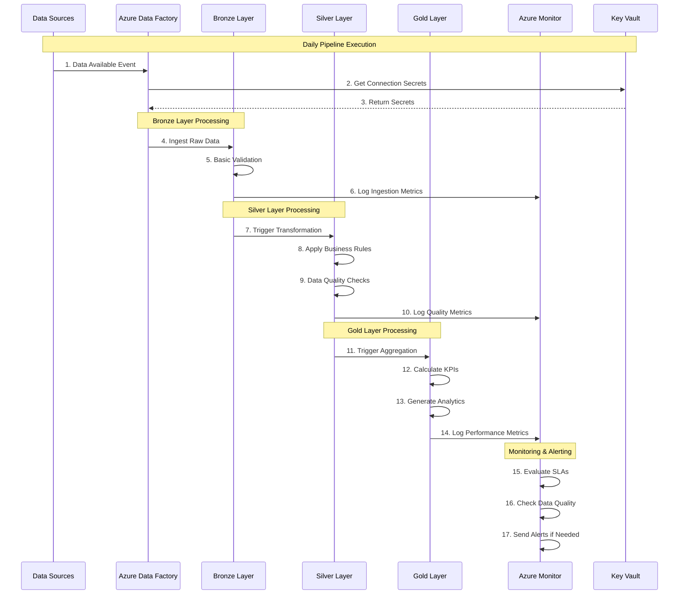

## Data Sources and Metadata

### 1. POS Systems - SQL Server

**Source Configuration**:
```json
{
  "source_system": "POS_SQL_SERVER",
  "database_name": "RetailPOS",
  "connection_type": "SQL Server",
  "authentication": "SQL Authentication via Key Vault",
  "data_center": "Primary DC - East US",
  "sla_availability": "99.9%",
  "processing_frequency": "Hourly batch",
  "daily_volume": "50M transactions/day",
  "data_size": "2GB/day per store"
}
```

**Entity Relationship Diagram**:

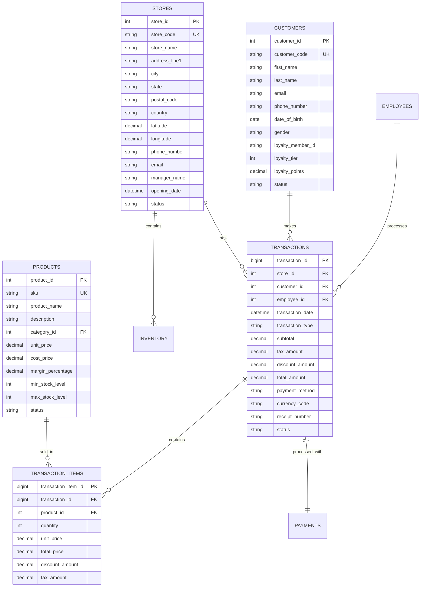

### 2. E-commerce Platform - REST API

**Real-time Processing Architecture**:

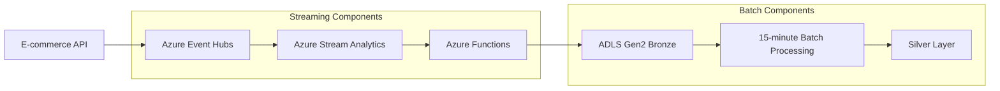

**API Data Model**:

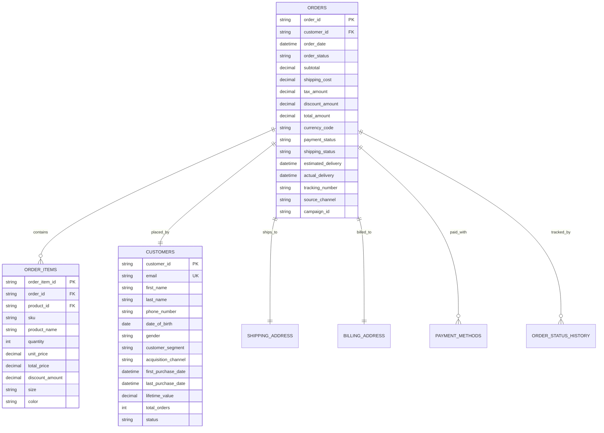

## Folder Structure

### Bronze Layer Structure
```
adls-gen2-container/
├── bronze/
│   ├── pos_transactions/
│   │   ├── year=2024/
│   │   │   ├── month=01/
│   │   │   │   ├── day=15/
│   │   │   │   │   ├── hour=00/
│   │   │   │   │   │   ├── pos_transactions_20240115_000000.parquet
│   │   │   │   │   │   ├── pos_transactions_20240115_000000_metadata.json
│   │   │   │   │   │   └── pos_transactions_20240115_000000_checksum.md5
│   │   │   │   │   ├── hour=01/
│   │   │   │   │   └── hour=23/
│   │   │   │   ├── day=16/
│   │   │   │   └── day=31/
│   │   │   ├── month=02/
│   │   │   └── month=12/
│   │   ├── _metadata/
│   │   │   ├── schema_evolution_log.json
│   │   │   ├── data_quality_reports/
│   │   │   └── ingestion_logs/
│   │   └── _temp/
│   ├── ecommerce_orders/
│   │   ├── year=2024/
│   │   │   ├── month=01/
│   │   │   │   ├── day=15/
│   │   │   │   │   ├── hour=00/
│   │   │   │   │   │   ├── minute=00/
│   │   │   │   │   │   │   ├── orders_20240115_000000.json.gz
│   │   │   │   │   │   │   └── orders_20240115_000000_metadata.json
│   │   │   │   │   │   ├── minute=15/
│   │   │   │   │   │   ├── minute=30/
│   │   │   │   │   │   └── minute=45/
│   │   │   │   │   ├── hour=01/
│   │   │   │   │   └── hour=23/
│   │   │   │   ├── day=16/
│   │   │   │   └── day=31/
│   │   │   ├── month=02/
│   │   │   └── month=12/
│   │   ├── _metadata/
│   │   └── _temp/
│   ├── inventory_movement/
│   │   ├── year=2024/
│   │   │   ├── month=01/
│   │   │   │   ├── day=15/
│   │   │   │   │   ├── inventory_movement_20240115.parquet
│   │   │   │   │   └── inventory_movement_20240115_metadata.json
│   │   │   │   ├── day=16/
│   │   │   │   └── day=31/
│   │   │   ├── month=02/
│   │   │   └── month=12/
│   │   ├── _metadata/
│   │   └── _temp/
│   └── customer_data/
│       ├── year=2024/
│       │   ├── month=01/
│       │   │   ├── day=15/
│       │   │   │   ├── customer_data_20240115_delta.parquet
│       │   │   │   └── customer_data_20240115_metadata.json
│       │   │   │   ├── day=16/
│       │   │   │   └── day=31/
│       │   │   ├── month=02/
│       │   │   └── month=12/
│       │   │   └── year=2023/
│       ├── _metadata/
│       └── _temp/
```

### Silver Layer Structure
```
adls-gen2-container/
├── silver/
│   ├── clean_transactions/
│   │   ├── year=2024/
│   │   │   ├── month=01/
│   │   │   │   ├── day=15/
│   │   │   │   │   ├── clean_transactions_20240115.parquet
│   │   │   │   │   ├── clean_transactions_20240115_quality_report.json
│   │   │   │   │   └── clean_transactions_20240115_audit_log.json
│   │   │   │   ├── day=16/
│   │   │   │   └── day=31/
│   │   │   ├── month=02/
│   │   │   └── month=12/
│   │   │   └── year=2023/
│   │   ├── _metadata/
│   │   │   ├── schema_version.json
│   │   │   ├── business_rules_applied.json
│   │   │   ├── data_quality_metrics/
│   │   │   └── transformation_logs/
│   │   └── _temp/
│   ├── enriched_orders/
│   │   ├── year=2024/
│   │   │   ├── month=01/
│   │   │   │   ├── day=15/
│   │   │   │   │   ├── enriched_orders_20240115.parquet
│   │   │   │   │   ├── enriched_orders_20240115_quality_report.json
│   │   │   │   │   └── enriched_orders_20240115_audit_log.json
│   │   │   │   ├── day=16/
│   │   │   │   └── day=31/
│   │   │   ├── month=02/
│   │   │   └── month=12/
│   │   │   └── year=2023/
│   │   ├── _metadata/
│   │   └── _temp/
│   ├── inventory_snapshot/
│   ├── customer_master/
│   ├── payment_master/
│   ├── loyalty_master/
│   ├── marketing_master/
│   └── social_media_master/
```

### Gold Layer Structure
```
adls-gen2-container/
├── gold/
│   ├── daily_sales_summary/
│   │   ├── year=2024/
│   │   │   ├── month=01/
│   │   │   │   ├── day=15/
│   │   │   │   │   ├── daily_sales_summary_20240115.parquet
│   │   │   │   │   ├── daily_sales_summary_20240115_kpi_report.json
│   │   │   │   │   └── daily_sales_summary_20240115_audit_log.json
│   │   │   │   ├── day=16/
│   │   │   │   └── day=31/
│   │   │   ├── month=02/
│   │   │   └── month=12/
│   │   │   └── year=2023/
│   │   ├── _metadata/
│   │   │   ├── kpi_definitions.json
│   │   │   ├── aggregation_rules.json
│   │   │   ├── business_metrics/
│   │   │   └── performance_logs/
│   │   └── _temp/
│   ├── customer_segments/
│   │   ├── year=2024/
│   │   │   ├── month=01/
│   │   │   │   ├── day=15/
│   │   │   │   │   ├── customer_segments_20240115.parquet
│   │   │   │   │   ├── customer_segments_20240115_segmentation_report.json
│   │   │   │   │   └── customer_segments_20240115_audit_log.json
│   │   │   │   ├── day=16/
│   │   │   │   └── day=31/
│   │   │   ├── month=02/
│   │   │   └── month=12/
│   │   │   └── year=2023/
│   │   ├── _metadata/
│   │   │   ├── segmentation_rules.json
│   │   │   ├── rfm_parameters.json
│   │   │   ├── customer_analytics/
│   │   │   └── performance_logs/
│   │   └── _temp/
│   ├── product_performance/
│   ├── inventory_alerts/
│   ├── financial_summary/
│   ├── marketing_performance/
│   └── social_media_analytics/
```

## Pipeline Components

### 1. Master Orchestration Pipeline

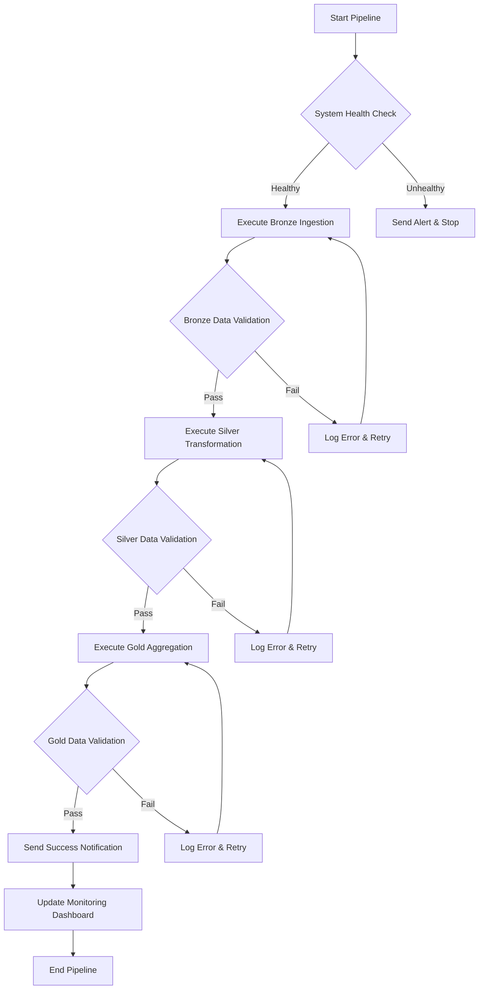

### 2. Bronze Layer Ingestion Pipeline

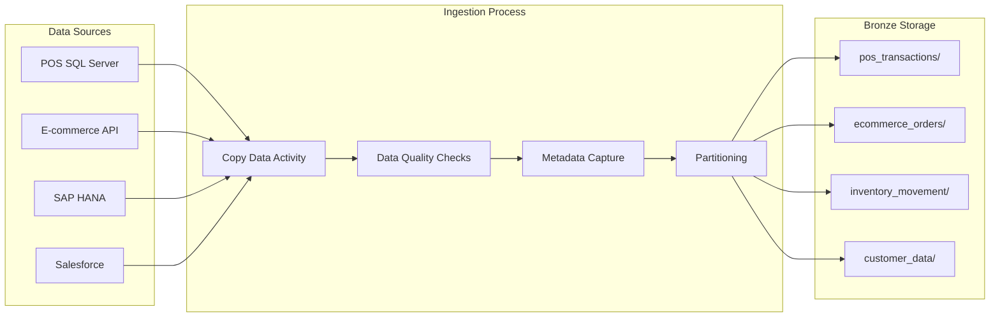

### 3. Silver Layer Transformation Pipeline

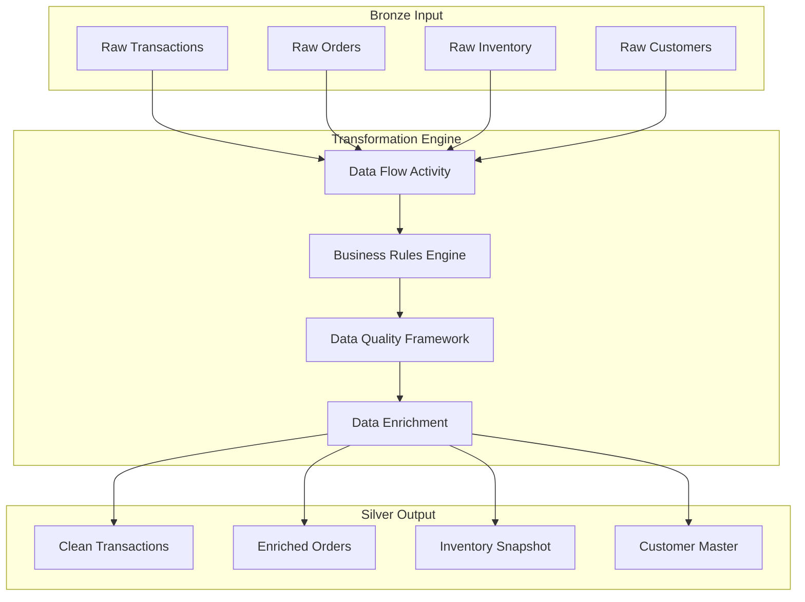

### 4. Gold Layer Aggregation Pipeline

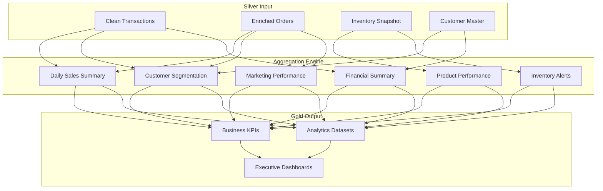

## Business Rules and Transformations

### Data Quality Rules
```json
{
  "data_quality_framework": {
    "bronze_validation": {
      "pos_transactions": {
        "required_fields": ["transaction_id", "store_id", "product_code", "amount"],
        "data_types": {
          "transaction_id": "bigint",
          "store_id": "int",
          "amount": "decimal(18,2)",
          "transaction_date": "datetime"
        },
        "business_rules": {
          "amount_validation": {
            "min_amount": 0.01,
            "max_amount": 10000.00
          },
          "store_validation": {
            "valid_stores": ["STORE001", "STORE002", "STORE003", "STORE004", "STORE005"]
          }
        },
        "completeness_threshold": 95.0,
        "accuracy_threshold": 98.0
      }
    },
    "silver_validation": {
      "completeness_threshold": 98.0,
      "accuracy_threshold": 99.0,
      "consistency_threshold": 99.5
    },
    "gold_validation": {
      "completeness_threshold": 99.0,
      "accuracy_threshold": 99.5,
      "consistency_threshold": 99.8
    }
  }
}
```

### Customer Segmentation Rules
```json
{
  "customer_segmentation": {
    "rfm_analysis": {
      "recency_parameters": {
        "r1_high": 30,
        "r2_medium": 90,
        "r3_low": 180,
        "r4_very_low": 365
      },
      "frequency_parameters": {
        "f1_high": 12,
        "f2_medium": 6,
        "f3_low": 3,
        "f4_very_low": 1
      },
      "monetary_parameters": {
        "m1_high": 1000.00,
        "m2_medium": 500.00,
        "m3_low": 200.00,
        "m4_very_low": 50.00
      },
      "segmentation_matrix": {
        "champions": {"r": [1, 2], "f": [1, 2], "m": [1, 2]},
        "loyal_customers": {"r": [1, 2], "f": [1, 2, 3], "m": [1, 2]},
        "potential_loyalists": {"r": [1, 2], "f": [1, 2], "m": [3, 4]},
        "new_customers": {"r": [1], "f": [1], "m": [1, 2, 3, 4]},
        "at_risk": {"r": [3, 4], "f": [1, 2, 3], "m": [1, 2]},
        "hibernating": {"r": [4], "f": [1, 2, 3, 4], "m": [1, 2, 3, 4]},
        "lost": {"r": [4], "f": [4], "m": [4]}
      }
    }
  }
}
```

## Security and Access Control

### Role-Based Access Control (RBAC)

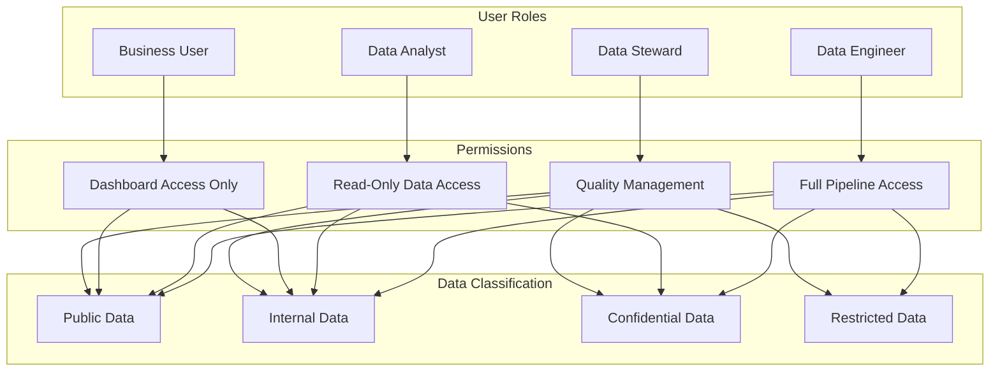

### Azure Key Vault Integration

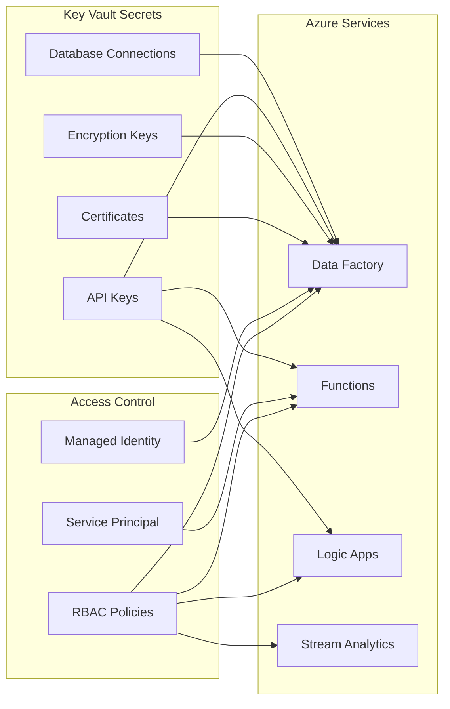

## Monitoring and Alerting

### Pipeline Monitoring Dashboard

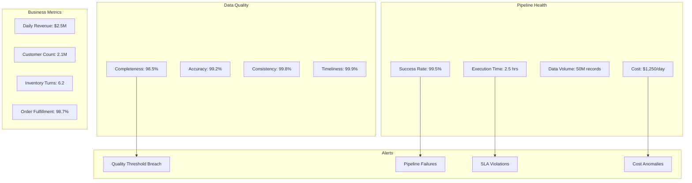

## Deployment and Configuration

### Infrastructure Setup
```bash
# Deploy Azure resources
az group create --name rg-retail-data-pipeline --location "East US"

# Deploy Data Factory
az datafactory create --resource-group rg-retail-data-pipeline --name adf-retail-pipeline --location "East US"

# Deploy Storage Account
az storage account create --resource-group rg-retail-data-pipeline --name retaildatalakestg --location "East US" --sku Standard_LRS

# Deploy Key Vault
az keyvault create --resource-group rg-retail-data-pipeline --name retail-data-pipeline-kv --location "East US"
```

### Pipeline Configuration
```json
{
  "pipeline_configuration": {
    "master_orchestration": {
      "name": "99-master-orchestration",
      "schedule": "daily at 6:00 AM EST",
      "timeout": "8 hours",
      "retry_policy": {
        "max_retries": 3,
        "retry_interval": "30 minutes"
      }
    },
    "bronze_ingestion": {
      "name": "01-bronze-ingestion",
      "schedule": "hourly",
      "parallel_execution": true,
      "data_sources": ["pos", "ecommerce", "inventory", "customer"]
    },
    "silver_transformation": {
      "name": "02-silver-transformation",
      "schedule": "after bronze completion",
      "data_flows": ["pos_cleaning", "order_enrichment", "inventory_processing", "customer_master"]
    },
    "gold_aggregation": {
      "name": "03-gold-aggregation",
      "schedule": "after silver completion",
      "aggregations": ["daily_sales", "customer_segments", "product_performance", "inventory_alerts"]
    }
  }
}
```

## Business Value and KPIs

### Key Performance Indicators

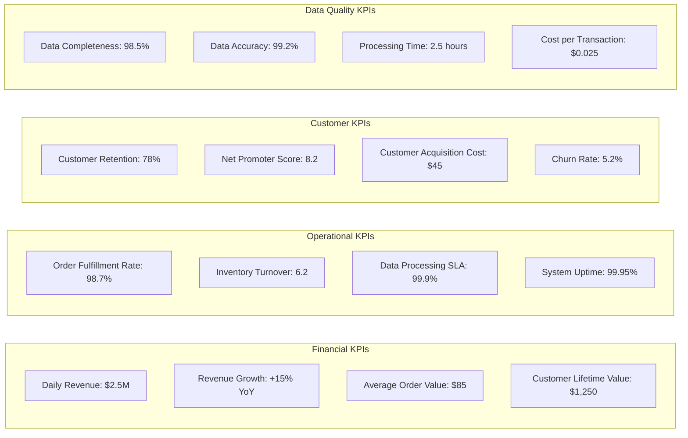

## Troubleshooting and Support

### Common Issues and Solutions

| Issue | Cause | Solution |
|-------|-------|----------|
| Pipeline Timeout | Large data volume | Increase timeout, optimize queries |
| Data Quality Failure | Source system changes | Update validation rules |
| Connection Failures | Network issues | Check firewall, retry logic |
| Cost Spike | Resource over-provisioning | Right-size compute resources |

### Support Contacts
- **Data Engineering Team**: data-eng@company.com
- **Infrastructure Team**: infra@company.com
- **Business Analysts**: analytics@company.com
- **Emergency Support**: +1-800-DATA-HELP

## Version History
- **v1.0**: Initial implementation with basic bronze/silver/gold layers
- **v1.1**: Added monitoring and alerting capabilities
- **v1.2**: Enhanced data quality framework
- **v2.0**: Performance optimizations and cost improvements
- **v2.1**: Added real-time streaming capabilities
- **v2.2**: Enhanced security and compliance features

## License
This project is proprietary and confidential. All rights reserved.

---

*Last Updated: January 15, 2024*
*Document Version: 2.2*
