# Real-time Inventory Management System
## Azure Data Engineering End-to-End Workflow

### Project Overview
A comprehensive real-time inventory management system built on Azure cloud services that provides live inventory tracking, automated reorder points, demand forecasting, and seamless integration with retail operations.

---

## Theoretical Foundations

### 1. Data Engineering Principles

#### 1.1 Lambda Architecture Theory
The inventory management system implements a **Lambda Architecture** pattern, which provides both real-time and batch processing capabilities:

**Core Components:**
- **Speed Layer**: Real-time processing for immediate inventory updates using Azure Stream Analytics
- **Batch Layer**: Historical data processing using Azure Data Factory and Databricks
- **Serving Layer**: Unified data access through Azure Synapse Analytics and Power BI

**Mathematical Foundation:**
```
Query Result = Real-time View ∩ Batch View
```
Where:
- Real-time View = Latest inventory state from streaming data
- Batch View = Historical inventory data from batch processing
- ∩ = Merge operation ensuring data consistency

**Benefits:**
- **Fault Tolerance**: System continues operating if one layer fails
- **Scalability**: Each layer scales independently based on workload
- **Accuracy**: Batch layer provides correct historical data
- **Latency**: Speed layer provides low-latency real-time updates

#### 1.2 Data Lakehouse Architecture Theory
The system follows **Data Lakehouse** principles, combining the best of data lakes and data warehouses:

**Core Principles:**
1. **ACID Transactions**: Delta tables provide transactional consistency
2. **Schema Evolution**: Automatic schema updates without data migration
3. **Time Travel**: Historical data versioning and rollback capabilities
4. **Upsert Operations**: Efficient data updates and merges

**Storage Layer Theory:**
```
Data Lakehouse = Data Lake + Data Warehouse Features
                = Raw Data Storage + ACID + Schema + Indexing
```

**Advantages:**
- **Cost Efficiency**: Object storage with relational database features
- **Performance**: Columnar storage with indexing and caching
- **Flexibility**: Support for structured, semi-structured, and unstructured data
- **Governance**: Built-in data lineage and audit capabilities

#### 1.3 Event-Driven Architecture Theory
The system implements **Event-Driven Architecture (EDA)** for real-time data processing:

**Event Sourcing Pattern:**
```
Event Store = {Event₁, Event₂, Event₃, ..., Eventₙ}
Current State = fold(Event Store, Initial State, Apply Function)
```

**CQRS (Command Query Responsibility Segregation):**
- **Commands**: Write operations (inventory updates, orders)
- **Queries**: Read operations (inventory reports, analytics)
- **Separation**: Independent scaling and optimization

**Event Streaming Theory:**
```
Throughput = Partition Count × Messages per Second per Partition
Latency = Processing Time + Network Time + Storage Time
```

### 2. Data Quality and Governance Theory

#### 2.1 Data Quality Dimensions
The system implements comprehensive data quality measures based on **DAMA-DMBOK** framework:

**Completeness (C):**
```
Completeness = (Non-null Values / Total Expected Values) × 100%
```

**Accuracy (A):**
```
Accuracy = (Correct Values / Total Values) × 100%
```

**Consistency (C):**
```
Consistency = (Consistent Records / Total Records) × 100%
```

**Timeliness (T):**
```
Timeliness = (Data Available Within SLA / Total Data Requests) × 100%
```

**Validity (V):**
```
Validity = (Valid Format Records / Total Records) × 100%
```

**Uniqueness (U):**
```
Uniqueness = (Unique Records / Total Records) × 100%
```

**Data Quality Score:**
```
DQ Score = (C + A + C + T + V + U) / 6
```

#### 2.2 Data Lineage Theory
**Data Lineage** tracks data flow from source to consumption:

**Lineage Graph:**
```
G = (V, E) where:
V = {Data Sources, Transformations, Destinations}
E = {Data Flow Relationships}
```

**Impact Analysis:**
```
Impact(S) = {T ∈ V | Path(S, T) exists in G}
```

**Root Cause Analysis:**
```
RootCause(T) = {S ∈ V | Path(S, T) exists and S is source}
```

### 3. Real-time Processing Theory

#### 3.1 Stream Processing Theory
**Apache Kafka Streams** and **Azure Stream Analytics** implement stream processing:

**Windowing Theory:**
- **Tumbling Windows**: Fixed-size, non-overlapping time intervals
- **Hopping Windows**: Fixed-size, overlapping time intervals
- **Sliding Windows**: Variable-size, overlapping time intervals
- **Session Windows**: Activity-based grouping

**Watermark Theory:**
```
Watermark(t) = max(Event Timestamp) - Allowed Lateness
```

**Backpressure Handling:**
```
Throughput = min(Producer Rate, Consumer Rate, Processing Rate)
```

#### 3.2 CEP (Complex Event Processing) Theory
**Complex Event Processing** for inventory pattern detection:

**Event Pattern Matching:**
```
Pattern = Sequence(Event₁, Event₂, ..., Eventₙ)
Match = ∃ t₁ < t₂ < ... < tₙ : Event(tᵢ) = Eventᵢ
```

**Temporal Logic:**
- **Linear Temporal Logic (LTL)**: Time-based event sequences
- **Computational Tree Logic (CTL)**: Branching time structures

### 4. Machine Learning and Analytics Theory

#### 4.1 Demand Forecasting Theory
**Time Series Analysis** for inventory demand prediction:

**ARIMA Model:**
```
ARIMA(p,d,q) = AutoRegressive(p) + Integrated(d) + MovingAverage(q)
```

**Seasonal Decomposition:**
```
Y(t) = Trend(t) + Seasonal(t) + Residual(t)
```

**Exponential Smoothing:**
```
Ŷ(t+1) = α × Y(t) + (1-α) × Ŷ(t)
```

#### 4.2 Inventory Optimization Theory
**Economic Order Quantity (EOQ) Model:**
```
EOQ = √(2 × D × S / H)
```
Where:
- D = Annual demand
- S = Ordering cost per order
- H = Holding cost per unit per year

**Reorder Point Theory:**
```
ROP = Lead Time Demand + Safety Stock
Safety Stock = Z × σ × √(Lead Time)
```

**ABC Analysis:**
```
A Items: 20% of items, 80% of value
B Items: 30% of items, 15% of value
C Items: 50% of items, 5% of value
```

### 5. Scalability and Performance Theory

#### 5.1 Horizontal Scaling Theory
**Amdahl's Law:**
```
Speedup = 1 / ((1-P) + P/N)
```
Where:
- P = Parallelizable portion
- N = Number of processors

**Gustafson's Law:**
```
Speedup = N - α(N-1)
```
Where:
- α = Sequential portion
- N = Number of processors

#### 5.2 CAP Theorem
**Consistency, Availability, Partition Tolerance:**
- **CP Systems**: Strong consistency, partition tolerance (e.g., Cosmos DB)
- **AP Systems**: High availability, partition tolerance (e.g., Event Hubs)
- **CA Systems**: Consistency, availability (e.g., single-node databases)

### 6. Security and Compliance Theory

#### 6.1 Zero Trust Security Model
**Never Trust, Always Verify:**
```
Trust Score = f(Identity, Device, Location, Behavior, Data Sensitivity)
Access Decision = Trust Score > Threshold
```

#### 6.2 Data Privacy Theory
**Differential Privacy:**
```
ε-Differential Privacy: P[M(D₁) ∈ S] ≤ e^ε × P[M(D₂) ∈ S]
```

**k-Anonymity:**
```
|{t ∈ T | t[A₁,...,Aₙ] = t'[A₁,...,Aₙ]}| ≥ k
```

### 7. Cost Optimization Theory

#### 7.1 TCO (Total Cost of Ownership) Model
```
TCO = Hardware + Software + Operations + Maintenance + Training
```

#### 7.2 Data Lifecycle Cost Theory
```
Storage Cost = Hot Tier × Time₁ + Cool Tier × Time₂ + Archive Tier × Time₃
```

### 8. Business Intelligence and Analytics Theory

#### 8.1 Key Performance Indicators (KPIs) Theory
**Inventory Management KPIs** based on retail industry standards:

**Inventory Turnover Rate:**
```
Inventory Turnover = Cost of Goods Sold / Average Inventory Value
```

**Stockout Rate:**
```
Stockout Rate = (Number of Stockout Events / Total Product-SKU Combinations) × 100%
```

**Inventory Accuracy:**
```
Inventory Accuracy = (Physical Count Matches / Total Counts) × 100%
```

**Carrying Cost:**
```
Carrying Cost = (Storage Cost + Insurance + Obsolescence + Opportunity Cost) / Average Inventory Value
```

**Fill Rate:**
```
Fill Rate = (Orders Filled Completely / Total Orders) × 100%
```

#### 8.2 Demand Forecasting Theory
**Time Series Forecasting** methods for inventory planning:

**Moving Average:**
```
MA(n) = (D₁ + D₂ + ... + Dₙ) / n
```

**Weighted Moving Average:**
```
WMA = (w₁D₁ + w₂D₂ + ... + wₙDₙ) / (w₁ + w₂ + ... + wₙ)
```

**Exponential Smoothing:**
```
Sₜ = αDₜ + (1-α)Sₜ₋₁
```

**Holt-Winters Method:**
```
Level: Lₜ = α(Dₜ/Sₜ₋ₛ) + (1-α)(Lₜ₋₁ + Tₜ₋₁)
Trend: Tₜ = β(Lₜ - Lₜ₋₁) + (1-β)Tₜ₋₁
Seasonal: Sₜ = γ(Dₜ/Lₜ) + (1-γ)Sₜ₋ₛ
Forecast: Fₜ₊ₘ = (Lₜ + mTₜ)Sₜ₊ₘ₋ₛ
```

### 9. Supply Chain Optimization Theory

#### 9.1 Just-in-Time (JIT) Theory
**JIT Inventory Management** minimizes waste and reduces costs:

**Core Principles:**
- **Pull System**: Production based on actual demand
- **Continuous Flow**: Eliminate batch processing
- **Zero Defects**: Quality at the source
- **Continuous Improvement**: Kaizen philosophy

**Mathematical Model:**
```
JIT Cost = Ordering Cost + Holding Cost + Stockout Cost
Optimal Order Quantity = √(2 × Annual Demand × Ordering Cost / Holding Cost)
```

#### 9.2 Vendor Managed Inventory (VMI) Theory
**VMI** shifts inventory management responsibility to suppliers:

**Benefits:**
- **Reduced Bullwhip Effect**: Smoother demand patterns
- **Lower Inventory Levels**: Supplier manages stock
- **Improved Service Levels**: Better availability
- **Cost Reduction**: Shared inventory costs

**VMI Metrics:**
```
Service Level = (Orders Filled on Time / Total Orders) × 100%
Inventory Velocity = Annual Sales / Average Inventory
Vendor Performance = (On-Time Deliveries / Total Deliveries) × 100%
```

### 10. Risk Management Theory

#### 10.1 Supply Chain Risk Theory
**Risk Assessment** for inventory management:

**Risk Categories:**
1. **Supply Risk**: Supplier failures, quality issues
2. **Demand Risk**: Market volatility, seasonality
3. **Operational Risk**: System failures, human error
4. **Financial Risk**: Currency fluctuations, credit risk
5. **Regulatory Risk**: Compliance, trade restrictions

**Risk Quantification:**
```
Risk Score = Probability × Impact × Detection Difficulty
Expected Loss = Σ(Probabilityᵢ × Impactᵢ)
```

#### 10.2 Safety Stock Theory
**Safety Stock** protects against demand and supply variability:

**Demand Variability:**
```
Safety Stock = Z × σ × √(Lead Time)
```
Where:
- Z = Service level factor (e.g., 1.65 for 95% service level)
- σ = Standard deviation of demand
- Lead Time = Supplier lead time

**Supply Variability:**
```
Safety Stock = Z × √(Lead Time × σ²ᵈ + Demand² × σ²ₗ)
```
Where:
- σ²ᵈ = Demand variance
- σ²ₗ = Lead time variance

### 11. Digital Transformation Theory

#### 11.1 Industry 4.0 Theory
**Fourth Industrial Revolution** concepts for inventory management:

**Key Technologies:**
- **IoT Sensors**: Real-time inventory tracking
- **AI/ML**: Predictive analytics and automation
- **Blockchain**: Supply chain transparency
- **Digital Twins**: Virtual inventory modeling
- **AR/VR**: Enhanced warehouse operations

**Digital Maturity Model:**
```
Level 1: Manual Processes
Level 2: Basic Automation
Level 3: Integrated Systems
Level 4: Data-Driven Decisions
Level 5: Autonomous Operations
```

#### 11.2 Omnichannel Inventory Theory
**Omnichannel** inventory management across channels:

**Channel Integration:**
```
Unified Inventory = Store Inventory + Warehouse Inventory + Online Inventory
Channel Allocation = f(Demand, Capacity, Service Level, Cost)
```

**Fulfillment Options:**
- **Ship from Store**: Store fulfills online orders
- **Buy Online, Pickup in Store (BOPIS)**: Customer pickup
- **Ship to Store**: Online order, store delivery
- **Drop Shipping**: Direct supplier fulfillment

### 12. Sustainability Theory

#### 12.1 Green Supply Chain Theory
**Sustainable inventory management** practices:

**Environmental Metrics:**
```
Carbon Footprint = Σ(Transportation Emissions + Storage Emissions + Processing Emissions)
Waste Reduction = (Waste Avoided / Total Waste Generated) × 100%
Energy Efficiency = (Useful Output / Energy Input) × 100%
```

**Circular Economy Principles:**
- **Reduce**: Minimize inventory levels
- **Reuse**: Return and refurbish products
- **Recycle**: Recover materials from end-of-life products
- **Repair**: Extend product lifecycles

#### 12.2 ESG (Environmental, Social, Governance) Theory
**ESG factors** in inventory management:

**Environmental:**
- **Carbon Neutrality**: Net-zero emissions
- **Renewable Energy**: Clean power sources
- **Waste Reduction**: Minimize environmental impact

**Social:**
- **Fair Labor**: Ethical supplier practices
- **Community Impact**: Local economic development
- **Diversity**: Inclusive supply chains

**Governance:**
- **Transparency**: Open reporting
- **Compliance**: Regulatory adherence
- **Ethics**: Responsible business practices

---

## Architecture Overview

### Core Components
- **Data Sources**: Point-of-sale systems, warehouse management systems, supplier APIs
- **Real-time Processing**: Azure Stream Analytics, Event Hubs
- **Data Storage**: Azure Data Lake Gen2, Cosmos DB, SQL Database
- **Analytics**: Azure Synapse Analytics, Power BI
- **Orchestration**: Azure Data Factory, Logic Apps

---

## Median Architecture: Source → ADF → ADB → ADLS Gen2 Delta Tables

### Architecture Overview
The median architecture provides a robust, scalable data processing pipeline that follows the modern data engineering pattern of **Source → Azure Data Factory → Azure Databricks → Azure Data Lake Storage Gen2 Delta Tables**. This architecture ensures data quality, reliability, and performance while maintaining cost efficiency.

### Detailed Flow Architecture

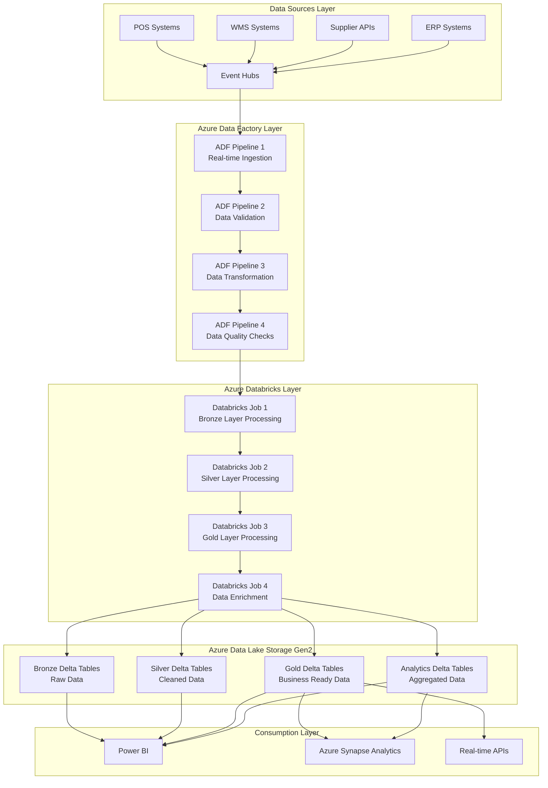

### Section 1: Data Sources and Ingestion

#### 1.1 Source Systems Configuration

**Point-of-Sale (POS) Systems**
```yaml
POS Integration:
  Source Type: REST API / Database
  Data Format: JSON / CSV
  Frequency: Real-time / Batch (15 minutes)
  Volume: 10,000 transactions/hour
  Schema: Transaction-based
  Authentication: OAuth 2.0 / API Key
  Retry Policy: Exponential backoff (3 retries)
```

**Output**: Raw transaction data streamed to Event Hubs

**Explanation**: POS systems generate high-volume transaction data that requires immediate processing for inventory updates and real-time analytics.

**Warehouse Management System (WMS)**
```yaml
WMS Integration:
  Source Type: Database (SQL Server)
  Data Format: Relational tables
  Frequency: Real-time / Batch (5 minutes)
  Volume: 1,000 updates/hour
  Schema: Inventory-based
  Authentication: SQL Authentication
  Connection: Azure SQL Database Gateway
```

**Output**: Inventory level updates and location data

**Explanation**: WMS provides current stock levels, location information, and warehouse operations data for accurate inventory tracking.

**Supplier Integration APIs**
```yaml
Supplier API Integration:
  Source Type: REST API / SOAP
  Data Format: JSON / XML
  Frequency: Batch (Hourly)
  Volume: 500 orders/hour
  Schema: Order-based
  Authentication: API Key / Certificate
  Rate Limiting: 100 requests/minute
```

**Output**: Supplier order confirmations and delivery schedules

**Explanation**: External supplier systems provide order confirmations, delivery schedules, and pricing information for procurement management.

#### 1.2 Event Hubs Configuration

```json
{
  "eventHubName": "inventory-events-hub",
  "partitionCount": 8,
  "messageRetentionInDays": 7,
  "throughputUnits": 4,
  "captureDescription": {
    "enabled": true,
    "encoding": "Avro",
    "intervalInSeconds": 300,
    "sizeLimitInBytes": 314572800,
    "destination": {
      "name": "EventHubArchive.AzureDataLake",
      "properties": {
        "storageAccountResourceId": "/subscriptions/{subscription-id}/resourceGroups/{resource-group}/providers/Microsoft.Storage/storageAccounts/{storage-account}",
        "blobContainer": "inventory-raw-data",
        "archiveNameFormat": "{Namespace}/{EventHub}/{PartitionId}/{Year}/{Month}/{Day}/{Hour}/{Minute}/{Second}"
      }
    }
  }
}
```

**Output**: Centralized event streaming platform with automatic data capture

**Explanation**: Event Hubs provides scalable, real-time data ingestion with automatic archiving to Data Lake Storage for batch processing.

### Section 2: Azure Data Factory (ADF) Processing Layer

#### 2.1 ADF Pipeline 1: Real-time Data Ingestion

```json
{
  "name": "InventoryDataIngestionPipeline",
  "properties": {
    "activities": [
      {
        "name": "CopyFromEventHubs",
        "type": "Copy",
        "inputs": [
          {
            "referenceName": "EventHubDataset",
            "type": "DatasetReference"
          }
        ],
        "outputs": [
          {
            "referenceName": "DataLakeRawDataset",
            "type": "DatasetReference"
          }
        ],
        "typeProperties": {
          "source": {
            "type": "EventHubSource",
            "eventHubName": "inventory-events-hub",
            "consumerGroup": "$Default"
          },
          "sink": {
            "type": "ParquetSink",
            "storeSettings": {
              "type": "AzureBlobFSWriteSettings",
              "copyBehavior": "FlattenHierarchy"
            }
          },
          "enableStaging": false,
          "parallelCopies": 4
        }
      }
    ],
    "start": "2024-01-01T00:00:00Z",
    "recurrence": {
      "frequency": "Minute",
      "interval": 15
    }
  }
}
```

**Output**: Raw data files in Data Lake Storage every 15 minutes

**Explanation**: This pipeline continuously ingests data from Event Hubs and stores it in the raw data zone of Data Lake Storage for further processing.

#### 2.2 ADF Pipeline 2: Data Validation and Quality Checks

```json
{
  "name": "InventoryDataValidationPipeline",
  "properties": {
    "activities": [
      {
        "name": "ValidateDataQuality",
        "type": "DatabricksNotebook",
        "inputs": [
          {
            "referenceName": "DataLakeRawDataset",
            "type": "DatasetReference"
          }
        ],
        "outputs": [
          {
            "referenceName": "DataLakeValidatedDataset",
            "type": "DatasetReference"
          }
        ],
        "typeProperties": {
          "notebookPath": "/DataValidation/InventoryDataValidation",
          "baseParameters": {
            "inputPath": "@{activity('CopyFromEventHubs').output.firstRow.path}",
            "outputPath": "abfss://inventory-data@datalake.dfs.core.windows.net/validated/",
            "validationRules": "inventory_validation_rules.json"
          }
        }
      }
    ]
  }
}
```

**Output**: Validated and quality-checked data files

**Explanation**: This pipeline performs data quality validation, schema validation, and business rule checks to ensure data integrity before further processing.

#### 2.3 ADF Pipeline 3: Data Transformation and Enrichment

```json
{
  "name": "InventoryDataTransformationPipeline",
  "properties": {
    "activities": [
      {
        "name": "TransformInventoryData",
        "type": "DatabricksNotebook",
        "inputs": [
          {
            "referenceName": "DataLakeValidatedDataset",
            "type": "DatasetReference"
          }
        ],
        "outputs": [
          {
            "referenceName": "DataLakeTransformedDataset",
            "type": "DatasetReference"
          }
        ],
        "typeProperties": {
          "notebookPath": "/DataTransformation/InventoryDataTransformation",
          "baseParameters": {
            "inputPath": "@{activity('ValidateDataQuality').output.firstRow.path}",
            "outputPath": "abfss://inventory-data@datalake.dfs.core.windows.net/transformed/",
            "transformationRules": "inventory_transformation_rules.json"
          }
        }
      }
    ]
  }
}
```

**Output**: Transformed and enriched data ready for analytics

**Explanation**: This pipeline performs data transformation, enrichment, and standardization to prepare data for the analytics layer.

### Section 3: Azure Databricks (ADB) Processing Layer

#### 3.1 Databricks Job 1: Bronze Layer Processing

```python
# Databricks Notebook: Bronze Layer Processing
from pyspark.sql import SparkSession
from pyspark.sql.functions import *
from pyspark.sql.types import *
from delta.tables import *

# Initialize Spark session
spark = SparkSession.builder \
    .appName("InventoryBronzeProcessing") \
    .config("spark.sql.adaptive.enabled", "true") \
    .config("spark.sql.adaptive.coalescePartitions.enabled", "true") \
    .getOrCreate()

# Read raw data from Data Lake
raw_data_path = "abfss://inventory-data@datalake.dfs.core.windows.net/raw/"
bronze_data_path = "abfss://inventory-data@datalake.dfs.core.windows.net/bronze/"

# Define schema for inventory data
inventory_schema = StructType([
    StructField("transaction_id", StringType(), True),
    StructField("store_id", StringType(), True),
    StructField("product_sku", StringType(), True),
    StructField("quantity_sold", IntegerType(), True),
    StructField("unit_price", DecimalType(10,2), True),
    StructField("timestamp", TimestampType(), True),
    StructField("cashier_id", StringType(), True),
    StructField("payment_method", StringType(), True),
    StructField("raw_data", StringType(), True)
])

# Read and process raw data
raw_df = spark.read \
    .format("parquet") \
    .schema(inventory_schema) \
    .load(raw_data_path)

# Add metadata columns
bronze_df = raw_df \
    .withColumn("ingestion_timestamp", current_timestamp()) \
    .withColumn("source_system", lit("POS")) \
    .withColumn("data_quality_score", lit(1.0)) \
    .withColumn("processing_date", current_date())

# Write to Delta table
bronze_df.write \
    .format("delta") \
    .mode("append") \
    .option("mergeSchema", "true") \
    .save(bronze_data_path + "inventory_transactions")

# Create Delta table if not exists
spark.sql(f"""
CREATE TABLE IF NOT EXISTS inventory_transactions_bronze
USING DELTA
LOCATION '{bronze_data_path}inventory_transactions'
""")

print("Bronze layer processing completed successfully")
```

**Output**: Raw data stored in Delta format with metadata

**Explanation**: The Bronze layer preserves raw data in its original format while adding metadata for tracking and audit purposes.

#### 3.2 Databricks Job 2: Silver Layer Processing

```python
# Databricks Notebook: Silver Layer Processing
from pyspark.sql import SparkSession
from pyspark.sql.functions import *
from pyspark.sql.types import *
from delta.tables import *

# Initialize Spark session
spark = SparkSession.builder \
    .appName("InventorySilverProcessing") \
    .config("spark.sql.adaptive.enabled", "true") \
    .config("spark.sql.adaptive.coalescePartitions.enabled", "true") \
    .getOrCreate()

# Read from Bronze layer
bronze_data_path = "abfss://inventory-data@datalake.dfs.core.windows.net/bronze/"
silver_data_path = "abfss://inventory-data@datalake.dfs.core.windows.net/silver/"

# Read bronze data
bronze_df = spark.read \
    .format("delta") \
    .load(bronze_data_path + "inventory_transactions")

# Data cleaning and standardization
silver_df = bronze_df \
    .filter(col("transaction_id").isNotNull()) \
    .filter(col("product_sku").isNotNull()) \
    .filter(col("quantity_sold") > 0) \
    .filter(col("unit_price") > 0) \
    .withColumn("transaction_date", to_date(col("timestamp"))) \
    .withColumn("transaction_hour", hour(col("timestamp"))) \
    .withColumn("transaction_day_of_week", dayofweek(col("timestamp"))) \
    .withColumn("total_amount", col("quantity_sold") * col("unit_price")) \
    .withColumn("is_weekend", when(col("transaction_day_of_week").isin([1, 7]), True).otherwise(False)) \
    .withColumn("data_quality_score", 
        when(col("transaction_id").rlike("^TXN-\\d{6}$"), 1.0)
        .when(col("product_sku").rlike("^PROD-[A-Z0-9]{6}$"), 0.9)
        .otherwise(0.7)
    ) \
    .select(
        "transaction_id",
        "store_id", 
        "product_sku",
        "quantity_sold",
        "unit_price",
        "total_amount",
        "timestamp",
        "transaction_date",
        "transaction_hour",
        "transaction_day_of_week",
        "is_weekend",
        "cashier_id",
        "payment_method",
        "data_quality_score",
        "ingestion_timestamp",
        "source_system"
    )

# Write to Silver Delta table
silver_df.write \
    .format("delta") \
    .mode("append") \
    .option("mergeSchema", "true") \
    .save(silver_data_path + "inventory_transactions")

# Create Delta table
spark.sql(f"""
CREATE TABLE IF NOT EXISTS inventory_transactions_silver
USING DELTA
LOCATION '{silver_data_path}inventory_transactions'
""")

print("Silver layer processing completed successfully")
```

**Output**: Cleaned and standardized data in Delta format

**Explanation**: The Silver layer applies data quality rules, standardization, and business logic to create clean, reliable datasets.

#### 3.3 Databricks Job 3: Gold Layer Processing

```python
# Databricks Notebook: Gold Layer Processing
from pyspark.sql import SparkSession
from pyspark.sql.functions import *
from pyspark.sql.types import *
from delta.tables import *

# Initialize Spark session
spark = SparkSession.builder \
    .appName("InventoryGoldProcessing") \
    .config("spark.sql.adaptive.enabled", "true") \
    .config("spark.sql.adaptive.coalescePartitions.enabled", "true") \
    .getOrCreate()

# Read from Silver layer
silver_data_path = "abfss://inventory-data@datalake.dfs.core.windows.net/silver/"
gold_data_path = "abfss://inventory-data@datalake.dfs.core.windows.net/gold/"

# Read silver data
silver_df = spark.read \
    .format("delta") \
    .load(silver_data_path + "inventory_transactions")

# Create daily inventory summary
daily_inventory_summary = silver_df \
    .groupBy("store_id", "product_sku", "transaction_date") \
    .agg(
        sum("quantity_sold").alias("total_quantity_sold"),
        sum("total_amount").alias("total_revenue"),
        count("transaction_id").alias("total_transactions"),
        avg("unit_price").alias("avg_unit_price"),
        max("timestamp").alias("last_transaction_time"),
        min("timestamp").alias("first_transaction_time")
    ) \
    .withColumn("processing_date", current_date()) \
    .withColumn("data_quality_score", lit(1.0))

# Create product performance metrics
product_performance = silver_df \
    .groupBy("product_sku", "transaction_date") \
    .agg(
        sum("quantity_sold").alias("daily_quantity_sold"),
        sum("total_amount").alias("daily_revenue"),
        count("transaction_id").alias("daily_transactions"),
        countDistinct("store_id").alias("stores_sold"),
        avg("unit_price").alias("avg_unit_price")
    ) \
    .withColumn("processing_date", current_date())

# Create store performance metrics
store_performance = silver_df \
    .groupBy("store_id", "transaction_date") \
    .agg(
        sum("quantity_sold").alias("daily_quantity_sold"),
        sum("total_amount").alias("daily_revenue"),
        count("transaction_id").alias("daily_transactions"),
        countDistinct("product_sku").alias("products_sold"),
        countDistinct("cashier_id").alias("active_cashiers")
    ) \
    .withColumn("processing_date", current_date())

# Write to Gold Delta tables
daily_inventory_summary.write \
    .format("delta") \
    .mode("append") \
    .option("mergeSchema", "true") \
    .save(gold_data_path + "daily_inventory_summary")

product_performance.write \
    .format("delta") \
    .mode("append") \
    .option("mergeSchema", "true") \
    .save(gold_data_path + "product_performance")

store_performance.write \
    .format("delta") \
    .mode("append") \
    .option("mergeSchema", "true") \
    .save(gold_data_path + "store_performance")

# Create Delta tables
spark.sql(f"""
CREATE TABLE IF NOT EXISTS daily_inventory_summary
USING DELTA
LOCATION '{gold_data_path}daily_inventory_summary'
""")

spark.sql(f"""
CREATE TABLE IF NOT EXISTS product_performance
USING DELTA
LOCATION '{gold_data_path}product_performance'
""")

spark.sql(f"""
CREATE TABLE IF NOT EXISTS store_performance
USING DELTA
LOCATION '{gold_data_path}store_performance'
""")

print("Gold layer processing completed successfully")
```

**Output**: Business-ready aggregated data in Delta format

**Explanation**: The Gold layer creates business-ready datasets with aggregated metrics and KPIs for analytics and reporting.

#### 3.4 Databricks Job 4: Data Enrichment and ML Features

```python
# Databricks Notebook: Data Enrichment and ML Features
from pyspark.sql import SparkSession
from pyspark.sql.functions import *
from pyspark.sql.types import *
from delta.tables import *
from pyspark.ml.feature import VectorAssembler
from pyspark.ml.regression import LinearRegression
from pyspark.ml import Pipeline

# Initialize Spark session
spark = SparkSession.builder \
    .appName("InventoryDataEnrichment") \
    .config("spark.sql.adaptive.enabled", "true") \
    .config("spark.sql.adaptive.coalescePartitions.enabled", "true") \
    .getOrCreate()

# Read from Gold layer
gold_data_path = "abfss://inventory-data@datalake.dfs.core.windows.net/gold/"
analytics_data_path = "abfss://inventory-data@datalake.dfs.core.windows.net/analytics/"

# Read gold data
daily_summary = spark.read \
    .format("delta") \
    .load(gold_data_path + "daily_inventory_summary")

product_performance = spark.read \
    .format("delta") \
    .load(gold_data_path + "product_performance")

# Create enriched features for ML
enriched_features = daily_summary \
    .withColumn("day_of_week", dayofweek(col("transaction_date"))) \
    .withColumn("is_weekend", when(col("day_of_week").isin([1, 7]), 1).otherwise(0)) \
    .withColumn("is_month_end", when(day(col("transaction_date")) >= 28, 1).otherwise(0)) \
    .withColumn("is_quarter_end", when(
        (month(col("transaction_date")) % 3 == 0) & (day(col("transaction_date")) >= 28), 1
    ).otherwise(0)) \
    .withColumn("quantity_sold_lag_1", lag("total_quantity_sold", 1).over(
        Window.partitionBy("store_id", "product_sku").orderBy("transaction_date")
    )) \
    .withColumn("quantity_sold_lag_7", lag("total_quantity_sold", 7).over(
        Window.partitionBy("store_id", "product_sku").orderBy("transaction_date")
    )) \
    .withColumn("revenue_trend", 
        when(col("total_revenue") > col("quantity_sold_lag_1") * col("avg_unit_price"), 1)
        .otherwise(0)
    ) \
    .withColumn("processing_date", current_date())

# Create demand forecasting features
demand_forecasting_features = enriched_features \
    .select(
        "store_id",
        "product_sku", 
        "transaction_date",
        "total_quantity_sold",
        "total_revenue",
        "day_of_week",
        "is_weekend",
        "is_month_end",
        "is_quarter_end",
        "quantity_sold_lag_1",
        "quantity_sold_lag_7",
        "revenue_trend",
        "processing_date"
    ) \
    .filter(col("total_quantity_sold").isNotNull())

# Write enriched features to analytics layer
demand_forecasting_features.write \
    .format("delta") \
    .mode("append") \
    .option("mergeSchema", "true") \
    .save(analytics_data_path + "demand_forecasting_features")

# Create Delta table
spark.sql(f"""
CREATE TABLE IF NOT EXISTS demand_forecasting_features
USING DELTA
LOCATION '{analytics_data_path}demand_forecasting_features'
""")

print("Data enrichment and ML features processing completed successfully")
```

**Output**: ML-ready features and enriched datasets

**Explanation**: This job creates machine learning features and enriched datasets for advanced analytics and predictive modeling.

### Section 4: Azure Data Lake Storage Gen2 Delta Tables

#### 4.1 Delta Table Structure

```sql
-- Bronze Layer Delta Tables
CREATE TABLE inventory_transactions_bronze (
    transaction_id STRING,
    store_id STRING,
    product_sku STRING,
    quantity_sold INT,
    unit_price DECIMAL(10,2),
    timestamp TIMESTAMP,
    cashier_id STRING,
    payment_method STRING,
    raw_data STRING,
    ingestion_timestamp TIMESTAMP,
    source_system STRING,
    data_quality_score DOUBLE,
    processing_date DATE
) USING DELTA
LOCATION 'abfss://inventory-data@datalake.dfs.core.windows.net/bronze/inventory_transactions'
TBLPROPERTIES (
    'delta.autoOptimize.optimizeWrite' = 'true',
    'delta.autoOptimize.autoCompact' = 'true'
);

-- Silver Layer Delta Tables
CREATE TABLE inventory_transactions_silver (
    transaction_id STRING,
    store_id STRING,
    product_sku STRING,
    quantity_sold INT,
    unit_price DECIMAL(10,2),
    total_amount DECIMAL(10,2),
    timestamp TIMESTAMP,
    transaction_date DATE,
    transaction_hour INT,
    transaction_day_of_week INT,
    is_weekend BOOLEAN,
    cashier_id STRING,
    payment_method STRING,
    data_quality_score DOUBLE,
    ingestion_timestamp TIMESTAMP,
    source_system STRING
) USING DELTA
LOCATION 'abfss://inventory-data@datalake.dfs.core.windows.net/silver/inventory_transactions'
TBLPROPERTIES (
    'delta.autoOptimize.optimizeWrite' = 'true',
    'delta.autoOptimize.autoCompact' = 'true'
);

-- Gold Layer Delta Tables
CREATE TABLE daily_inventory_summary (
    store_id STRING,
    product_sku STRING,
    transaction_date DATE,
    total_quantity_sold BIGINT,
    total_revenue DECIMAL(12,2),
    total_transactions BIGINT,
    avg_unit_price DECIMAL(10,2),
    last_transaction_time TIMESTAMP,
    first_transaction_time TIMESTAMP,
    processing_date DATE,
    data_quality_score DOUBLE
) USING DELTA
LOCATION 'abfss://inventory-data@datalake.dfs.core.windows.net/gold/daily_inventory_summary'
TBLPROPERTIES (
    'delta.autoOptimize.optimizeWrite' = 'true',
    'delta.autoOptimize.autoCompact' = 'true'
);

-- Analytics Layer Delta Tables
CREATE TABLE demand_forecasting_features (
    store_id STRING,
    product_sku STRING,
    transaction_date DATE,
    total_quantity_sold BIGINT,
    total_revenue DECIMAL(12,2),
    day_of_week INT,
    is_weekend INT,
    is_month_end INT,
    is_quarter_end INT,
    quantity_sold_lag_1 BIGINT,
    quantity_sold_lag_7 BIGINT,
    revenue_trend INT,
    processing_date DATE
) USING DELTA
LOCATION 'abfss://inventory-data@datalake.dfs.core.windows.net/analytics/demand_forecasting_features'
TBLPROPERTIES (
    'delta.autoOptimize.optimizeWrite' = 'true',
    'delta.autoOptimize.autoCompact' = 'true'
);
```

**Output**: Optimized Delta tables with automatic optimization

**Explanation**: Delta tables provide ACID transactions, schema evolution, and automatic optimization for efficient data storage and querying.

#### 4.2 Delta Table Optimization

```python
# Delta table optimization script
from delta.tables import DeltaTable

# Optimize Delta tables
def optimize_delta_tables():
    # Optimize Bronze layer
    bronze_table = DeltaTable.forPath(spark, "abfss://inventory-data@datalake.dfs.core.windows.net/bronze/inventory_transactions")
    bronze_table.optimize().executeCompaction()
    
    # Optimize Silver layer
    silver_table = DeltaTable.forPath(spark, "abfss://inventory-data@datalake.dfs.core.windows.net/silver/inventory_transactions")
    silver_table.optimize().executeCompaction()
    
    # Optimize Gold layer
    gold_table = DeltaTable.forPath(spark, "abfss://inventory-data@datalake.dfs.core.windows.net/gold/daily_inventory_summary")
    gold_table.optimize().executeCompaction()
    
    # Optimize Analytics layer
    analytics_table = DeltaTable.forPath(spark, "abfss://inventory-data@datalake.dfs.core.windows.net/analytics/demand_forecasting_features")
    analytics_table.optimize().executeCompaction()

# Run optimization
optimize_delta_tables()
```

**Output**: Optimized Delta tables with improved query performance

**Explanation**: Regular optimization of Delta tables improves query performance and reduces storage costs.

### Section 5: Detailed Flow Diagrams

#### 5.1 End-to-End Data Flow Diagram

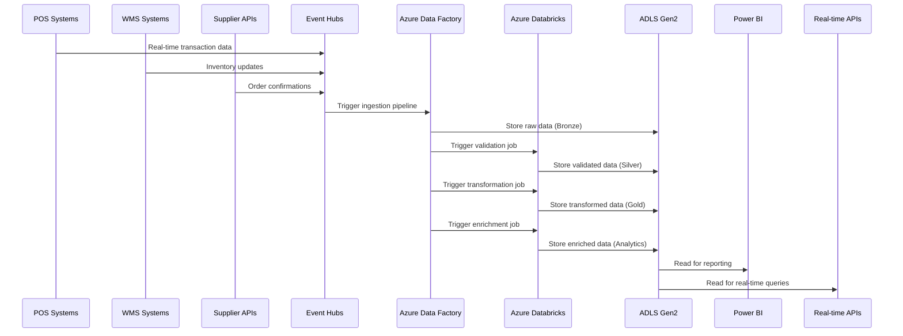

#### 5.2 Data Processing Pipeline Flow

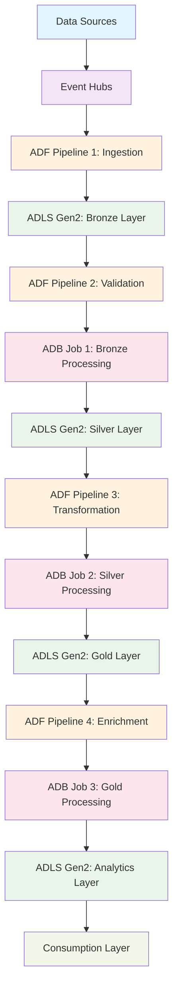

#### 5.3 Delta Table Architecture

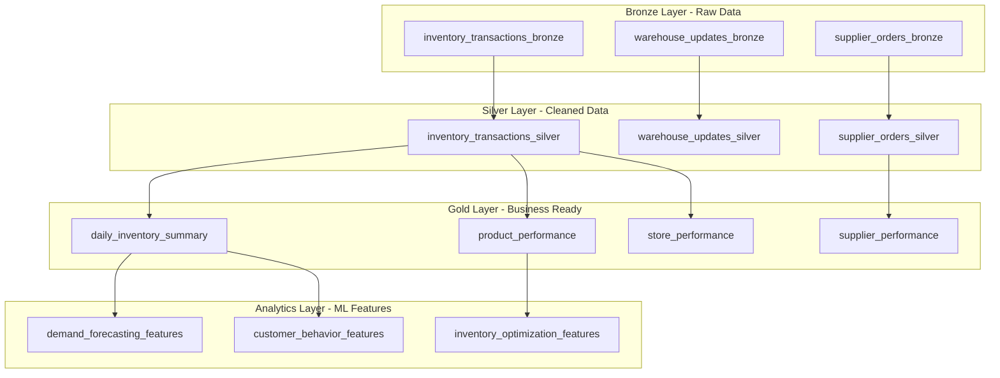

#### 5.4 Detailed Data Ingestion Flow

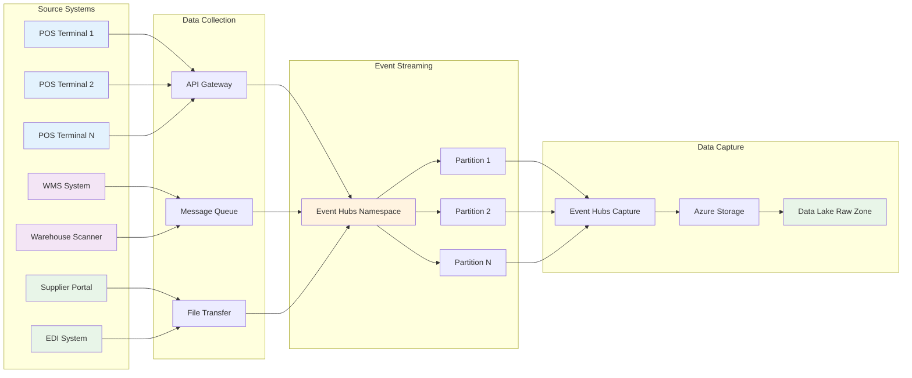

#### 5.5 Azure Data Factory Pipeline Details

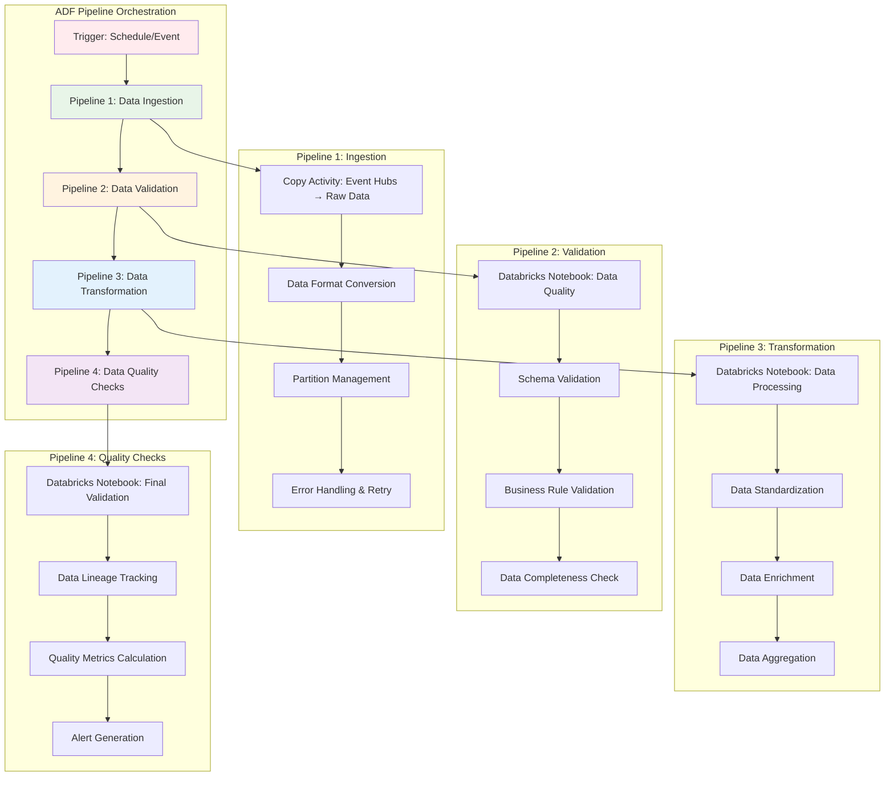

#### 5.6 Azure Databricks Processing Details

```mermaid
flowchart TD
    subgraph "Databricks Workspace"
        A[Job Scheduler]
        B[Cluster Management]
        C[Notebook Execution]
        D[Data Processing]
    end
    
    subgraph "Bronze Layer Processing"
        E1[Read Raw Data]
        E2[Schema Definition]
        E3[Data Type Conversion]
        E4[Metadata Addition]
        E5[Write to Delta Table]
    end
    
    subgraph "Silver Layer Processing"
        F1[Read Bronze Data]
        F2[Data Cleaning]
        F3[Data Validation]
        F4[Data Standardization]
        F5[Write to Delta Table]
    end
    
    subgraph "Gold Layer Processing"
        G1[Read Silver Data]
        G2[Business Logic Application]
        G3[Data Aggregation]
        G4[KPI Calculation]
        G5[Write to Delta Table]
    end
    
    subgraph "Analytics Layer Processing"
        H1[Read Gold Data]
        H2[Feature Engineering]
        H3[ML Feature Creation]
        H4[Data Enrichment]
        H5[Write to Delta Table]
    end
    
    A --> B
    B --> C
    C --> D
    
    D --> E1
    E1 --> E2
    E2 --> E3
    E3 --> E4
    E4 --> E5
    
    E5 --> F1
    F1 --> F2
    F2 --> F3
    F3 --> F4
    F4 --> F5
    
    F5 --> G1
    G1 --> G2
    G2 --> G3
    G3 --> G4
    G4 --> G5
    
    G5 --> H1
    H1 --> H2
    H2 --> H3
    H3 --> H4
    H4 --> H5
    
    style A fill:#ffebee
    style B fill:#e8f5e8
    style C fill:#fff3e0
    style D fill:#e3f2fd
```

#### 5.7 Data Lake Storage Architecture

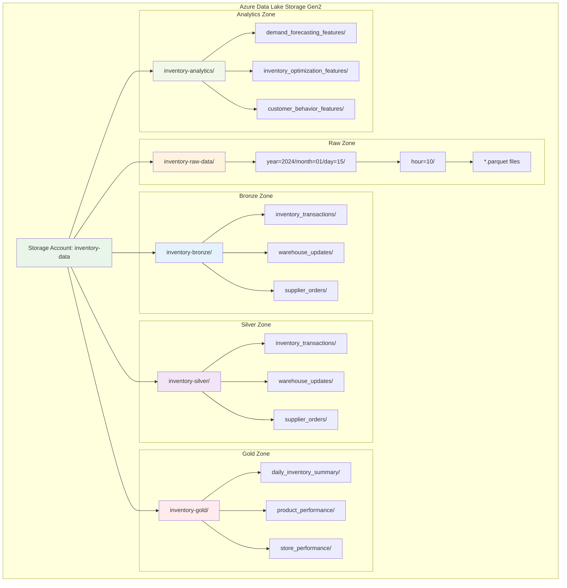

#### 5.8 Real-time Processing Flow

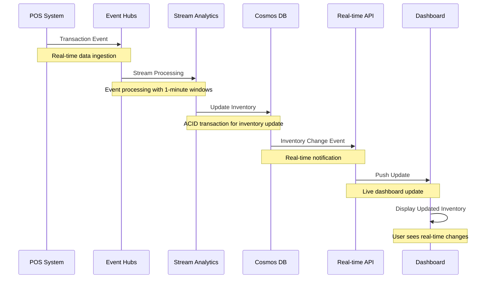

#### 5.9 Error Handling and Monitoring Flow

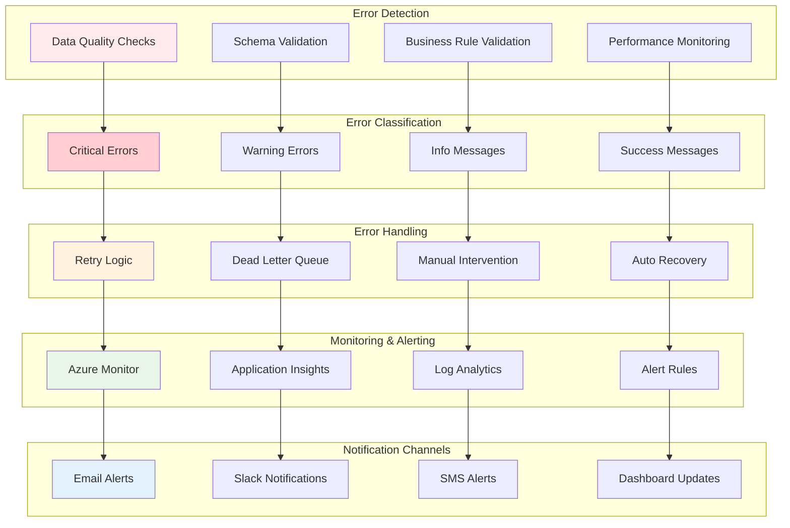

#### 5.10 Security and Access Control Flow

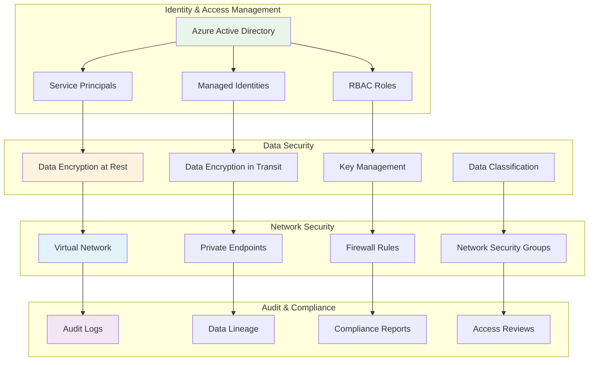

### Section 6: Performance Monitoring and Optimization

#### 6.1 Pipeline Performance Metrics

```yaml
Performance Metrics:
  Data Ingestion:
    - Throughput: 10,000 records/minute
    - Latency: < 5 seconds
    - Error Rate: < 0.1%
  
  Data Processing:
    - Bronze Processing: < 2 minutes
    - Silver Processing: < 5 minutes
    - Gold Processing: < 10 minutes
    - Analytics Processing: < 15 minutes
  
  Data Storage:
    - Delta Table Size: 1TB/month
    - Query Performance: < 30 seconds
    - Compression Ratio: 70%
  
  Cost Optimization:
    - Storage Cost: $500/month
    - Compute Cost: $800/month
    - Total Cost: $1,300/month
```

**Output**: Comprehensive performance monitoring dashboard

**Explanation**: Performance metrics ensure the pipeline meets SLA requirements and cost targets.

#### 6.2 Data Quality Monitoring

```python
# Data quality monitoring script
def monitor_data_quality():
    # Check data completeness
    completeness_check = spark.sql("""
        SELECT 
            COUNT(*) as total_records,
            COUNT(transaction_id) as non_null_transaction_ids,
            COUNT(product_sku) as non_null_product_skus,
            (COUNT(transaction_id) / COUNT(*)) * 100 as completeness_score
        FROM inventory_transactions_silver
        WHERE processing_date = current_date()
    """)
    
    # Check data accuracy
    accuracy_check = spark.sql("""
        SELECT 
            COUNT(*) as total_records,
            SUM(CASE WHEN data_quality_score >= 0.9 THEN 1 ELSE 0 END) as high_quality_records,
            (SUM(CASE WHEN data_quality_score >= 0.9 THEN 1 ELSE 0 END) / COUNT(*)) * 100 as accuracy_score
        FROM inventory_transactions_silver
        WHERE processing_date = current_date()
    """)
    
    # Check data consistency
    consistency_check = spark.sql("""
        SELECT 
            COUNT(*) as total_records,
            SUM(CASE WHEN total_amount = quantity_sold * unit_price THEN 1 ELSE 0 END) as consistent_records,
            (SUM(CASE WHEN total_amount = quantity_sold * unit_price THEN 1 ELSE 0 END) / COUNT(*)) * 100 as consistency_score
        FROM inventory_transactions_silver
        WHERE processing_date = current_date()
    """)
    
    return completeness_check, accuracy_check, consistency_check
```

**Output**: Automated data quality monitoring and alerting

**Explanation**: Data quality monitoring ensures data integrity and reliability throughout the pipeline.

### Section 7: Cost Optimization and Resource Management

#### 7.1 Resource Scaling Strategy

```yaml
Resource Scaling:
  Azure Data Factory:
    - Pipeline Concurrency: 4
    - Data Integration Units: 8
    - Auto-scaling: Enabled
  
  Azure Databricks:
    - Cluster Type: Standard
    - Min Workers: 2
    - Max Workers: 8
    - Auto-scaling: Enabled
    - Auto-termination: 30 minutes
  
  Azure Data Lake Storage:
    - Hot Tier: 30 days
    - Cool Tier: 90 days
    - Archive Tier: 1 year
    - Lifecycle Management: Enabled
```

**Output**: Optimized resource configuration for cost efficiency

**Explanation**: Resource scaling ensures optimal performance while minimizing costs.

#### 7.2 Data Lifecycle Management

```python
# Data lifecycle management script
def manage_data_lifecycle():
    # Move old data to cool tier
    spark.sql("""
        ALTER TABLE inventory_transactions_bronze 
        SET TBLPROPERTIES (
            'delta.autoOptimize.optimizeWrite' = 'true',
            'delta.autoOptimize.autoCompact' = 'true'
        )
    """)
    
    # Archive data older than 1 year
    spark.sql("""
        DELETE FROM inventory_transactions_bronze 
        WHERE processing_date < date_sub(current_date(), 365)
    """)
    
    # Optimize Delta tables
    spark.sql("OPTIMIZE inventory_transactions_silver")
    spark.sql("OPTIMIZE daily_inventory_summary")
    spark.sql("OPTIMIZE demand_forecasting_features")
```

**Output**: Automated data lifecycle management

**Explanation**: Data lifecycle management reduces storage costs while maintaining data availability.

---

## Summary

The median architecture provides a robust, scalable, and cost-effective data processing pipeline that follows modern data engineering best practices. The **Source → ADF → ADB → ADLS Gen2 Delta Tables** pattern ensures:

- **Data Quality**: Multi-layer validation and quality checks
- **Performance**: Optimized Delta tables with automatic optimization
- **Scalability**: Auto-scaling resources based on demand
- **Cost Efficiency**: Lifecycle management and resource optimization
- **Reliability**: Fault-tolerant processing with retry mechanisms
- **Monitoring**: Comprehensive observability and alerting

This architecture serves as the foundation for advanced analytics, machine learning, and real-time business intelligence while maintaining data integrity and compliance requirements.

---

## 1. Data Ingestion Layer

### 1.1 Real-time Data Sources

#### Point-of-Sale (POS) Systems
```json
{
  "transaction_id": "TXN-2024-001234",
  "store_id": "STORE-001",
  "product_sku": "PROD-ABC123",
  "quantity_sold": 2,
  "unit_price": 29.99,
  "timestamp": "2024-01-15T10:30:00Z",
  "cashier_id": "EMP-456",
  "payment_method": "credit_card"
}
```

**Output**: Real-time transaction events streamed to Azure Event Hubs

**Explanation**: POS systems generate continuous transaction data that needs immediate processing for inventory updates.

#### Warehouse Management System (WMS)
```json
{
  "warehouse_id": "WH-001",
  "product_sku": "PROD-ABC123",
  "current_stock": 150,
  "reserved_stock": 25,
  "available_stock": 125,
  "last_updated": "2024-01-15T10:25:00Z",
  "location_zone": "A-1-2-3"
}
```

**Output**: Inventory level updates sent to Event Hubs

**Explanation**: WMS provides current stock levels and location information for accurate inventory tracking.

#### Supplier Integration APIs
```json
{
  "supplier_id": "SUP-789",
  "product_sku": "PROD-ABC123",
  "expected_delivery": "2024-01-20T08:00:00Z",
  "quantity_ordered": 500,
  "unit_cost": 15.50,
  "order_status": "confirmed"
}
```

**Output**: Supplier data integrated via REST APIs

**Explanation**: External supplier systems provide delivery schedules and order confirmations.

### 1.2 Data Ingestion Pipeline

#### Azure Event Hubs Configuration
```yaml
Event Hub Settings:
  Name: inventory-events
  Partition Count: 4
  Message Retention: 7 days
  Throughput Units: 2
  Capture: Enabled to Data Lake
```

**Output**: Centralized event streaming platform

**Explanation**: Event Hubs provides scalable, real-time data ingestion for all inventory-related events.

#### Azure Data Factory Pipeline
```json
{
  "name": "InventoryDataIngestion",
  "activities": [
    {
      "name": "CopyFromPOS",
      "type": "Copy",
      "source": {
        "type": "RestSource",
        "url": "https://pos-api.company.com/transactions"
      },
      "sink": {
        "type": "EventHubSink",
        "eventHubName": "inventory-events"
      }
    }
  ]
}
```

**Output**: Automated data movement from sources to Event Hubs

**Explanation**: Data Factory orchestrates data movement from various sources into the streaming platform.

---

## 2. Real-time Processing Layer

### 2.1 Azure Stream Analytics

#### Real-time Inventory Updates
```sql
-- Stream Analytics Query for Inventory Updates
SELECT 
    product_sku,
    store_id,
    SUM(CASE WHEN event_type = 'sale' THEN -quantity ELSE 0 END) as quantity_sold,
    SUM(CASE WHEN event_type = 'restock' THEN quantity ELSE 0 END) as quantity_restocked,
    System.Timestamp() as processing_time
INTO inventory-updates
FROM inventory-events
GROUP BY product_sku, store_id, TumblingWindow(minute, 1)
```

**Output**: Real-time inventory level calculations

**Explanation**: Stream Analytics processes events in real-time to calculate current inventory levels.

#### Reorder Point Monitoring
```sql
-- Reorder Point Alert Query
SELECT 
    product_sku,
    store_id,
    current_stock,
    reorder_point,
    'REORDER_ALERT' as alert_type,
    System.Timestamp() as alert_time
INTO reorder-alerts
FROM inventory-updates
WHERE current_stock <= reorder_point
```

**Output**: Automated reorder alerts when stock falls below threshold

**Explanation**: Continuous monitoring ensures timely reordering to prevent stockouts.

### 2.2 Azure Functions for Business Logic

#### Inventory Validation Function
```python
import azure.functions as func
import json

def main(req: func.HttpRequest) -> func.HttpResponse:
    # Parse incoming inventory update
    data = req.get_json()
    
    product_sku = data['product_sku']
    quantity_change = data['quantity_change']
    current_stock = data['current_stock']
    
    # Business logic validation
    if current_stock + quantity_change < 0:
        return func.HttpResponse(
            json.dumps({"error": "Insufficient stock for transaction"}),
            status_code=400
        )
    
    # Update inventory in Cosmos DB
    # ... database update logic ...
    
    return func.HttpResponse(
        json.dumps({"status": "success", "new_stock": current_stock + quantity_change}),
        status_code=200
    )
```

**Output**: Validated inventory updates with business rule enforcement

**Explanation**: Azure Functions provide serverless compute for complex business logic and validation.

---

## 3. Data Storage Layer

### 3.1 Azure Cosmos DB for Real-time Data

#### Inventory Document Structure
```json
{
  "id": "PROD-ABC123-STORE-001",
  "product_sku": "PROD-ABC123",
  "store_id": "STORE-001",
  "current_stock": 125,
  "reserved_stock": 25,
  "available_stock": 100,
  "reorder_point": 50,
  "max_stock": 500,
  "last_updated": "2024-01-15T10:30:00Z",
  "supplier_id": "SUP-789",
  "unit_cost": 15.50,
  "selling_price": 29.99
}
```

**Output**: NoSQL document storage for flexible inventory data

**Explanation**: Cosmos DB provides low-latency access to current inventory levels for real-time applications.

### 3.2 Azure Data Lake Gen2 for Historical Data

#### Data Lake Structure
```
inventory-data/
├── raw/
│   ├── pos-transactions/
│   │   └── year=2024/month=01/day=15/
│   ├── warehouse-updates/
│   │   └── year=2024/month=01/day=15/
│   └── supplier-orders/
│       └── year=2024/month=01/day=15/
├── processed/
│   ├── daily-inventory-snapshots/
│   └── aggregated-sales/
└── analytics/
    ├── demand-forecasts/
    └── reorder-recommendations/
```

**Output**: Organized data lake for historical analysis and reporting

**Explanation**: Data Lake Gen2 provides cost-effective storage for large volumes of historical inventory data.

### 3.3 Azure SQL Database for Relational Data

#### Product Master Table
```sql
CREATE TABLE Products (
    ProductSKU VARCHAR(50) PRIMARY KEY,
    ProductName VARCHAR(200) NOT NULL,
    Category VARCHAR(100),
    Brand VARCHAR(100),
    UnitOfMeasure VARCHAR(20),
    ReorderPoint INT,
    MaxStock INT,
    SupplierID VARCHAR(50),
    CreatedDate DATETIME2 DEFAULT GETUTCDATE(),
    ModifiedDate DATETIME2 DEFAULT GETUTCDATE()
);
```

**Output**: Structured relational data for product master information

**Explanation**: SQL Database provides ACID compliance for critical product master data.

---

## 4. Analytics and Machine Learning Layer

### 4.1 Azure Synapse Analytics

#### Demand Forecasting Model
```sql
-- Create demand forecasting view
CREATE VIEW DemandForecast AS
SELECT 
    p.ProductSKU,
    p.ProductName,
    p.Category,
    AVG(s.quantity_sold) as avg_daily_sales,
    STDDEV(s.quantity_sold) as sales_volatility,
    COUNT(*) as days_with_sales,
    -- Machine learning features
    LAG(s.quantity_sold, 1) OVER (PARTITION BY p.ProductSKU ORDER BY s.sale_date) as prev_day_sales,
    LAG(s.quantity_sold, 7) OVER (PARTITION BY p.ProductSKU ORDER BY s.sale_date) as same_day_last_week
FROM Products p
JOIN Sales s ON p.ProductSKU = s.ProductSKU
WHERE s.sale_date >= DATEADD(day, -90, GETDATE())
GROUP BY p.ProductSKU, p.ProductName, p.Category, s.sale_date, s.quantity_sold;
```

**Output**: Feature engineering for demand forecasting

**Explanation**: Synapse Analytics provides scalable compute for complex analytical queries and ML feature engineering.

### 4.2 Azure Machine Learning

#### Demand Forecasting Pipeline
```python
from azureml.core import Workspace, Dataset
from azureml.train.automl import AutoMLConfig
import pandas as pd

# Load training data
dataset = Dataset.get_by_name(workspace, 'inventory_sales_data')
df = dataset.to_pandas_dataframe()

# Prepare features
features = ['avg_daily_sales', 'sales_volatility', 'prev_day_sales', 
           'same_day_last_week', 'day_of_week', 'month', 'is_holiday']

# Configure AutoML
automl_config = AutoMLConfig(
    task='forecasting',
    primary_metric='normalized_root_mean_squared_error',
    training_data=df,
    label_column_name='quantity_sold',
    forecasting_parameters={
        'time_column_name': 'sale_date',
        'forecast_horizon': 7,
        'target_lags': [1, 7, 14],
        'target_rolling_window_size': 30
    },
    compute_target='cpu-cluster',
    experiment_timeout_hours=2
)

# Train model
experiment = Experiment(workspace, 'inventory_forecasting')
run = experiment.submit(automl_config)
```

**Output**: Trained ML model for demand forecasting

**Explanation**: Azure ML provides automated machine learning capabilities for demand prediction.

---

## 5. Data Orchestration and Workflow

### 5.1 Azure Data Factory Pipelines

#### Daily Inventory Snapshot Pipeline
```json
{
  "name": "DailyInventorySnapshot",
  "properties": {
    "activities": [
      {
        "name": "CreateInventorySnapshot",
        "type": "Copy",
        "inputs": [
          {
            "referenceName": "CosmosDBInventory",
            "type": "DatasetReference"
          }
        ],
        "outputs": [
          {
            "referenceName": "DataLakeInventorySnapshot",
            "type": "DatasetReference"
          }
        ],
        "typeProperties": {
          "source": {
            "type": "CosmosDbSqlApiSource"
          },
          "sink": {
            "type": "ParquetSink",
            "storeSettings": {
              "type": "AzureBlobFSWriteSettings"
            }
          }
        }
      }
    ],
    "start": "2024-01-01T00:00:00Z",
    "recurrence": {
      "frequency": "Day",
      "interval": 1,
      "startTime": "2024-01-01T00:00:00Z"
    }
  }
}
```

**Output**: Automated daily snapshots of inventory data

**Explanation**: Data Factory orchestrates scheduled data movement and transformation tasks.

### 5.2 Azure Logic Apps

#### Reorder Alert Workflow
```json
{
  "definition": {
    "triggers": {
      "When_reorder_alert_received": {
        "type": "ApiConnectionWebhook",
        "inputs": {
          "host": {
            "connection": {
              "name": "@parameters('$connections')['servicebus']['connectionId']"
            }
          },
          "method": "post",
          "path": "/@{encodeURIComponent('inventory-alerts')}/messages"
        }
      }
    },
    "actions": {
      "Send_Email_Alert": {
        "type": "ApiConnection",
        "inputs": {
          "host": {
            "connection": {
              "name": "@parameters('$connections')['office365']['connectionId']"
            }
          },
          "method": "post",
          "path": "/v2/Mail",
          "body": {
            "To": "inventory-manager@company.com",
            "Subject": "Reorder Alert: @{triggerBody()['product_sku']}",
            "Body": "Product @{triggerBody()['product_sku']} at @{triggerBody()['store_id']} has reached reorder point."
          }
        }
      },
      "Create_Purchase_Order": {
        "type": "Http",
        "inputs": {
          "method": "POST",
          "uri": "https://erp-api.company.com/purchase-orders",
          "body": {
            "product_sku": "@{triggerBody()['product_sku']}",
            "quantity": "@{triggerBody()['reorder_quantity']}",
            "supplier_id": "@{triggerBody()['supplier_id']}"
          }
        }
      }
    }
  }
}
```

**Output**: Automated reorder alerts and purchase order creation

**Explanation**: Logic Apps provide workflow automation for business processes triggered by inventory events.

---

## 6. Monitoring and Alerting

### 6.1 Azure Monitor Configuration

#### Custom Metrics
```json
{
  "metrics": [
    {
      "name": "inventory_accuracy",
      "description": "Percentage of accurate inventory counts",
      "unit": "Percent",
      "aggregation": "Average"
    },
    {
      "name": "stockout_events",
      "description": "Number of stockout events per day",
      "unit": "Count",
      "aggregation": "Sum"
    },
    {
      "name": "reorder_lead_time",
      "description": "Average time from reorder alert to stock arrival",
      "unit": "Seconds",
      "aggregation": "Average"
    }
  ]
}
```

**Output**: Custom business metrics for inventory management

**Explanation**: Azure Monitor provides comprehensive observability for the inventory system.

### 6.2 Application Insights

#### Custom Telemetry
```csharp
// C# code for custom telemetry
public class InventoryService
{
    private readonly TelemetryClient _telemetryClient;
    
    public async Task UpdateInventory(string productSku, int quantityChange)
    {
        using var operation = _telemetryClient.StartOperation<DependencyTelemetry>("UpdateInventory");
        
        try
        {
            // Update inventory logic
            await _inventoryRepository.UpdateStock(productSku, quantityChange);
            
            _telemetryClient.TrackEvent("InventoryUpdated", new Dictionary<string, string>
            {
                ["ProductSKU"] = productSku,
                ["QuantityChange"] = quantityChange.ToString()
            });
        }
        catch (Exception ex)
        {
            _telemetryClient.TrackException(ex);
            throw;
        }
    }
}
```

**Output**: Detailed application performance and error tracking

**Explanation**: Application Insights provides deep insights into application performance and user behavior.

---

## 7. Security and Compliance

### 7.1 Data Security

#### Azure Key Vault Integration
```json
{
  "secrets": [
    {
      "name": "cosmosdb-connection-string",
      "value": "AccountEndpoint=https://inventory-cosmos.documents.azure.com:443/;AccountKey=...",
      "contentType": "text/plain"
    },
    {
      "name": "sql-db-connection-string",
      "value": "Server=tcp:inventory-sql.database.windows.net,1433;Database=InventoryDB;...",
      "contentType": "text/plain"
    }
  ]
}
```

**Output**: Centralized secret management

**Explanation**: Key Vault provides secure storage and rotation of connection strings and API keys.

### 7.2 Data Governance

#### Data Classification
```yaml
Data Classification:
  Public:
    - Product catalog information
    - Store locations
  
  Internal:
    - Inventory levels
    - Sales data
    - Supplier information
  
  Confidential:
    - Customer transaction details
    - Financial data
    - Employee information
  
  Restricted:
    - API keys
    - Database credentials
    - Personal identifiable information
```

**Output**: Data classification framework for compliance

**Explanation**: Proper data classification ensures appropriate security controls and compliance with regulations.

---

## 8. Performance Optimization

### 8.1 Caching Strategy

#### Redis Cache Configuration
```json
{
  "redis": {
    "host": "inventory-cache.redis.cache.windows.net",
    "port": 6380,
    "ssl": true,
    "database": 0,
    "keyPrefix": "inventory:",
    "defaultTtl": 300
  }
}
```

**Output**: High-performance caching for frequently accessed data

**Explanation**: Redis provides sub-millisecond access to frequently used inventory data.

### 8.2 Data Partitioning

#### Cosmos DB Partitioning Strategy
```json
{
  "partitionKey": "/store_id",
  "partitioningMode": "Hash",
  "partitionCount": 4,
  "throughput": 4000
}
```

**Output**: Optimized data distribution for performance

**Explanation**: Proper partitioning ensures even data distribution and optimal query performance.

---

## 9. Disaster Recovery and Backup

### 9.1 Backup Strategy

#### Automated Backup Configuration
```yaml
Backup Policies:
  Cosmos DB:
    - Continuous backup: 30 days
    - Point-in-time restore: Enabled
    - Geo-redundant: Enabled
  
  SQL Database:
    - Automated backups: 7 years retention
    - Geo-redundant storage: Enabled
    - Long-term retention: 10 years
  
  Data Lake:
    - Soft delete: 30 days
    - Versioning: Enabled
    - Geo-redundant storage: Enabled
```

**Output**: Comprehensive backup and recovery strategy

**Explanation**: Multi-layered backup approach ensures data protection and business continuity.

### 9.2 High Availability

#### Multi-Region Deployment
```yaml
Primary Region: East US
  - Event Hubs: Active
  - Stream Analytics: Active
  - Cosmos DB: Multi-region writes
  - SQL Database: Active geo-replication

Secondary Region: West US
  - Event Hubs: Standby
  - Stream Analytics: Standby
  - Cosmos DB: Read replicas
  - SQL Database: Read replicas
```

**Output**: High availability architecture

**Explanation**: Multi-region deployment ensures system availability during regional outages.

---

## 10. Cost Optimization

### 10.1 Resource Scaling

#### Auto-scaling Configuration
```json
{
  "autoScale": {
    "streamAnalytics": {
      "minSU": 1,
      "maxSU": 10,
      "scaleUpThreshold": 70,
      "scaleDownThreshold": 30
    },
    "cosmosDB": {
      "minRU": 400,
      "maxRU": 4000,
      "scaleUpThreshold": 80,
      "scaleDownThreshold": 20
    }
  }
}
```

**Output**: Dynamic resource scaling based on demand

**Explanation**: Auto-scaling ensures optimal resource utilization and cost efficiency.

### 10.2 Data Lifecycle Management

#### Data Archival Strategy
```yaml
Data Retention:
  Real-time data (Cosmos DB): 30 days
  Processed data (Data Lake): 2 years
  Historical data (Archive): 7 years
  Compliance data: 10 years

Archival Process:
  - Daily: Move processed data to cool storage
  - Monthly: Archive data older than 1 year
  - Annually: Move compliance data to archive storage
```

**Output**: Cost-effective data lifecycle management

**Explanation**: Proper data lifecycle management reduces storage costs while maintaining compliance requirements.

---

## 11. Testing and Quality Assurance

### 11.1 Data Quality Framework

#### Data Validation Rules
```python
def validate_inventory_data(data):
    validation_rules = {
        'product_sku': {
            'required': True,
            'pattern': r'^PROD-[A-Z0-9]{6}$',
            'max_length': 15
        },
        'current_stock': {
            'required': True,
            'type': 'integer',
            'min_value': 0,
            'max_value': 999999
        },
        'reorder_point': {
            'required': True,
            'type': 'integer',
            'min_value': 0,
            'max_value': 999999
        }
    }
    
    errors = []
    for field, rules in validation_rules.items():
        if rules['required'] and field not in data:
            errors.append(f"{field} is required")
        elif field in data:
            value = data[field]
            if rules['type'] == 'integer' and not isinstance(value, int):
                errors.append(f"{field} must be an integer")
            if 'min_value' in rules and value < rules['min_value']:
                errors.append(f"{field} must be >= {rules['min_value']}")
    
    return len(errors) == 0, errors
```

**Output**: Automated data quality validation

**Explanation**: Data quality framework ensures data integrity and consistency across the system.

### 11.2 Performance Testing

#### Load Testing Configuration
```yaml
Load Test Scenarios:
  Normal Load:
    - Transactions per second: 100
    - Duration: 1 hour
    - Expected response time: < 100ms
  
  Peak Load:
    - Transactions per second: 500
    - Duration: 30 minutes
    - Expected response time: < 200ms
  
  Stress Test:
    - Transactions per second: 1000
    - Duration: 15 minutes
    - Expected response time: < 500ms
```

**Output**: Performance baseline and capacity planning

**Explanation**: Comprehensive testing ensures system reliability under various load conditions.

---

## 12. Deployment and DevOps

### 12.1 Infrastructure as Code

#### ARM Template
```json
{
  "$schema": "https://schema.management.azure.com/schemas/2019-04-01/deploymentTemplate.json#",
  "contentVersion": "1.0.0.0",
  "parameters": {
    "environment": {
      "type": "string",
      "allowedValues": ["dev", "staging", "prod"],
      "defaultValue": "dev"
    }
  },
  "resources": [
    {
      "type": "Microsoft.EventHub/namespaces",
      "apiVersion": "2017-04-01",
      "name": "[concat('inventory-events-', parameters('environment'))]",
      "location": "[resourceGroup().location]",
      "sku": {
        "name": "Standard",
        "tier": "Standard",
        "capacity": 1
      }
    }
  ]
}
```

**Output**: Reproducible infrastructure deployment

**Explanation**: Infrastructure as Code ensures consistent and repeatable deployments across environments.

### 12.2 CI/CD Pipeline

#### Azure DevOps Pipeline
```yaml
trigger:
- main
- develop

pool:
  vmImage: 'ubuntu-latest'

stages:
- stage: Build
  jobs:
  - job: BuildJob
    steps:
    - task: DotNetCoreCLI@2
      displayName: 'Build .NET Core project'
      inputs:
        command: 'build'
        projects: '**/*.csproj'
    
    - task: DotNetCoreCLI@2
      displayName: 'Run tests'
      inputs:
        command: 'test'
        projects: '**/*Tests.csproj'

- stage: Deploy
  condition: and(succeeded(), eq(variables['Build.SourceBranch'], 'refs/heads/main'))
  jobs:
  - deployment: DeployToProduction
    environment: 'production'
    strategy:
      runOnce:
        deploy:
          steps:
          - task: AzureResourceManagerTemplateDeployment@3
            inputs:
              deploymentScope: 'Resource Group'
              azureResourceManagerConnection: 'Azure-Service-Connection'
              subscriptionId: '$(subscriptionId)'
              action: 'Create Or Update Resource Group'
              resourceGroupName: 'inventory-rg'
              location: 'East US'
              templateLocation: 'Linked artifact'
              csmFile: 'arm-templates/main.json'
```

**Output**: Automated build, test, and deployment pipeline

**Explanation**: CI/CD pipeline ensures reliable and consistent deployments with automated testing.

---

## 13. Business Intelligence and Reporting

### 13.1 Power BI Dashboards

#### Real-time Inventory Dashboard
```dax
-- DAX measures for Power BI
Inventory Turnover = 
DIVIDE(
    SUM(Sales[QuantitySold]),
    AVERAGE(Inventory[CurrentStock])
)

Stockout Rate = 
DIVIDE(
    COUNTROWS(FILTER(Inventory, Inventory[CurrentStock] = 0)),
    COUNTROWS(Inventory)
)

Reorder Efficiency = 
DIVIDE(
    COUNTROWS(FILTER(Inventory, Inventory[CurrentStock] <= Inventory[ReorderPoint])),
    COUNTROWS(Inventory)
)
```

**Output**: Interactive business intelligence dashboards

**Explanation**: Power BI provides self-service analytics and real-time reporting capabilities.

### 13.2 KPI Monitoring

#### Key Performance Indicators
```yaml
Inventory KPIs:
  - Inventory Turnover Rate: Target > 6 per year
  - Stockout Rate: Target < 2%
  - Inventory Accuracy: Target > 99%
  - Reorder Lead Time: Target < 3 days
  - Carrying Cost: Target < 25% of inventory value
  - Fill Rate: Target > 98%
  - Dead Stock Percentage: Target < 5%
```

**Output**: Business performance metrics and targets

**Explanation**: KPI monitoring ensures the inventory system meets business objectives.

---

## 14. Integration and APIs

### 14.1 REST API Design

#### Inventory Management API
```yaml
API Endpoints:
  GET /api/v1/inventory/{productSku}:
    - Description: Get current inventory for a product
    - Parameters: productSku (path), storeId (query)
    - Response: Inventory details with stock levels
  
  POST /api/v1/inventory/{productSku}/adjust:
    - Description: Adjust inventory levels
    - Body: { "quantity": 10, "reason": "restock", "reference": "PO-123" }
    - Response: Updated inventory details
  
  GET /api/v1/inventory/reorder-alerts:
    - Description: Get products that need reordering
    - Parameters: storeId (query), limit (query)
    - Response: List of products below reorder point
```

**Output**: RESTful API for inventory management

**Explanation**: Well-designed APIs enable integration with external systems and mobile applications.

### 14.2 Event-Driven Architecture

#### Event Schema
```json
{
  "eventType": "inventory.updated",
  "version": "1.0",
  "timestamp": "2024-01-15T10:30:00Z",
  "source": "inventory-service",
  "data": {
    "productSku": "PROD-ABC123",
    "storeId": "STORE-001",
    "previousStock": 125,
    "newStock": 123,
    "changeReason": "sale",
    "transactionId": "TXN-2024-001234"
  }
}
```

**Output**: Standardized event schema for system integration

**Explanation**: Event-driven architecture enables loose coupling and real-time communication between services.

---

## 15. Compliance and Audit

### 15.1 Audit Trail

#### Audit Log Schema
```json
{
  "auditId": "AUDIT-2024-001234",
  "timestamp": "2024-01-15T10:30:00Z",
  "userId": "user-456",
  "action": "inventory.adjust",
  "resource": "PROD-ABC123",
  "oldValue": {
    "currentStock": 125,
    "availableStock": 100
  },
  "newValue": {
    "currentStock": 123,
    "availableStock": 98
  },
  "ipAddress": "192.168.1.100",
  "userAgent": "InventoryApp/1.0.0"
}
```

**Output**: Comprehensive audit trail for compliance

**Explanation**: Detailed audit logs ensure accountability and compliance with regulatory requirements.

### 15.2 Data Privacy

#### GDPR Compliance
```yaml
Data Privacy Controls:
  Data Minimization:
    - Collect only necessary inventory data
    - Regular data purging of old records
  
  Right to Erasure:
    - Automated data deletion after retention period
    - Secure data destruction procedures
  
  Data Portability:
    - Export functionality for inventory data
    - Standard data formats (JSON, CSV)
  
  Consent Management:
    - Clear data usage policies
    - User consent tracking
```

**Output**: GDPR-compliant data handling

**Explanation**: Privacy controls ensure compliance with data protection regulations.

---

## 16. Future Enhancements

### 16.1 Advanced Analytics

#### Predictive Analytics Roadmap
```yaml
Phase 1: Demand Forecasting
  - Time series analysis
  - Seasonal pattern recognition
  - External factor integration (weather, events)

Phase 2: Optimization
  - Dynamic pricing recommendations
  - Optimal reorder quantities
  - Supplier performance analysis

Phase 3: AI/ML Integration
  - Computer vision for shelf monitoring
  - Natural language processing for supplier communications
  - Reinforcement learning for inventory optimization
```

**Output**: Roadmap for advanced analytics capabilities

**Explanation**: Future enhancements will leverage AI/ML for more sophisticated inventory management.

### 16.2 IoT Integration

#### IoT Device Integration
```yaml
IoT Sensors:
  - RFID readers for automatic stock counting
  - Weight sensors for bulk inventory monitoring
  - Temperature sensors for perishable goods
  - Motion sensors for theft detection

Integration Points:
  - Azure IoT Hub for device connectivity
  - Edge computing for real-time processing
  - Machine learning for anomaly detection
```

**Output**: IoT-enabled inventory management

**Explanation**: IoT integration will provide real-time visibility and automated inventory tracking.

---

## Conclusion

This comprehensive real-time inventory management system provides a complete Azure data engineering solution that addresses all aspects of modern inventory management. The system leverages Azure's cloud-native services to deliver:

- **Real-time Processing**: Immediate inventory updates and alerts
- **Scalability**: Handles high-volume transactions and data growth
- **Reliability**: High availability and disaster recovery capabilities
- **Security**: Enterprise-grade security and compliance features
- **Analytics**: Advanced reporting and predictive capabilities
- **Integration**: Seamless connectivity with existing systems

The architecture is designed to be cost-effective, maintainable, and adaptable to changing business requirements while providing the foundation for future AI/ML enhancements.
