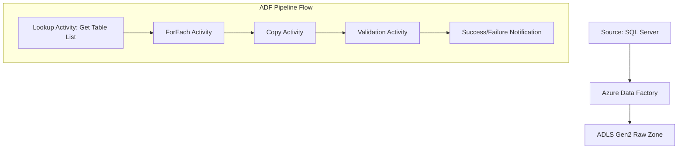
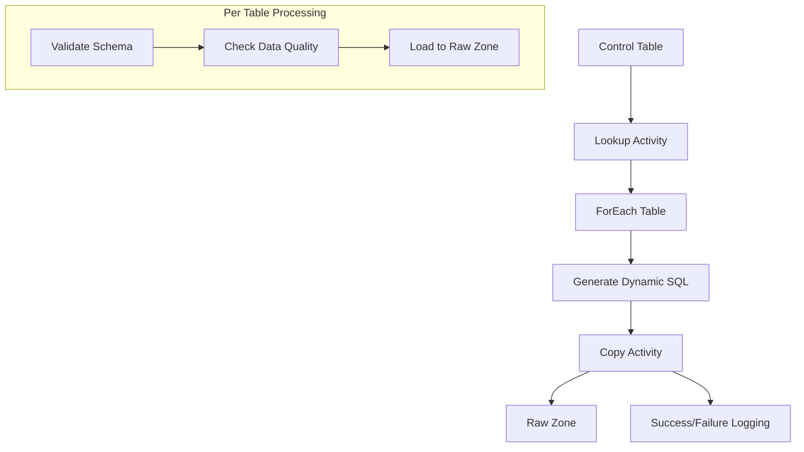

# Retail - Data Warehouse Migration (Azure)

## Project Overview

This comprehensive data warehouse migration project aims to modernize a retail organization's data infrastructure by transitioning from an on-premises SQL Server environment to Azure cloud services. The migration will enhance data analytics capabilities and enable real-time business insights.

## Detailed Project Flow

### 1. Assessment & Planning Phase

- **Source System Analysis**
    - Database size: Current SQL Server database (500GB+)
    - Number of tables: 200+ including fact and dimension tables
    - Daily data volume: ~50GB incremental data
- **Sample Tables Structure**
    
    ```sql
    -- Example of source tables
    CREATE TABLE Sales_Fact (
        SaleID INT PRIMARY KEY,
        ProductID INT,
        CustomerID INT,
        StoreID INT,
        SaleDate DATE,
        Quantity INT,
        Amount DECIMAL(18,2)
    );
    
    CREATE TABLE Product_Dim (
        ProductID INT PRIMARY KEY,
        ProductName VARCHAR(100),
        Category VARCHAR(50),
        SubCategory VARCHAR(50),
        UnitPrice DECIMAL(18,2)
    );
    
    CREATE TABLE Store_Dim (
        StoreID INT PRIMARY KEY,
        StoreName VARCHAR(100),
        Region VARCHAR(50),
        Country VARCHAR(50)
    );
    ```
    

### 2. Data Extraction & Ingestion Strategy

- **Initial Load Process**
    - Setup Azure Data Factory pipeline for full load
    - Configure copy activity with SQL Server as source
    - Define ADLS Gen2 raw zone as destination

Here's a detailed look at the Azure Data Factory pipeline implementation:



### Pipeline Components

- **Dynamic Table Loading**
    
    ```sql
    -- Store table list in control table
    CREATE TABLE TableConfig (
        TableName VARCHAR(100),
        SchemaName VARCHAR(50),
        LoadType VARCHAR(20),
        WatermarkColumn VARCHAR(50),
        BatchSize INT
    );
    ```
    
- **Metadata-Driven Pipeline**
    
    ```json
    {
        "name": "DynamicTableLoadPipeline",
        "properties": {
            "activities": [
                {
                    "name": "GetTableList",
                    "type": "Lookup",
                    "source": {
                        "query": "SELECT TableName, SchemaName FROM TableConfig"
                    }
                }
            ]
        }
    }
    ```
    

The pipeline handles multiple tables through these steps:

- **1. Table Discovery**
    - Query metadata from control table
    - Generate dynamic source queries
    - Map source to destination paths
- **2. Parallel Processing**
    - Configure concurrent table loads
    - Set batch sizes for large tables
    - Implement error handling per table



- **3. Error Handling Framework**
    
    ```sql
    CREATE TABLE Pipeline_Execution_Log (
        ExecutionID UNIQUEIDENTIFIER,
        TableName VARCHAR(100),
        StartTime DATETIME,
        EndTime DATETIME,
        RowsCopied BIGINT,
        Status VARCHAR(50),
        ErrorMessage VARCHAR(MAX)
    );
    ```
    

This comprehensive pipeline design ensures:

- Scalable processing of multiple tables
- Robust error handling and logging
- Configurable load strategies per table
- Monitoring and alerting capabilities
- **Incremental Load Design**
    
    ```sql
    -- Example of incremental load query
    SELECT *
    FROM Sales_Fact
    WHERE SaleDate >= @LastLoadDate
      AND SaleDate < @CurrentLoadDate;
    ```
    

  

### Azure Data Factory (ADF) Process Flow

The Azure Data Factory implementation follows a robust ETL/ELT pattern with the following key components:

- **Control Flow Activities**
    - Lookup activities for metadata-driven processing
    - ForEach loops for batch processing
    - If Condition activities for error handling
- **Pipeline Monitoring**
    
    ```sql
    CREATE TABLE PipelineMonitoring (
        PipelineRunId UNIQUEIDENTIFIER,
        PipelineName VARCHAR(100),
        ActivityName VARCHAR(100),
        StartTime DATETIME,
        EndTime DATETIME,
        Status VARCHAR(50),
        ErrorDetails VARCHAR(MAX)
    );
    ```
    

### Medallion Architecture Implementation

The data lake follows the medallion architecture pattern with three distinct layers:

Here's a detailed breakdown of each layer with retail-specific examples:

### Bronze Layer Examples (Raw Data)

1. Point-of-Sale (POS) Transaction Records 
    - Raw transaction logs with timestamps, store IDs, and product codes
    - Payment method details and transaction amounts
    - Cashier IDs and register numbers
2. Inventory Management Data 
    - Stock levels across all store locations
    - Product receiving logs and timestamps
    - Warehouse transfer records
3. Customer Loyalty Program Data 
    - Raw membership sign-ups
    - Points accumulated per transaction
    - Redemption records

### Silver Layer Examples (Processed Data)

1. Standardized Transaction Data 
    - Normalized store codes and names
    - Validated product SKUs
    - Cleansed customer information
2. Quality-Checked Inventory Data 
    - Validated stock counts
    - Standardized product categories
    - Corrected unit measures
3. Enhanced Customer Data 
    - Deduplicated customer records
    - Standardized address formats
    - Verified contact information

### Gold Layer Examples (Business-Ready Data)

1. Sales Analytics 
    - Daily sales by store, region, and product category
    - Customer segment performance metrics
    - Seasonal sales trends analysis
2. Inventory Intelligence 
    - Stock turnover ratios by category
    - Optimal reorder point calculations
    - Seasonal inventory forecasts
3. Customer Insights 
    - Customer lifetime value calculations
    - Purchase pattern analysis
    - Loyalty program effectiveness metrics

Each layer builds upon the previous one, transforming raw retail data into actionable business insights while maintaining data lineage and quality.

- **Bronze Layer (Raw)**
    - Raw data ingestion from source systems
    - Minimal transformations
    - Full audit logging of incoming data
- **Silver Layer (Processed)**
    - Data cleansing and standardization
    - Schema enforcement
    - Quality validation logs
- **Gold Layer (Curated)**
    - Business-level aggregations
    - Dimensional modeling
    - Performance optimization

Logging Framework Implementation:

```sql
-- Data Quality Logging
CREATE TABLE DataQualityLog (
    LogID UNIQUEIDENTIFIER,
    LayerName VARCHAR(50),
    TableName VARCHAR(100),
    ValidationRule VARCHAR(200),
    FailedRecords INT,
    LogDateTime DATETIME,
    Severity VARCHAR(20)
);

-- Data Processing Workflow Log
CREATE TABLE WorkflowLog (
    WorkflowID UNIQUEIDENTIFIER,
    LayerName VARCHAR(50),
    ProcessName VARCHAR(100),
    RecordsProcessed BIGINT,
    StartTime DATETIME,
    EndTime DATETIME,
    Status VARCHAR(50),
    ErrorMessage VARCHAR(MAX)
);
```

Key Workflow Considerations:

- Implement checkpoint mechanisms between layers
- Maintain data lineage across transformations
- Set up alerting for critical failure points
- Monitor data quality metrics at each layer

### 3. Data Lake Organization

ADLS Gen2 folder structure:

```
retail-dw/
├── raw/
│   ├── sales/
│   ├── products/
│   └── stores/
├── processed/
│   ├── transformed/
│   └── validated/
└── curated/
    ├── sales_analytics/
    └── reporting/
```

### 4. Data Transformation Workflow

- **Data Quality Checks**
    
    ```sql
    -- Example of data validation query
    SELECT COUNT(*) as DuplicateCount
    FROM Sales_Fact
    GROUP BY SaleID
    HAVING COUNT(*) > 1;
    ```
    
- **Business Logic Implementation**
    
    ```sql
    -- Example of sales aggregation
    SELECT 
        p.Category,
        s.Region,
        SUM(f.Amount) as TotalSales,
        COUNT(DISTINCT f.CustomerID) as UniqueCustomers
    FROM Sales_Fact f
    JOIN Product_Dim p ON f.ProductID = p.ProductID
    JOIN Store_Dim s ON f.StoreID = s.StoreID
    GROUP BY p.Category, s.Region;
    ```
    

### 5. Azure Synapse Analytics Implementation

- **Table Distribution Strategy**
    
    ```sql
    -- Example of distributed table creation
    CREATE TABLE [dbo].[Sales_Fact]
    (
        SaleID INT,
        ProductID INT,
        CustomerID INT,
        StoreID INT,
        SaleDate DATE,
        Quantity INT,
        Amount DECIMAL(18,2)
    )
    WITH
    (
        DISTRIBUTION = HASH(ProductID),
        CLUSTERED COLUMNSTORE INDEX
    );
    ```
    

### 6. Power BI Integration

- **Dataset Design**
    - Create star schema model for sales analysis
    - Implement row-level security based on store regions
    - Configure incremental refresh policies

### 7. Monitoring & Maintenance

- **Performance Metrics**
    - Pipeline execution time: Target < 4 hours for full load
    - Query performance: 95% queries under 10 seconds
    - Data freshness: Maximum 1-hour lag

## Implementation Timeline

| **Phase** | **Duration** | **Key Deliverables** |
| --- | --- | --- |
| Assessment | 2 weeks | Source analysis report, Migration strategy |
| Development | 8 weeks | ETL pipelines, Validation framework |
| Testing | 4 weeks | Test results, Performance metrics |
| Deployment | 2 weeks | Production environment, Documentation |

## Risk Mitigation

- **Data Loss Prevention**
    - Implement checksum validation for all data transfers
    - Maintain source system backups during migration
    - Set up monitoring alerts for pipeline failures

## Success Criteria

- 100% data accuracy post-migration
- Zero data loss during transfer
- Performance improvement: 40% faster query execution
- Successful Power BI report validation

This comprehensive migration plan ensures a systematic approach to transitioning the retail data warehouse to Azure, with careful consideration for data integrity, performance, and business continuity.

## Detailed ADF Pipeline Implementation

### 1. Pipeline Components

- **Source Connectors**
    - SQL Server linked service for on-premises database
    - Self-hosted Integration Runtime for secure data movement
    - Connection string with managed identity authentication
- **Destination Connectors**
    - ADLS Gen2 linked service using service principal
    - Storage account with hierarchical namespace enabled
    - Folder structure following medallion architecture

### 2. Control Flow Activities

```json
{
    "name": "RetailDataMigrationPipeline",
    "properties": {
        "activities": [
            {
                "name": "GetTableMetadata",
                "type": "Lookup",
                "typeProperties": {
                    "source": {
                        "type": "SqlServerSource",
                        "sqlReaderQuery": "SELECT TableName, LastLoadDate FROM Migration_Control"
                    }
                }
            },
            {
                "name": "ForEachTable",
                "type": "ForEach",
                "dependsOn": [
                    {
                        "activity": "GetTableMetadata",
                        "dependencyConditions": ["Succeeded"]
                    }
                ]
            }
        ]
    }
}

```

### 3. Data Flow Components

- **Source Transformation**
    - Watermark-based incremental load strategy
    - Partition hint for large tables
    - Source validation rules

```sql
-- Example of source query with watermark
SELECT * 
FROM @{item().TableName}
WHERE LastModifiedDate >= @{activity('GetLastLoadDate').output.firstRow.LastLoadDate}

```

- **Data Flow Transformations**
    - Data type mapping and conversion
    - NULL handling and default values
    - Business rule application

### 4. Error Handling Framework

```json
{
    "name": "LogPipelineExecution",
    "type": "SqlServerStoredProcedure",
    "typeProperties": {
        "storedProcedureName": "[dbo].[LogPipelineExecution]",
        "storedProcedureParameters": {
            "PipelineName": {
                "value": "@pipeline().Pipeline",
                "type": "String"
            },
            "Status": {
                "value": "@activity('CopyData').output.status",
                "type": "String"
            }
        }
    }
}

```

### 5. Monitoring Setup

- **Azure Monitor Integration**
    - Custom metrics for pipeline performance
    - Alert rules for failure conditions
    - Dashboard for real-time monitoring

```json
{
    "name": "AlertOnFailure",
    "type": "WebActivity",
    "typeProperties": {
        "method": "POST",
        "url": "LogicApp_Webhook_URL",
        "body": {
            "pipelineName": "@pipeline().Pipeline",
            "errorMessage": "@activity('CopyData').error.message"
        }
    }
}

```

### 6. Performance Optimization

- **Copy Activity Settings**
    - Parallel copy degree: 8-16 based on data volume
    - Batch size: 100,000 rows per batch
    - Stage copy enabled for large tables

```json
{
    "name": "CopyToADLS",
    "type": "Copy",
    "typeProperties": {
        "enableStaging": true,
        "parallelCopies": 16,
        "sink": {
            "type": "ParquetSink",
            "storeSettings": {
                "type": "AzureBlobFSWriteSettings",
                "copyBehavior": "PreserveHierarchy"
            }
        }
    }
}

```

This detailed ADF implementation ensures efficient, reliable, and monitored data migration from on-premises SQL Server to Azure Data Lake Storage Gen2, following the medallion architecture pattern and incorporating best practices for enterprise-scale ETL processes.


Customer Data Integration Pipeline
The Customer Data Integration Pipeline was designed to integrate and consolidate customer data from multiple sources, including on-premises SQL Server and cloud-based APIs, into Azure Data Lake Storage (ADLS Gen2). Azure Data Factory (ADF) was used to extract data from diverse sources, leveraging its capabilities for hybrid data integration. The ingested data was transformed using Python and PySpark scripts within Azure Databricks (ADB), where advanced transformation logic and business rules were applied to ensure data consistency and accuracy.

To automate the pipeline, ADF was configured with event-based triggers that executed workflows upon detecting new data from the source systems. PySpark scripts in Databricks processed and aggregated the data, enabling seamless integration into ADLS Gen2. The pipeline also implemented error-handling and logging mechanisms to ensure the reliability and maintainability of the system. These mechanisms tracked and flagged any discrepancies, allowing for quick resolution and ensuring data quality throughout the integration process.

The transformed and integrated customer data was stored in ADLS Gen2, partitioned for efficient querying and analytics. SQL queries were used to validate the data integrity and generate reports. The pipeline enabled organizations to consolidate customer data into a single source of truth, facilitating enhanced customer insights and decision-making. The integration of ADF, ADB, ADLS Gen2, Python, PySpark, and SQL created a scalable solution capable of handling complex customer data integration requirements.
